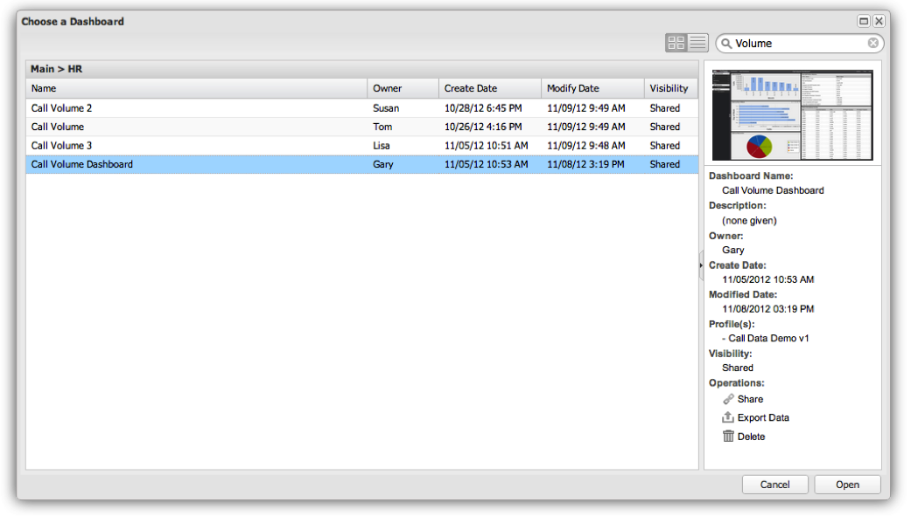

# Búsqueda dentro del explorador del panel{#searching-within-the-dashboard-browser}

El Explorador de tableros también le permite realizar búsquedas para encontrar los tableros existentes.

Para realizar una búsqueda, utilice el cuadro de búsqueda de la barra de herramientas del Explorador de paneles. Los resultados de búsqueda aparecerán en el Explorador del panel mientras escribe. Puede borrar una búsqueda en cualquier momento eliminando el texto de la búsqueda o haciendo clic en el icono **[!UICONTROL X]** en el cuadro de búsqueda.

También puede ordenar los resultados utilizando las funciones de ordenación en cada encabezado de columna. Al hacer clic en el encabezado de una columna, se alternará el orden de las columnas. También puede acceder a las opciones de ordenación mediante el menú desplegable del encabezado de cada columna.

Este menú **[!UICONTROL Columns]** también le permite modificar las columnas visibles en la vista de lista del panel. Aquí puede alternar la visibilidad de las columnas seleccionando o anulando la selección de las columnas que desee.

## Panel Detalles {#section-e1e5a5a0f9cc4eb89b0b94764587ae9c}

El panel Detalles del tablero muestra la información detallada del tablero junto con una versión en miniatura del tablero. La información que se encuentra en el panel incluye el nombre del tablero, una breve descripción, el propietario y la fecha de creación, la última fecha de modificación y los perfiles utilizados para crear el tablero. La visibilidad del panel (ya sea privada o compartida) también está disponible en este panel.
