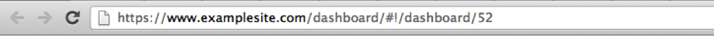

# Hipervínculo del panel{#dashboard-hyperlink}

La tercera forma de abrir un tablero es mediante el hipervínculo de un tablero.

Cada tablero tiene un hipervínculo único que puede utilizarse para abrir el tablero a través de la barra de direcciones del explorador. Los hipervínculos de tablero también se pueden usar para marcar y compartir por correo electrónico.

Si tiene un hipervínculo de tablero, simplemente ingréelo en la barra de direcciones del explorador y vaya al vínculo . Se le dirigirá al sitio del tablero y se le pedirá que inicie sesión (si aún no lo ha hecho). Una vez que haya iniciado sesión, el panel se cargará en la interfaz.

>[!NOTE]
>
>Se le preguntará si el panel ya no existe o si no tiene los permisos adecuados para acceder al tablero.

