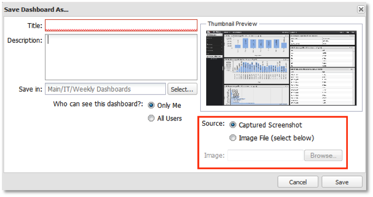

# Guardar un panel{#saving-a-dashboard}

{{eol}}

1. Para guardar un tablero nuevo, seleccione: **[!UICONTROL Save]** o **[!UICONTROL Save As…]** en el menú Tablero en la parte superior de la interfaz del tablero. Para un tablero nuevo, ambas opciones tienen el mismo resultado.

   Esto inicia el **[!UICONTROL Save New Dashboard]** ventana donde puede introducir un título, una breve descripción y una ubicación para almacenar el tablero.

   >[!NOTE]
   >
   >Los tableros pueden ser privados o compartidos. Si un tablero está etiquetado **[!UICONTROL Private]** en el **[!UICONTROL Visibility]** , solo usted (o un administrador del sistema) puede ver y editar el tablero. Si un tablero está etiquetado **[!UICONTROL Shared]** en el **[!UICONTROL Visibility]** , todos los usuarios del sistema pueden ver y editar el tablero.

1. En el **[!UICONTROL Source]** , elija una miniatura de imagen para representar el tablero. De forma predeterminada, se toma una captura de pantalla del tablero y se utiliza como la miniatura del tablero.

   Esta miniatura se utilizará si la variable **[!UICONTROL Captured Screenshot]** está seleccionada. Si desea utilizar otro archivo de imagen, seleccione la opción **[!UICONTROL Image File]** y elija la imagen que desea que represente el tablero.

   >[!NOTE]
   >
   >Si su navegador no admite captura de pantalla, se utilizará una captura de pantalla predeterminada. En este caso, puede que desee seleccionar un archivo de imagen para representar el tablero.

   

1. Haga clic en **[!UICONTROL Save]** para guardar el tablero en el servidor. Usted será el propietario de este tablero y tendrá control total sobre él en el futuro.
