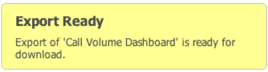

# Exportación de datos{#exporting-data}

Muestra tres formas de exportar datos y de recuperar exportaciones.

Los datos se pueden exportar desde el panel de tres formas.

En primer lugar, puede exportar datos desde una visualización individual. En segundo lugar, puede exportar el tablero de trabajo actual, incluidas las configuraciones y selecciones que haya realizado. En tercer lugar, puede exportar un tablero guardado sin abrirlo.

Las exportaciones se realizan mediante un proceso de dos pasos. En primer lugar, las exportaciones se ponen en cola en el servidor mediante uno de los tres métodos anteriores. El estado de la exportación se muestra en el menú **[!UICONTROL Exports]** mientras se prepara la exportación. A continuación, cuando las exportaciones estén listas, puede descargar los datos en formato CSV o Excel.

Las exportaciones pueden tardar varios minutos, pero se puede seguir utilizando la aplicación durante una exportación.

## Exportación de visualizaciones {#section-46b74b46c2eb44129c8b85a9eabd2304}

Para exportar datos desde una visualización, haga clic en **[!UICONTROL Save]** en el menú de herramientas de la visualización.

La exportación se iniciará en el servidor y se agregará un indicador de exportación al menú Exportaciones.

## Exportación de tableros {#section-27329f2a5fed44b49deb26dc5164531f}

Para iniciar una exportación de datos desde un panel de trabajo, seleccione **[!UICONTROL Export]** en el menú **[!UICONTROL Dashboard]**.

La exportación se iniciará en el servidor y se agregará un indicador de exportación al menú Exportaciones.

## Exportación de tableros guardados {#section-e989f7b16e25479ab77454f2c34471ba}

Para iniciar una exportación de datos desde un tablero guardado, utilice el Explorador de tableros. Dentro del explorador del panel, vaya al tablero deseado y selecciónelo para que aparezcan los detalles del tablero. En el panel de detalles de la derecha, en la sección **[!UICONTROL Operations]**, seleccione **[!UICONTROL Export Data]**.

La exportación se iniciará en el servidor y se agregará un indicador de exportación al menú **[!UICONTROL Exports]**
.

## Recuperación de exportaciones {#section-0f03c5321c804867b7c72cf92f6f67d0}

Cuando se completa una exportación, aparece una notificación emergente para notificarle que la exportación está lista.

Para recuperar la exportación, utilice el menú **[!UICONTROL Exports]**. Al hacer clic en la marca de verificación verde a la derecha del elemento de exportación deseado, se mostrará un menú desplegable. Dentro de este menú, en el submenú **[!UICONTROL Save Export As…]** , seleccione la opción de menú adecuada para descargar la exportación en formato CSV o Excel.

Se inicia el proceso de descarga de archivos del explorador.

Las exportaciones no se eliminan automáticamente, por lo que puede descargar fácilmente la exportación en cada formato. Puede quitar las exportaciones del menú **[!UICONTROL Exports]** del panel de navegación izquierdo. De lo contrario, se eliminarán automáticamente cuando cierre la sesión.

Para eliminar una exportación de **[!UICONTROL Export List]**, haga clic en la marca de verificación a la derecha del título de exportación y seleccione **[!UICONTROL Remove From List]**.

