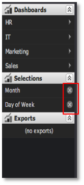

# Eliminar de selecciones{#removing-selections}

Las selecciones se pueden eliminar en cualquier momento.

Simplemente haga clic en el icono **[!UICONTROL X]** dentro del elemento de selecciones correspondiente en el menú de selecciones.

Si las selecciones de una visualización están bloqueadas, verá un pequeño icono de candado que sustituye al icono **[!UICONTROL X]**. Las selecciones bloqueadas no se pueden eliminar sin desbloquear primero la visualización.

