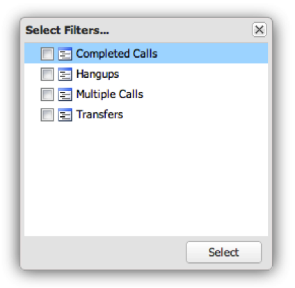

# Configuración de visualizaciones{#configuring-visualizations}

Muestra cómo configurar Título, Perfil, Dimension, Métrica, Filtro, Mostrar arriba, Ordenar por y Periodo de tiempo.

Cada visualización del lienzo del tablero tiene su propia configuración. Cuando se añade por primera vez una visualización al lienzo del panel, su ventana de configuración aparece automáticamente. Una vez configurada, la visualización se puede modificar en cualquier momento haciendo clic en el icono de engranaje en la parte superior derecha de la ventana de visualización.

>[!NOTE]
>
>Las opciones de configuración varían ligeramente según el tipo de visualización que se esté visualizando.

## Título de visualización {#section-0414844283d745ae912e85f8ea14a51d}

Este campo le permite personalizar el título que se muestra en la parte superior de la visualización. De forma predeterminada, el título se establece en **[!UICONTROL Automatic Title]**, que generará automáticamente un título para la ventana de visualización. Al borrar el botón **[!UICONTROL Automatic Title]**, puede colocar cualquier título en este campo. (Este campo se aplica a todas las visualizaciones).

## Perfil {#section-16eb0def0a2d4eb289f5bb9200d14754}

Este campo le permite seleccionar de qué perfil desea visualizar los datos. Al hacer clic en el menú desplegable, se le proporcionará una lista de perfiles a los que tiene acceso. (Este campo no se aplica a las visualizaciones de texto enriquecido).

Los perfiles son conjuntos de datos definidos dentro de Data Workbench que contienen datos sobre un dominio determinado, junto con las dimensiones, métricas y filtros que acompañan a los datos. Un perfil a menudo está diseñado para cumplir un propósito específico (como tráfico de sitio web o marketing).

>[!NOTE]
>
>Solo puede ver los perfiles a los que se le ha concedido acceso. Para obtener más información, consulte Controles de acceso.

## Dimensión {#section-4ebb8c4308a146c3a35c7ac7ab6b579f}

Permite seleccionar la dimensión que desea visualizar. La lista se rellena a partir de la lista de dimensiones disponibles del perfil seleccionado en el campo Perfil . Haga clic en la dimensión deseada y, a continuación, haga clic en el botón Seleccionar . (Este campo no es aplicable a las visualizaciones de Leyendas de métricas y Texto enriquecido).

Los Dimension son categorías de tipos de datos similares. Por ejemplo, la dimensión Días de la semana está compuesta por los siguientes elementos de datos: Domingo, lunes, martes, miércoles, jueves, viernes y sábado. Los Dimension muestran lo que se está midiendo.

## Métricas {#section-7d46f2f1b9fe4e539b5eb0a0dc6e5ad3}

Le permite seleccionar las métricas que desea visualizar. Las métricas son objetos cuantitativos y están definidas por alguna expresión cuantificable. Por ejemplo, Vistas de página por sesión se deriva de la expresión del recuento de Vistas de página dividido por el recuento de Sesiones. Las métricas responden a la pregunta &quot;¿cuántas?&quot;

Las visualizaciones de una sola métrica tienen una ventana de selección de una sola métrica:

Las visualizaciones multimétricas tienen una ventana de selección multimétrica:

La lista se rellena a partir de la lista de métricas disponibles en el perfil seleccionado en el campo Perfil .

Haga clic en las métricas deseadas y luego haga clic en **[!UICONTROL Select]**. (Este campo no se aplica a las visualizaciones de texto enriquecido).

## Filtros {#section-f8619ae2f8e54735a2c1b0fbb8bb1281}

Seleccione los filtros que desee aplicar a la visualización. La ventana de selección de filtros permite seleccionar varios filtros de la lista de filtros. La lista se rellena desde la lista de filtros disponibles del perfil seleccionado en el campo Perfil . Haga clic en el filtro deseado y, a continuación, haga clic en **[!UICONTROL Select]**.

>[!NOTE]
>
>Los filtros aplicados aquí solo se aplican a su visualización correspondiente, no a todo el panel. Esto resulta útil para comparar los resultados de dos visualizaciones diferentes con filtros aplicados diferentes.

## Mostrar tablas {#section-7ce71cb0fa6446998b710b427e68b133}

Las visualizaciones del panel no están diseñadas para mostrar la totalidad de los datos. En su lugar, permiten especificar el número de registros de dimensión que desea mostrar en la visualización. Esto muestra el número superior de dimensiones en función del valor de ordenación que se proporciona a continuación. (Este campo no es aplicable a las visualizaciones Tablas, Leyendas de métricas y Texto enriquecido).

## Ordenar por {#section-f686249e20444359bff87c00cc2ba29f}

Esto le permite especificar cómo se deben ordenar los datos cuando se muestran en la visualización. (Este campo no es aplicable a las visualizaciones Tablas, Leyendas de métricas y Texto enriquecido). Hay varias opciones de clasificación:

* **[!UICONTROL Default]** : Devuelve los datos sin ordenar en función del orden almacenado en Data Workbench. Esta es la opción que se utiliza para datos basados en tiempo, como hora, día, semana o mes.
* **[!UICONTROL Dimension]** -Ordene los datos en función del valor de dimensión alfanumérica.
* **[!UICONTROL Metric]** - Ordene los datos en función del valor de la métrica y sea útil para visualizar rápidamente las dimensiones principales.
* **[!UICONTROL Descending]** - Ordene los datos en orden descendente.
* **[!UICONTROL Ascending]** - Ordenar los datos en orden ascendente.

## Periodo {#section-6220368e9e524b46ac735add6ab9edb0}

Esta visualización le permite especificar la fecha de inicio o finalización deseada de los datos para mostrarlos en la visualización.

Al seleccionar **[!UICONTROL All Dates]**, se muestra todo el intervalo de fechas disponible en el perfil.

Al seleccionar **[!UICONTROL Range]** solo se muestran los datos que se encuentran dentro de un intervalo especificado. Para introducir el intervalo de fechas, puede escribir la fecha de inicio y/o final, o utilizar una entrada de calendario seleccionando el icono de calendario.

(Este campo no se aplica a las visualizaciones de texto enriquecido).

>[!NOTE]
>
>Los intervalos de fechas aplicados aquí solo se aplican a su visualización correspondiente, no al tablero completo. Esto resulta útil para comparar los resultados de dos visualizaciones diferentes con diferentes intervalos de fechas aplicados.

