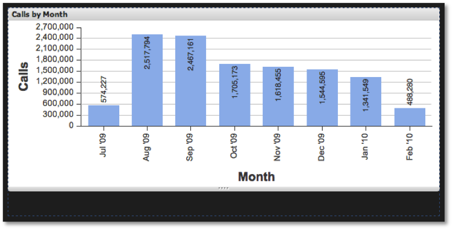

# Cambio de tamaño de las visualizaciones{#sizing-visualizations}

Además de expandir y contraer una visualización, también puede cambiar su tamaño.

Utilice el controlador de cambio de tamaño de la parte inferior de la ventana de visualización. Al pasar el ratón por encima del borde inferior de una ventana de visualización, puede hacer clic y arrastrar para que la ventana sea más alta o más corta en el lienzo del tablero. Cualquier otra visualización dentro del tablero se reposicionará automáticamente para ajustarse al nuevo tamaño de la visualización cambiada de tamaño. La anchura de la visualización es fija en relación con la anchura del explorador y no se puede manipular.

