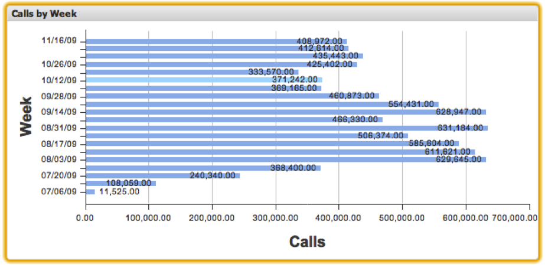

# Gráficos de barras{#bar-charts}

Las visualizaciones de gráficos de barras permiten visualizar datos de métricas y dimensiones con cada elemento de datos representado como una barra horizontal en el gráfico. Los gráficos de barras permiten mostrar hasta 200 elementos de datos únicos en el gráfico a la vez. Los valores de dimensión se etiquetan a lo largo del eje y, mientras que los incrementos de métrica se etiquetan a lo largo del eje x. La barra de cada valor de dimensión está etiquetada con su valor de métrica exacto.

