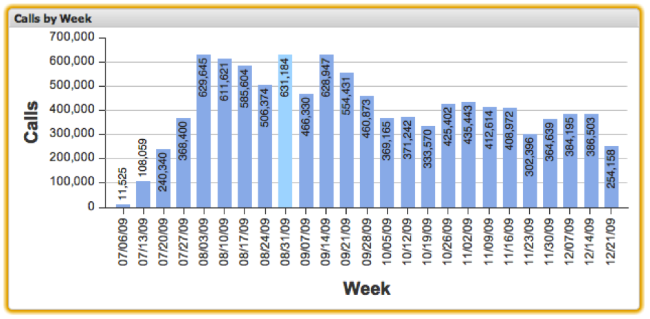

# Gráficos de columna{#column-charts}

Las visualizaciones de gráficos de columnas le permiten visualizar datos de métricas y dimensiones con cada elemento de datos representado como una columna vertical en el gráfico. Los gráficos de columnas permiten mostrar hasta 200 elementos de datos únicos en el gráfico a la vez. Los valores de dimensión se etiquetan a lo largo del eje x, mientras que los incrementos de métrica se etiquetan a lo largo del eje y. La columna de cada valor de dimensión está etiquetada con su valor de métrica exacto.

