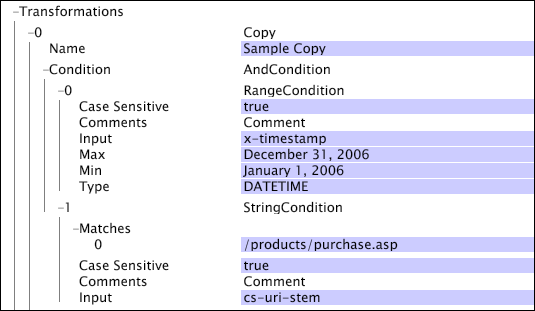

# Operaciones booleanas{#boolean-operations}

Las operaciones booleanas combinan los resultados de las operaciones de prueba, que funcionan como elementos secundarios de las operaciones booleanas.

Para obtener información sobre las operaciones de prueba, consulte [Operaciones de prueba](../../../../home/c-dataset-const-proc/c-conditions/c-test-ops/c-test-ops.md#concept-c4bf6cb9e7a94cc7ac49ca9b0b1a2144). Al definir una operación [!DNL boolean], puede definir cero o más elementos secundarios para la operación.

**Adición de una condición secundaria a una operación booleana**

1. Haga clic con el botón derecho en el nombre o en el número correspondiente a la operación [!DNL Boolean].
1. Haga clic en **[!UICONTROL Add new child]** y elija uno de los tipos de condición disponibles para agregar.
1. Repita los pasos 1 y 2 hasta que haya agregado todas las condiciones secundarias deseadas para la operación [!DNL Boolean].

   >[!NOTE]
   >
   >Al hacer clic con el botón derecho en el nombre o en el número correspondiente a una operación [!DNL Boolean], aparece la opción de menú [!DNL Add new sibling]. Un elemento secundario es otra condición en la misma posición relativa en la jerarquía de condiciones que la operación [!DNL Boolean] en la que hizo clic con el botón derecho. Añadir un nuevo elemento secundario para una operación [!DNL Boolean] es lo mismo que añadir una nueva condición haciendo clic con el botón derecho en el parámetro [!DNL Condition] o [!DNL Log Entry Condition].

**Para quitar una condición secundaria de una operación booleana:**

1. Haga clic con el botón derecho en el nombre de la condición secundaria o en el número correspondiente a la condición secundaria que desea eliminar de la operación [!DNL Boolean].
1. Haga clic en **[!UICONTROL Remove]** &lt;* **[!UICONTROL #number]***>, donde número es el número correspondiente a la condición secundaria que desea eliminar.

Esta sección trata sobre las siguientes condiciones:

* [Y](../../../../home/c-dataset-const-proc/c-conditions/c-test-ops/c-boolean-ops.md#section-a14dba4b07cc4ab9aeb20868f773db7c)
* [Ni](../../../../home/c-dataset-const-proc/c-conditions/c-test-ops/c-boolean-ops.md#section-7e48b61266aa43ecbc48b979bf5e939b)
* [O](../../../../home/c-dataset-const-proc/c-conditions/c-test-ops/c-boolean-ops.md#section-a3aa0f56b6234f2680fa81939228326b)

## Y {#section-a14dba4b07cc4ab9aeb20868f773db7c}

La condición [!DNL And] puede tener cero o más condiciones secundarias y devuelve el valor &quot;True&quot; cuando ninguno de sus nodos secundarios devuelve el valor &quot;False&quot;.

La condición [!DNL And] forma la operación raíz de todas las pruebas de condición dentro del servidor de Data Workbench. Si la condición [!DNL And] no contiene elementos secundarios, la condición se evalúa como verdadera y se ejecuta la operación asociada. Por este motivo, las acciones que solo tienen la condición [!DNL And] como prueba de condición siempre se ejecutan y por qué se utilizan como raíz para todas las pruebas de condición.

Este ejemplo muestra cómo se utiliza una condición [!DNL And] para asegurarse de que la transformación [!DNL Copy] se produce cuando solo la fecha de la entrada de registro se produjo en el año 2006 y que la página solicitada era [!DNL /products/purchase.asp].

## Ni {#section-7e48b61266aa43ecbc48b979bf5e939b}

La condición [!DNL Neither] puede tener cero o más condiciones secundarias y devuelve el valor false si alguna de sus condiciones secundarias se evalúa como verdadera. Si la condición [!DNL Neither] no contiene elementos secundarios, ninguno de sus elementos secundarios puede devolver el valor &quot;True&quot;. Como resultado, la condición [!DNL Neither] se evalúa como verdadera.

El siguiente ejemplo muestra una condición [!DNL Neither] con dos condiciones [!DNL Range] como secundarias. Como se define, la condición [!DNL Neither] excluye las entradas de registro que se produjeron entre el 1 de enero de 2007 y el 10 de enero de 2007 o durante el período comprendido entre el 12 de enero de 2007 y el 14 de enero de 2007. Tal condición podría utilizarse como [!DNL Log Entry Condition] para eliminar transacciones de un conjunto de datos durante periodos en los que hubo un problema conocido con los datos recopilados.

## O {#section-a3aa0f56b6234f2680fa81939228326b}

La condición [!DNL Or] puede tener cero o más condiciones secundarias y devuelve el valor &quot;True&quot; si al menos una de sus condiciones secundarias se evalúa como &quot;True&quot;. Si la condición [!DNL Or] no contiene elementos secundarios, ninguno de sus elementos secundarios puede devolver el valor &quot;True&quot;. Como resultado, la condición [!DNL Or] se evalúa como falsa.

Este ejemplo muestra la condición [!DNL Or] con una condición [!DNL String Match] y una condición [!DNL Range] como elementos secundarios. La condición [!DNL Or] solo se cumple si la entrada de registro tiene el valor [!DNL x-hasproblem] establecido en sí o la entrada de registro se produjo durante el intervalo de tiempo comprendido entre el 1 de enero de 2007 y el 10 de enero de 2007.

