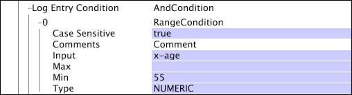

# Condiciones de las operaciones de prueba{#test-operation-conditions}

Información sobre las condiciones de operación de prueba, incluidas la comparación, no vacío, intervalo, expresión regular y coincidencia de cadenas.

* [Comparar](../../../../home/c-dataset-const-proc/c-conditions/c-test-ops/c-test-op-con.md#section-fb2bdb3838504099b324b9838cdeeaac)
* [No vacío](../../../../home/c-dataset-const-proc/c-conditions/c-test-ops/c-test-op-con.md#section-1decb9d887894073a1b6b3d985729ac8)
* [Intervalo](../../../../home/c-dataset-const-proc/c-conditions/c-test-ops/c-test-op-con.md#section-1db31583bb09418b8f49481a897b08a6)
* [Expresión regular](../../../../home/c-dataset-const-proc/c-conditions/c-test-ops/c-test-op-con.md#section-ae9c016502cb44128760c58f2d2d5297)
* [Coincidencia de cadena](../../../../home/c-dataset-const-proc/c-conditions/c-test-ops/c-test-op-con.md#section-f8d132085c6b4500bfbe4515b848142f)

## Comparar {#section-fb2bdb3838504099b324b9838cdeeaac}

La condición [!DNL Compare] compara valores numéricos o de cadena. Para comparaciones de valores de cadena, puede especificar si se deben tener en cuenta las mayúsculas y minúsculas.

Los parámetros de la condición [!DNL Compare] se describen en la siguiente tabla:

<table id="table_05B1FBB2AED242D99081E62BE2FBEC60"> 
 <thead> 
  <tr> 
   <th colname="col1" class="entry"> Parámetro </th> 
   <th colname="col2" class="entry"> Descripción </th> 
   <th colname="col3" class="entry"> Predeterminado </th> 
  </tr> 
 </thead>
 <tbody> 
  <tr> 
   <td colname="col1"> Distinción entre mayúsculas y minúsculas </td> 
   <td colname="col2">Verdadero o falso. Solo se usa si el Tipo es  LEXICAL. Si se establece en false, las mayúsculas y minúsculas se consideran iguales. </td> 
   <td colname="col3"> true </td> 
  </tr> 
  <tr> 
   <td colname="col1"> Comentarios </td> 
   <td colname="col2"> Opcional. Notas sobre la condición. </td> 
   <td colname="col3"> Comentarios </td> 
  </tr> 
  <tr> 
   <td colname="col1"> Entrada A </td> 
   <td colname="col2"> El primero de los dos valores que se va a comparar. Este valor representa el operando izquierdo de la condición. </td> 
   <td colname="col3"> </td> 
  </tr> 
  <tr> 
   <td colname="col1"> Entrada B </td> 
   <td colname="col2"> El segundo de los dos valores que se va a comparar. Este valor representa el operando derecho en la condición. </td> 
   <td colname="col3"> </td> 
  </tr> 
  <tr> 
   <td colname="col1"> Operación </td> 
   <td colname="col2"> 
La operación de comparación. Las operaciones disponibles (y sus significados) son las siguientes: 
     <ul id="ul_74F3C298E9CC4FE89897BA0052A9EB9F"> 
      <li id="li_1605FA73474E404A84056D40E7082623"> = o == (Entrada A igual a Entrada B) </li> 
      <li id="li_F694A262ED7A4787B2A68B877339620C"> &lt;&gt; O bien != (la entrada A no es igual a la entrada B) </li> 
      <li id="li_1A75437E23B64BEB92297E1C771092B0"> &lt;&gt; </li> 
      <li id="li_B80ED6BE9DEA41FE84BC6BA3B7759276"> &lt;&gt; </li> 
      <li id="li_93148F34065F489E8E198DFB9F9F0E70"> &gt; (la entrada A es buena que la entrada B) </li> 
      <li id="li_8A98EE9AED2445429805169040BB253D"> &gt;= (la entrada A es buena o igual a la entrada B) </li> 
     </ul> 
 </td> 
   <td colname="col3"> = </td> 
  </tr> 
  <tr> 
   <td colname="col1"> Tipo </td> 
   <td colname="col2">Tipo de comparación que se va a realizar. Los tipos disponibles son  LEXICAL,  NUMÉRICA y  DATETIME. Para obtener descripciones de los tipos, consulte <a href="../../../../home/c-dataset-const-proc/c-conditions/c-test-ops/c-test-types.md#concept-a9fca97a2f03464cb0cbab8b5f809d0a"> Tipos de pruebas para operaciones de prueba</a>. </td> 
   <td colname="col3">  LEXICAL </td> 
  </tr> 
 </tbody> 
</table>

Este ejemplo utiliza una condición [!DNL Compare] para definir el [!DNL Log Entry Condition]. A medida que el servidor de Data Workbench lee cada registro de datos de evento, compara los valores numéricos x-age y 55. Si para una entrada de registro determinada, x-age es menor o igual que 55, la entrada de registro se incluye en el proceso de construcción del conjunto de datos.

## No vacío {#section-1decb9d887894073a1b6b3d985729ac8}

La condición [!DNL Not Empty] comprueba un campo para ver si contiene un valor o está vacío. La condición se cumple para cualquier entrada de registro cuyo valor para el campo [!DNL Input] no esté vacío.

Los parámetros de la condición [!DNL Not Empty] se describen en la siguiente tabla:

| Parámetro | Descripción | Predeterminado |
|---|---|---|
| Comentarios | Opcional. Notas sobre la condición. | Comentarios |
| Entrada | Nombre del campo de la entrada de registro para comprobar si hay contenido. |  |

Este ejemplo toma como entrada x-some-field y prueba si el campo no está vacío. La condición se cumple si se rellena el campo.

## Intervalo {#section-1db31583bb09418b8f49481a897b08a6}

La condición [!DNL Range] toma un campo de entrada y determina si el valor de ese campo se encuentra, de forma inclusiva, dentro de los valores de parámetro mínimos (Min) y máximos (Max) dados.

Los parámetros de la condición [!DNL Range] se describen en la siguiente tabla:

<table id="table_1587D8D333804FC28024C0DFC2F2D4D3"> 
 <thead> 
  <tr> 
   <th colname="col1" class="entry"> Parámetro </th> 
   <th colname="col2" class="entry"> Descripción </th> 
   <th colname="col3" class="entry"> Predeterminado </th> 
  </tr> 
 </thead>
 <tbody> 
  <tr> 
   <td colname="col1"> Distinción entre mayúsculas y minúsculas </td> 
   <td colname="col2">Verdadero o falso. Solo se usa si el  Tipo es  LEXICAL. Si se establece en false, las mayúsculas y minúsculas se consideran iguales. </td> 
   <td colname="col3"> true </td> 
  </tr> 
  <tr> 
   <td colname="col1"> Comentarios </td> 
   <td colname="col2"> Opcional. Notas sobre la condición. </td> 
   <td colname="col3"> Comentarios </td> 
  </tr> 
  <tr> 
   <td colname="col1"> Entrada </td> 
   <td colname="col2"> Nombre del campo de la entrada de registro que se utilizará como entrada. </td> 
   <td colname="col3"> </td> 
  </tr> 
  <tr> 
   <td colname="col1"> Mínimo </td> 
   <td colname="col2"> 
Límite inferior del rango. 
 
 El valor de este parámetro debe ser un valor literal o una cadena, no un nombre de campo. Si utiliza una fecha para este campo, debe especificar una zona horaria. Para obtener una lista de abreviaciones de zona horaria admitidas, consulte <a href="../../../../home/c-dataset-const-proc/c-time-zone.md#concept-9b540ec3e770490d94e9d5a985765477"> Códigos de zona horaria</a>. 
 </td> 
   <td colname="col3"> </td> 
  </tr> 
  <tr> 
   <td colname="col1"> Máximo </td> 
   <td colname="col2"> 
Límite superior del rango. 
 
 
Nota: El valor de este parámetro debe ser un valor literal o una cadena, no un nombre de campo. Si utiliza una fecha para este campo, debe especificar una zona horaria. Para obtener una lista de abreviaciones de zona horaria admitidas, consulte <a href="../../../../home/c-dataset-const-proc/c-time-zone.md#concept-9b540ec3e770490d94e9d5a985765477"> Códigos de zona horaria</a>. 
 
 </td> 
   <td colname="col3"> </td> 
  </tr> 
  <tr> 
   <td colname="col1"> Tipo </td> 
   <td colname="col2">Tipo de comparación que se va a realizar. Los tipos disponibles son  LEXICAL,  NUMÉRICA y  DATETIME. Para obtener descripciones de los tipos, consulte <a href="../../../../home/c-dataset-const-proc/c-conditions/c-test-ops/c-test-types.md#concept-a9fca97a2f03464cb0cbab8b5f809d0a"> Tipos de pruebas para operaciones de prueba</a>. </td> 
   <td colname="col3"> </td> 
  </tr> 
 </tbody> 
</table>

Este ejemplo utiliza una condición [!DNL Range] para definir el [!DNL Log Entry Condition]. A medida que el servidor de Data Workbench lee cada registro [!DNL event data], compara los valores numéricos x-age y 55. Si para una entrada de registro determinada, x-age tiene al menos 55 años, la entrada de registro se incluye en el proceso de construcción del conjunto de datos. Este ejemplo realiza la misma función que el ejemplo de condición [!DNL Compare]. Consulte [Comparar](../../../../home/c-dataset-const-proc/c-conditions/c-test-ops/c-test-op-con.md#section-fb2bdb3838504099b324b9838cdeeaac).

>[!NOTE]
>
>Si el parámetro Min o Max se deja en blanco, el servidor de Data Workbench sustituye los valores de entero mínimo o máximo disponibles. El valor mínimo es cero (0) y el valor máximo es infinito.

## Expresión regular {#section-ae9c016502cb44128760c58f2d2d5297}

La prueba de condición [!DNL Regular Expression] utiliza la coincidencia de patrones de expresiones regulares (consulte [Expresiones regulares](../../../../home/c-dataset-const-proc/c-reg-exp.md#concept-070077baa419475094ef0469e92c5b9c)) para determinar si el valor del campo de entrada especificado contiene una cadena que coincide con uno de los patrones especificados en el parámetro Coincide.

Si la entrada es un vector de cadenas, solo se utiliza el primer valor del vector para la prueba. La condición [!DNL Regular Expression] realiza comparaciones de cadenas completas. Si desea identificar subcadenas, debe anteponer y anexar &quot;.*&quot; a la cadena.

Los parámetros de la condición [!DNL Regular Expression] se describen en la siguiente tabla:

<table id="table_0BF5F89F87C9493B8DABA97620074FAD"> 
 <thead> 
  <tr> 
   <th colname="col1" class="entry"> Parámetro </th> 
   <th colname="col2" class="entry"> Descripción </th> 
   <th colname="col3" class="entry"> Predeterminado </th> 
  </tr> 
 </thead>
 <tbody> 
  <tr> 
   <td colname="col1"> Distinción entre mayúsculas y minúsculas </td> 
   <td colname="col2"> Verdadero o falso. Si se establece en false, las mayúsculas y minúsculas se consideran iguales. </td> 
   <td colname="col3"> true </td> 
  </tr> 
  <tr> 
   <td colname="col1"> Comentarios </td> 
   <td colname="col2"> Opcional. Notas sobre la condición. </td> 
   <td colname="col3"> Comentarios </td> 
  </tr> 
  <tr> 
   <td colname="col1"> Entrada </td> 
   <td colname="col2"> Nombre del campo de la entrada de registro que se utilizará como entrada. </td> 
   <td colname="col3"> </td> 
  </tr> 
  <tr> 
   <td colname="col1"> Coincide </td> 
   <td colname="col2"> 
Patrones de expresión regular que coinciden con el valor del campo de entrada. 
 
 <b> Adición de un patrón de expresión regular</b> 
     <ol id="ol_6D6467FF74334DEA8E8625C3B155D11D"> 
      <li id="li_9E13A63558FF44749C2E49BD50B7F770">Haga clic con el botón derecho en  Coincide. </li> 
      <li id="li_195A2F3B6B9442F5B1DACDE0FC96CE5C">Haga clic en  Agregar nueva &gt;  Expresión regular. </li> 
      <li id="li_225E98F8EF39426A9483B86EA2CFE6DF">Introduzca la expresión regular que desee en el cuadro de texto. </li> 
     </ol> 
 </td> 
   <td colname="col3"> </td> 
  </tr> 
 </tbody> 
</table>

Este ejemplo ilustra el uso de la condición [!DNL Regular Expression] para que coincida con un campo de datos recopilados del tráfico del sitio web. La condición devuelve el valor &quot;True&quot; solo si el campo cs(referrer-query) contiene una cadena que coincide con la expresión regular `campaign=C[1-9][0-9]{4}`. Esta expresión regular coincide con cualquier cadena que contenga `campaign=C12345`. Sin embargo, el patrón no coincidiría con la cadena `campaign=C0123&` porque el primer carácter después de `C` no está dentro del rango `1-9`.

## Coincidencia de cadena {#section-f8d132085c6b4500bfbe4515b848142f}

La condición [!DNL String Match] prueba la igualdad de cadenas. Toma un campo especificado como entrada y prueba el valor de ese campo en cada entrada de registro con las cadenas especificadas en el parámetro Matches de la operación. Si alguna de estas cadenas de coincidencia que distinguen entre mayúsculas y minúsculas es la misma que el valor del campo de entrada proporcionado, la operación devuelve el valor &quot;True&quot;. Si el [!DNL StringCondition] no contiene cadenas de coincidencia, la condición devuelve el valor &quot;False&quot;. Si la entrada es un vector de cadenas, solo se utiliza el primer valor (cadena) del vector para la prueba.

<table id="table_BD599BAA5DD54B278813B6C38AC8DE6B"> 
 <thead> 
  <tr> 
   <th colname="col1" class="entry"> Parámetro </th> 
   <th colname="col2" class="entry"> Descripción </th> 
   <th colname="col3" class="entry"> Predeterminado </th> 
  </tr> 
 </thead>
 <tbody> 
  <tr> 
   <td colname="col1"> Distinción entre mayúsculas y minúsculas </td> 
   <td colname="col2"> Verdadero o falso. Si se establece en false, las mayúsculas y minúsculas se consideran iguales. </td> 
   <td colname="col3"> true </td> 
  </tr> 
  <tr> 
   <td colname="col1"> Comentarios </td> 
   <td colname="col2"> Opcional. Notas sobre la condición. </td> 
   <td colname="col3"> Comentarios </td> 
  </tr> 
  <tr> 
   <td colname="col1"> Entrada </td> 
   <td colname="col2"> Nombre del campo de la entrada de registro que se utilizará como entrada. </td> 
   <td colname="col3"> </td> 
  </tr> 
  <tr> 
   <td colname="col1"> Coincide </td> 
   <td colname="col2"> 
Las cadenas que deben coincidir con el valor del campo de entrada. 
 
 <b>Para agregar una cadena</b> 
     <ol id="ol_9E32218C771445D88357960475FAD6EB"> 
      <li id="li_A700747858D0470491783E9B3933DAFE">Haga clic con el botón derecho en  Coincide. </li> 
      <li id="li_9D1A2462EA404B0F84426176737CAFED">Haga clic en  Agregar nueva &gt;  Cadena. </li> 
      <li id="li_E84D2439B59548E5B1803C64A295A18E">Introduzca la cadena deseada en el cuadro de texto. </li> 
     </ol> 
 </td> 
   <td colname="col3"> </td> 
  </tr> 
 </tbody> 
</table>

Este ejemplo utiliza datos recopilados del tráfico del sitio web para ilustrar el uso de la condición [!DNL String Match]. La condición comprueba si el campo de entrada (cs-uri-stem) coincide con cualquiera de las dos cadenas especificadas en el parámetro Matches y si el campo cs-uri-stem es la cadena exacta [!DNL /navigation/footer.asp] o la cadena exacta [!DNL /navigation/header.asp].

