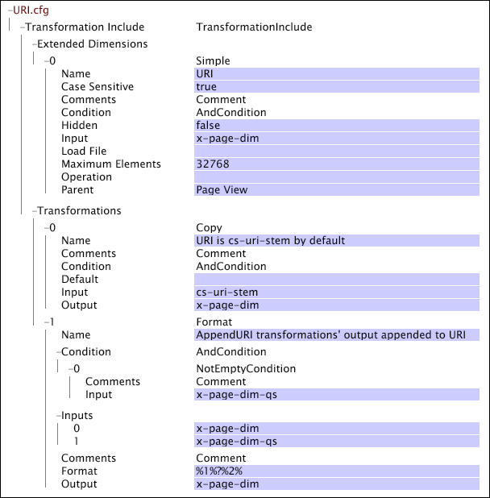
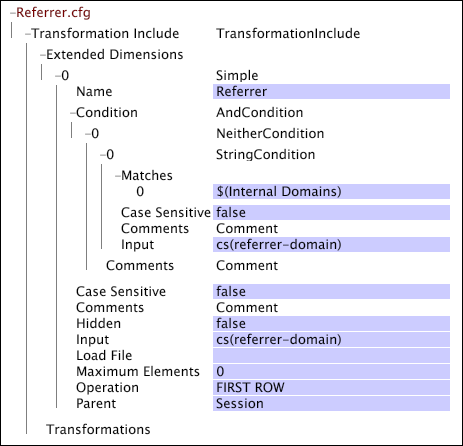

# Configuración específica de web para la transformación{#web-specific-settings-for-transformation}

Información sobre la configuración específica de la web que se definen en Conjuntos de datos de transformación Incluir archivos que se entregan con perfiles de Adobe para el sitio.

Las condiciones, dimensiones y parámetros definidos por esta configuración se crean durante la fase de transformación de la construcción del conjunto de datos.

* [Condición de vista de página](../../../home/c-dataset-const-proc/c-config-web-data/c-web-spec-transf.md#section-cc2807a12a88492f8b64a43234a1f835)
* [Dimension URI](../../../home/c-dataset-const-proc/c-config-web-data/c-web-spec-transf.md#section-348f7e9099d049d197a7cdcbc8a6c234)
* [Dimension del referente](../../../home/c-dataset-const-proc/c-config-web-data/c-web-spec-transf.md#section-8a97ec34d18b4814b5f95495ac4f8638)
* [Parámetros de sesión](../../../home/c-dataset-const-proc/c-config-web-data/c-web-spec-transf.md#section-0a209b0c504041a5801f7f71a963c8b1)

## Condición de vista de página {#section-cc2807a12a88492f8b64a43234a1f835}

El [!DNL Page View Condition] es una operación de condición que determina si una entrada de registro determinada (es decir, una solicitud de página) debe incluirse en los datos recopilados sobre el historial de vistas de página de un visitante. Cuando la entrada de registro cumple con el [!DNL Page View Condition], se convierte en un elemento de la dimensión contable Vista de página . Si una entrada de registro no cumple con [!DNL Page View Condition], otras dimensiones siguen pudiendo acceder a sus campos de datos. Además de la dimensión Vista de página , los resultados de [!DNL Page View Condition] pueden afectar a las siguientes dimensiones:

* **[!DNL URI]y  [!DNL Page]:** Estas dimensiones se ven directamente afectadas por el  [!DNL Page View Condition]. Si la página dada no pasa el [!DNL Page View Condition,], no se incluye en las dimensiones URI o de página.

* **[!DNL Visitor Page Views]y  [!DNL Session Page Views]:** las dimensiones Vistas de página del visitante y Vistas de página de sesión son un recuento del número de páginas que vio un visitante en una sesión determinada o en una sesión determinada, respectivamente. Las páginas filtradas por [!DNL Page View Condition] no forman parte de este recuento.

* **Número de sesión:** El  [!DNL Page View Condition] tiene un efecto indirecto en la dimensión Número de sesión. La dimensión Número de sesión se crea antes de [!DNL Page View Condition]; por lo tanto, al considerar [!DNL Session Number] en relación con el [!DNL Page Views], es posible tener sesiones sin vistas de página.

La implementación predeterminada de [!DNL Site] incluye un archivo [!DNL Transformation Dataset Include] en el que se definen la dimensión contable de vista de página y el [!DNL Page View Condition] relacionado.

Para obtener información sobre las dimensiones contables, consulte [Dimension extendidos](../../../home/c-dataset-const-proc/c-ex-dim/c-abt-ex-dim.md).

**Para editar los ajustes de configuración de la condición de vista de página**

1. Abra [!DNL Profile Manager] en el perfil del conjunto de datos y abra el archivo [!DNL Dataset\Transformation\Traffic\Page View.cfg] .

   >[!NOTE]
   >
   >Si ha personalizado la implementación de [!DNL Site], el archivo en el que existen estos ajustes de configuración puede diferir de la ubicación descrita.

1. Revise o edite los valores de los parámetros de [!DNL Page View Condition] según sea necesario. Utilice el siguiente ejemplo como guía. En este archivo, el [!DNL Page View Condition] se define mediante una transformación [!DNL Copy]. Tenga en cuenta que este archivo también contiene la definición de la dimensión contable Vista de página .

   

   >[!NOTE]
   >
   >Para obtener información sobre las dimensiones contables, consulte [Dimension extendidos](../../../home/c-dataset-const-proc/c-ex-dim/c-abt-ex-dim.md). Para obtener información sobre la transformación [!DNL Copy], consulte [Transformaciones de datos](../../../home/c-dataset-const-proc/c-data-trans/c-abt-transf.md).

1. Guarde el archivo haciendo clic con el botón derecho **[!UICONTROL (modified)]** en la parte superior de la ventana y luego haga clic en **[!UICONTROL Save]**.

1. Para que los cambios realizados localmente surtan efecto, en [!DNL Profile Manager], haga clic con el botón derecho en la marca de verificación del archivo en la columna [!DNL User] y, a continuación, haga clic en **[!UICONTROL Save to]** > *&lt;**[!UICONTROL profile name]**>*, donde el nombre del perfil es el nombre del perfil del conjunto de datos o del perfil heredado al que pertenece el archivo de inclusión del conjunto de datos.

   >[!NOTE]
   >
   >No guarde el archivo de configuración modificado en ninguno de los perfiles internos proporcionados por Adobe, ya que los cambios se sobrescriben al instalar actualizaciones en estos perfiles.

## Dimension URI {#section-348f7e9099d049d197a7cdcbc8a6c234}

Si está trabajando con [!DNL Site], debe definir la dimensión URI cuyos elementos sean los datos URI de las páginas del sitio web visitadas. La implementación predeterminada incluye un archivo [!DNL Transformation Dataset Include] en el que se define la dimensión simple de URI.

Para obtener información sobre dimensiones simples, consulte [Dimension extendidos](../../../home/c-dataset-const-proc/c-ex-dim/c-abt-ex-dim.md).

**Para editar los ajustes de configuración de la dimensión URI**

1. Abra [!DNL Profile Manager] en el perfil del conjunto de datos y abra el archivo [!DNL Dataset\Transformation\Traffic\URI.cfg] .

   >[!NOTE]
   >
   >Si ha personalizado la implementación de [!DNL Site], el archivo en el que existen estos ajustes de configuración puede diferir de la ubicación descrita.

1. Revise o edite los valores de los parámetros del archivo como desee. Utilice el siguiente ejemplo e información como guías.

Los ajustes de configuración de la dimensión URI incluyen los dos parámetros siguientes:

* **Distinción entre mayúsculas y minúsculas:** True o false. Si es verdadero, se tiene en cuenta el caso de la letra (superior/inferior) al identificar páginas únicas. El valor predeterminado es true.
* **Máximo de elementos:** el número máximo de elementos (es decir, URI) para la dimensión URI. El valor predeterminado es 32768.

   >[!NOTE]
   >
   >Cambiar este valor puede causar problemas graves de rendimiento. No cambie este valor sin consultar el Adobe.

* Guarde el archivo [!DNL URI.cfg] haciendo clic con el botón derecho en **[!UICONTROL (modified)]** en la parte superior de la ventana y, a continuación, haga clic en **[!UICONTROL Save]**.

* Para que los cambios realizados localmente surtan efecto, en [!DNL Profile Manager], haga clic con el botón derecho en la marca de verificación del archivo en la columna [!DNL User] y, a continuación, haga clic en **[!UICONTROL Save to]** > *&lt;**[!UICONTROL profile name]**>*, donde el nombre del perfil es el nombre del perfil del conjunto de datos o del perfil heredado al que pertenece el archivo de inclusión del conjunto de datos.

   >[!NOTE]
   >
   >No guarde el archivo de configuración modificado en ninguno de los perfiles internos proporcionados por Adobe, ya que los cambios se sobrescriben al instalar actualizaciones en estos perfiles.

## Dimension de referente {#section-8a97ec34d18b4814b5f95495ac4f8638}

Si está trabajando con [!DNL Site], debe definir la dimensión Referente cuyos elementos consistan en los dominios de segundo nivel de los referentes de las primeras entradas de registro en todas las sesiones. La implementación predeterminada incluye un archivo [!DNL Transformation Dataset Include] en el que se define la dimensión simple del referente.

Para obtener información sobre dimensiones simples, consulte [Dimension extendidos](../../../home/c-dataset-const-proc/c-ex-dim/c-abt-ex-dim.md).

**Para editar los ajustes de configuración de la dimensión Referente**

1. Abra [!DNL Profile Manager] en el perfil del conjunto de datos y abra el archivo [!DNL Dataset\Transformation\Traffic\Referrer.cfg] .

   >[!NOTE]
   >
   >Si ha personalizado la implementación de [!DNL Site], el archivo en el que existen estos ajustes de configuración puede diferir de la ubicación descrita.

1. Revise o edite los valores de los parámetros del archivo como desee. Utilice el siguiente ejemplo e información como guías.

   

   Los ajustes de configuración de la dimensión Referente incluyen el parámetro Maximum Elements , que especifica el número máximo de elementos (es decir, referentes) para la dimensión Referente. El valor predeterminado es 32768.

   >[!NOTE]
   >
   >En el ejemplo anterior, el parámetro [!DNL Maximum Elements] se establece en 0. Cuando este parámetro se establece en 0, el servidor de Data Workbench utiliza su valor predeterminado interno de 32768.

1. Guarde el archivo [!DNL Referrer.cfg] haciendo clic con el botón derecho en **[!UICONTROL (modified)]** en la parte superior de la ventana y, a continuación, haga clic en **[!UICONTROL Save]**.

1. Para que los cambios realizados localmente surtan efecto, en [!DNL Profile Manager], haga clic con el botón derecho en la marca de verificación del archivo en la columna [!DNL User] y, a continuación, haga clic en **[!UICONTROL Save to]** > *&lt;**[!UICONTROL profile name]**>*, donde el nombre del perfil es el nombre del perfil del conjunto de datos o del perfil heredado al que pertenece el archivo de inclusión del conjunto de datos.

   >[!NOTE]
   >
   >No guarde el archivo de configuración modificado en ninguno de los perfiles internos proporcionados por Adobe, ya que los cambios se sobrescriben al instalar actualizaciones en estos perfiles.

## Parámetros de sesión {#section-0a209b0c504041a5801f7f71a963c8b1}

Si está trabajando con [!DNL Site], puede especificar parámetros que definan los límites de la sesión de un visitante en un sitio web. Estos parámetros solo son válidos cuando se definen en un archivo [!DNL Transformation Dataset Include] dentro de la implementación [!DNL Site].

Los siguientes parámetros son únicos, ya que pueden ser miembros del vector [!DNL Transformation Dataset Include] del archivo [!DNL Parameters] o pueden enumerarse como parámetros individuales en el archivo [!DNL Transformation.cfg]. Un parámetro se puede definir exactamente una vez, por lo que estos parámetros se definen en el archivo [!DNL Transformation.cfg]o en el vector [!DNL Parameters] del archivo de inclusión del conjunto de datos, no en ambos archivos.
**Duración máxima de sesión y tiempo de espera de sesión**

La duración máxima de sesión y el tiempo de espera de sesión son parámetros de cadena que definen la duración de la sesión de un visitante. Estos parámetros funcionan con el parámetro Dominios internos para determinar la duración de la sesión.

Duración máxima de sesión especifica la duración más larga de la sesión antes de que se inicie una nueva sesión. Esto evita que las páginas web con contenido automático se actualicen desde la creación de sesiones que son arbitrariamente largas. Si el referente de un clic se establece en una de las entradas del parámetro Dominios internos , este tiempo de espera se utiliza para definir el final de una sesión. Ninguna sesión puede ser superior a la duración máxima de sesión especificada independientemente de la cantidad de clics que contenga. El valor recomendado es de 48 horas.

Tiempo de espera de sesión especifica el tiempo que debe transcurrir entre las entradas de registro de un visitante determinado para determinar el final de una sesión y el inicio de una nueva (es decir, el tiempo de espera habitual que se utiliza para definir una sesión de usuario). El valor recomendado de este parámetro es de 30 minutos. Si el referente de un clic no está establecido en uno de los referentes del parámetro Dominios internos , se utiliza este tiempo de espera para definir la sesión. Si cs(referrer-domain) para una entrada de registro está en la lista de dominios internos, la duración máxima de la sesión determina si la entrada de registro actual es parte de una sesión existente o el inicio de una nueva sesión.

Considere una situación en la que se llama a un visitante desde su equipo durante un período de tiempo superior al tiempo de espera de sesión mientras navega por el sitio. Al regresar, continúa explorando donde lo dejó. Dado que el visitante nunca abandona el sitio o cierra su explorador, el cs(dominio del referente) de su siguiente clic es el mismo que el dominio interno y su sesión original permanece activa mientras no se alcance la configuración Duración máxima de sesión . Si el dominio del sitio aparece como un dominio interno y no se alcanza el tiempo de espera máximo, la interacción del visitante aparece como una sola sesión y no como dos sesiones independientes. Sin embargo, si el visitante regresa a su equipo y el siguiente clic tiene un referente externo (o en blanco), se inicia una nueva sesión.

>[!NOTE]
>
>La [!DNL Sessionize] transformación [!DNL Timeout Condition] también influye en la determinación de la duración de la sesión de un visitante. Si no se aplican el tiempo de espera de sesión y la duración máxima de sesión, se comprueba el [!DNL Timeout Condition] para determinar si una entrada de registro debe considerarse el inicio de una nueva sesión. Para obtener más información, consulte [Transformaciones de datos](../../../home/c-dataset-const-proc/c-data-trans/c-abt-transf.md).

**Para editar los parámetros de Duración máxima de sesión y Tiempo de espera de sesión**

Si está trabajando con [!DNL Site], es probable que la implementación predeterminada incluya un archivo [!DNL Transformation Dataset Include] en el que se especifiquen los nombres y los valores recomendados de estos parámetros.

1. Abra [!DNL Profile Manager] dentro del perfil del conjunto de datos y vaya a [!DNL Dataset\Transformation\Traffic\Session Parameters.cfg].

   >[!NOTE]
   >
   >Si ha personalizado la implementación de [!DNL Site], el archivo en el que se definen estos parámetros puede diferir de la ubicación descrita.

1. Edite los valores de los parámetros como desee. Asegúrese de especificar las unidades deseadas (minutos, horas, etc.).

   

1. Guarde el archivo [!DNL Session Parameters.cfg] haciendo clic con el botón derecho en **[!UICONTROL (modified)]** en la parte superior de la ventana y haciendo clic en **[!UICONTROL Save]**.

1. Para que los cambios realizados localmente surtan efecto, en [!DNL Profile Manager], haga clic con el botón derecho en la marca de verificación del archivo en la columna [!DNL User] y, a continuación, haga clic en **[!UICONTROL Save to]** > **[!UICONTROL profile name]**, donde el nombre del perfil es el nombre del perfil del conjunto de datos o del perfil heredado al que pertenece el archivo de inclusión del conjunto de datos.

   >[!NOTE]
   >
   >No guarde el archivo de configuración modificado en ninguno de los perfiles internos proporcionados por Adobe, ya que los cambios se sobrescriben al instalar actualizaciones en estos perfiles.

**[!DNL Internal Domains]**

[!DNL Internal Domains] es un parámetro vectorial que enumera los hosts de nivel de dominio (referentes internos) que deben tratarse como parte de un sitio web en particular. Estos hosts se eliminan de la dimensión del referente (que es una lista de la información del referente externo). Cuando cs(referrer-domain) coincide con cualquiera de las cadenas enumeradas en el conjunto de dominios internos, se ignora el tiempo de espera de sesión y se utiliza la duración máxima de sesión para determinar la duración de la sesión.

El parámetro Dominios internos también se puede usar para evitar el inicio de una nueva sesión cuando los visitantes se desplazan entre los múltiples dominios de una empresa asociados de una manera que supera el tiempo de espera de sesión. Por ejemplo, considere una empresa que tiene partes de su sitio divididas en dos dominios: uno se registra ( [!DNL xyz.com]) y el otro no se registra ( [!DNL xyz-unlogged.com]). Si estos sitios están integrados de una manera que facilite el movimiento sin fisuras del tráfico entre los dos dominios, no es deseable generar una sesión diferente cada vez que el visitante se desplace del dominio [!DNL xyz-unlogged.com] al dominio [!DNL xyz.com] . Al enumerar [!DNL xyz-unlogged.com] como dominio interno, las sesiones no se dividen en varias sesiones como resultado del tráfico entre estos dos dominios siempre y cuando no se alcance la configuración de la duración máxima de sesión.

**Para agregar un dominio interno**

Si está trabajando con [!DNL Site], la implementación predeterminada incluye un archivo [!DNL Transformation Dataset Include] para definir el parámetro Dominios internos . En este archivo, el parámetro se denomina ; solo debe introducir los dominios internos que desea incluir y guardar el archivo actualizado.

1. Abra el [!DNL Profile Manager] dentro del perfil del conjunto de datos y vaya a [!DNL Dataset\Transformation\Traffic\Internal Domains.cfg.]

   >[!NOTE]
   >
   >Si ha personalizado la implementación de [!DNL Site], el archivo en el que se define el parámetro Dominios internos puede diferir de la ubicación descrita.

1. Haga clic con el botón derecho en **[!UICONTROL Value]** para el parámetro vectorial Dominios internos y haga clic en **[!UICONTROL Add new]** > **[!UICONTROL Value]**.

1. Edite los valores como desee.

   

1. Guarde el archivo [!DNL Internal Domains.cfg] haciendo clic con el botón derecho en **[!UICONTROL (modified)]** en la parte superior de la ventana y haciendo clic en **[!UICONTROL Save]**.

1. Para que los cambios realizados localmente surtan efecto, en [!DNL Profile Manager], haga clic con el botón derecho en la marca de verificación del archivo en la columna [!DNL User] y, a continuación, haga clic en **[!UICONTROL Save to]** > *&lt;**[!UICONTROL profile name]**>*, donde el nombre del perfil es el nombre del perfil del conjunto de datos o del perfil heredado al que pertenece el archivo de inclusión del conjunto de datos.

   >[!NOTE]
   >
   >No guarde el archivo de configuración modificado en ninguno de los perfiles internos proporcionados por Adobe, ya que los cambios se sobrescriben al instalar actualizaciones en estos perfiles.
