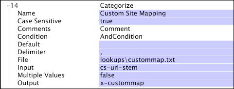

# Definición de transformaciones de búsqueda{#defining-lookup-transformations}

Información sobre las transformaciones que puede utilizar para incorporar datos de búsqueda en el conjunto de datos.

Tenga en cuenta que no todos los tipos se pueden utilizar durante ambas fases del proceso de construcción del conjunto de datos.

* [Categorizar](../../../../home/c-dataset-const-proc/c-data-trans/c-int-lookup-data/c-def-lookup-transf.md#section-8474376c14e54d14ae73749696ada468)
* [FlatFileLookup](../../../../home/c-dataset-const-proc/c-data-trans/c-int-lookup-data/c-def-lookup-transf.md#section-e09b2eeb96444a859b14f03cdaab31f2)
* [ODBCLookup](../../../../home/c-dataset-const-proc/c-data-trans/c-int-lookup-data/c-def-lookup-transf.md#section-4dcc3747e42e45c0a057e85f308a83cc)

## Categorizar {#section-8474376c14e54d14ae73749696ada468}

La [!DNL Categorize] transformación utiliza una tabla de búsqueda de dos columnas compuesta por pares de patrón-cadena/valor. Durante esta transformación, el servidor del área de trabajo de datos lee cada registro de datos de evento a su vez y compara el contenido de un campo designado en el registro con cada una de las cadenas de patrón enumeradas en la primera columna de la tabla de búsqueda. Si el campo designado coincide con una de las cadenas de patrón, el servidor del área de trabajo de datos escribe el valor (que se encuentra en la segunda columna) asociado a esa cadena de patrón en un campo de salida designado en el registro.

Las cadenas de la primera columna de la tabla de búsqueda pueden empezar con el carácter ^ y/o finalizar en el carácter $ para forzar la coincidencia al principio o al final. Esta transformación no acepta expresiones regulares para definir condiciones de coincidencia en la primera columna. Si el valor de entrada es un vector de cadenas, cada cadena se ejecuta a través de la transformación y los resultados se anexan a un vector de cadena de salida.

Una [!DNL Categorize] transformación es generalmente más fácil y rápida que usar una [!DNL Regular Expression] transformación para lograr lo mismo.

>[!NOTE]
>
>La prueba de subcadena utilizada en [!DNL Categorize] distingue entre mayúsculas y minúsculas a menos que se especifique lo contrario con el [!DNL Case Sensitive] parámetro .

<table id="table_1773344FAAE34BD4919CC4414249FDEE"> 
 <thead> 
  <tr> 
   <th colname="col1" class="entry"> Parámetro </th> 
   <th colname="col2" class="entry"> Descripción </th> 
   <th colname="col3" class="entry"> Valor predeterminado </th> 
  </tr> 
 </thead>
 <tbody> 
  <tr> 
   <td colname="col1"> Nombre </td> 
   <td colname="col2"> Nombre descriptivo de la transformación. Aquí puede introducir cualquier nombre. </td> 
   <td colname="col3"> </td> 
  </tr> 
  <tr> 
   <td colname="col1"> Distinción entre mayúsculas y minúsculas </td> 
   <td colname="col2"> True o false. Especifica si la prueba de subcadena distingue entre mayúsculas y minúsculas. </td> 
   <td colname="col3"> true </td> 
  </tr> 
  <tr> 
   <td colname="col1"> Comentarios </td> 
   <td colname="col2"> Opcional. Notas sobre la transformación. </td> 
   <td colname="col3"> </td> 
  </tr> 
  <tr> 
   <td colname="col1"> Condición </td> 
   <td colname="col2"> Condiciones en las que se aplica esta transformación. </td> 
   <td colname="col3"> </td> 
  </tr> 
  <tr> 
   <td colname="col1"> Valor predeterminado </td> 
   <td colname="col2"> El valor predeterminado que se usará si la prueba de condición pasa y no hay ninguna entrada en el archivo de categorización que coincida con la entrada o si el campo de entrada no está definido en la entrada de registro dada. </td> 
   <td colname="col3"> </td> 
  </tr> 
  <tr> 
   <td colname="col1"> Delimitador </td> 
   <td colname="col2"> 
Cadena que se utiliza para separar las columnas del archivo de búsqueda. Debe tener un solo carácter de longitud. 
 
 Si mantiene pulsada la tecla Ctrl y hace clic con el botón derecho en el parámetro Delimitador, aparecerá un menú  Insertar . Este menú contiene una lista de caracteres especiales que a menudo se utilizan como delimitadores. 
 </td> 
   <td colname="col3"> </td> 
  </tr> 
  <tr> 
   <td colname="col1"> Valores múltiples </td> 
   <td colname="col2"> True o false. Si es true, cuando varias filas del archivo coinciden con la entrada, cada coincidencia da como resultado que se anexe un valor al vector de salida de cadenas. Si es false, en el resultado solo se utiliza la primera fila coincidente del archivo. En este último caso, si la entrada es un vector, la salida es también un vector de longitud equivalente. Si la entrada es una cadena simple, el resultado también es una cadena simple. </td> 
   <td colname="col3"> false </td> 
  </tr> 
  <tr> 
   <td colname="col1"> Archivo </td> 
   <td colname="col2"> Ruta y nombre de archivo del archivo de categorización. Las rutas relativas se refieren al directorio de instalación del servidor del área de trabajo de datos. Este archivo se encuentra generalmente en el directorio de búsquedas dentro del directorio de instalación del servidor del área de trabajo de datos. </td> 
   <td colname="col3"> </td> 
  </tr> 
  <tr> 
   <td colname="col1"> Entrada </td> 
   <td colname="col2"> El archivo de categorización coincide con sus subcadenas con el valor de este campo para identificar la fila coincidente en el archivo. </td> 
   <td colname="col3"> </td> 
  </tr> 
  <tr> 
   <td colname="col1"> Salida </td> 
   <td colname="col2"> Nombre del campo asociado al resultado. </td> 
   <td colname="col3"> </td> 
  </tr> 
 </tbody> 
</table>

**Consideraciones para categorizar**

* Los cambios realizados en los archivos de búsqueda en [!DNL Categorize] transformaciones definidas en el [!DNL Transformation.cfg] archivo o en un [!DNL Transformation Dataset Include] archivo requieren una retransformación del conjunto de datos. Los archivos de búsqueda de [!DNL Categorize] transformaciones definidas en el [!DNL Log Processing.cfg] archivo o en un [!DNL Log Processing Dataset Include] archivo no están sujetos a esta limitación. Para obtener información sobre el reprocesamiento de los datos, consulte [Reprocesamiento y retransformación](../../../../home/c-dataset-const-proc/c-reproc-retrans/c-unst-reproc-retrans.md).

* [!DNL Categorize] las transformaciones definidas en el [!DNL Log Processing.cfg] archivo o en un [!DNL Log Processing Dataset Include] archivo recargan sus archivos de búsqueda cada vez que cambian los archivos de búsqueda. Los cambios no se aplican de forma retroactiva, pero se aplican a todos los datos de registro leídos después de que se produzca el cambio.

Este ejemplo ilustra el uso de la transformación para integrar los datos de búsqueda con los datos de eventos recopilados a partir del tráfico del sitio web. [!DNL Categorize] Supongamos que un sitio web en particular tiene secciones comerciales y que existe el requisito de poder ver y realizar comparaciones en función del flujo de tráfico y el valor generados por las diferentes secciones. Puede crear un archivo de búsqueda que enumera las subcadenas utilizadas para identificar estas diferentes secciones.

El archivo de búsqueda [!DNL Lookups\custommap.txt] contiene la siguiente tabla:

| /informe de productos/ | Productos |
|---|---|
| ^/deportes/ | Deportes |
| ^/noticias/ | Noticias |
| ... | ... |

Este archivo de categorización asigna cualquier cosa que contenga la cadena &quot;/products/&quot; al valor &quot;Productos&quot;, cualquier cosa que comience con &quot;/sports/&quot; al valor &quot;Deportes&quot; y cualquier cosa que comience con &quot;/news/&quot; al valor &quot;Noticias&quot;. La siguiente transformación de categorización utiliza el valor del campo cs-uri-stem como la cadena en la que se busca una subcadena coincidente. El resultado de la transformación se coloca en el campo x-custommap.

Suponiendo que el parámetro Valores múltiples se establece en false, el ejemplo generaría los siguientes valores para x-custommap dados los valores enumerados para cs-uri-stem.

| [!DNL cs-uri-stem] | [!DNL x-custommap] |
|---|---|
| [!DNL /sports/news/today.php] | Deportes |
| [!DNL /sports/products/buy.php] | Productos |
| [!DNL /news/headlines.php] | Noticias |
| [!DNL /news/products/subscribe.php] | Productos |

El resultado se basa en el orden de las subcadenas en el archivo de búsqueda. Por ejemplo, el cs-uri-stem [!DNL /sports/products/buy.php] devuelve &quot;Productos&quot;. Aunque la derivación URI empieza por &quot;/sports/&quot;, la cadena &quot;/products/&quot; aparece antes de &quot;/sports/&quot; en el archivo de búsqueda. Si el parámetro Valores múltiples se configurara en true, habría un valor adicional para x-custommap, ya que el último ejemplo coincidiría con dos filas en la tabla de búsqueda: Productos y noticias.

## FlatFileLookup {#section-e09b2eeb96444a859b14f03cdaab31f2}

La [!DNL FlatFileLookup] transformación utiliza una tabla de búsqueda compuesta por cualquier número de columnas y filas (aunque recuerde que reside en la memoria). Durante este tipo de transformación, el servidor del área de trabajo de datos lee cada registro de datos de eventos a su vez y compara el contenido de un campo designado en el registro con cada uno de los valores de una columna designada de la tabla de búsqueda. Si hay una coincidencia, el servidor del área de trabajo de datos escribe uno o más valores de la fila coincidente en la tabla de búsqueda en uno o más campos de salida designados en el registro de datos del evento.

La tabla de búsqueda utilizada durante esta transformación se rellena a partir de un archivo plano cuya ubicación se especifique al definir la transformación.

<table id="table_772B8ABF3B44493F99069010DDB5F77A"> 
 <thead> 
  <tr> 
   <th colname="col1" class="entry"> Parámetro </th> 
   <th colname="col2" class="entry"> Descripción </th> 
   <th colname="col3" class="entry"> Valor predeterminado </th> 
  </tr> 
 </thead>
 <tbody> 
  <tr> 
   <td colname="col1"> Nombre </td> 
   <td colname="col2"> Nombre descriptivo de la transformación. Aquí puede introducir cualquier nombre. </td> 
   <td colname="col3"> </td> 
  </tr> 
  <tr> 
   <td colname="col1"> Comentarios </td> 
   <td colname="col2"> Opcional. Notas sobre la transformación. </td> 
   <td colname="col3"> </td> 
  </tr> 
  <tr> 
   <td colname="col1"> Condición </td> 
   <td colname="col2"> Condiciones en las que se aplica esta transformación. </td> 
   <td colname="col3"> </td> 
  </tr> 
  <tr> 
   <td colname="col1"> Valor predeterminado </td> 
   <td colname="col2"> El valor predeterminado que se usará si se cumple la condición y si no hay ninguna entrada en el archivo de búsqueda que coincida con la entrada. </td> 
   <td colname="col3"> </td> 
  </tr> 
  <tr> 
   <td colname="col1"> Delimitador </td> 
   <td colname="col2"> 
Cadena que se utiliza para separar las columnas del archivo de búsqueda. Debe tener un solo carácter de longitud. 
 
 Si mantiene pulsada la tecla Ctrl y hace clic con el botón derecho en el parámetro Delimitador, aparecerá un menú  Insertar . Este menú contiene una lista de caracteres especiales que a menudo se utilizan como delimitadores. 
 </td> 
   <td colname="col3"> </td> 
  </tr> 
  <tr> 
   <td colname="col1"> Archivo </td> 
   <td colname="col2"> Ruta y nombre de archivo del archivo de búsqueda. Las rutas relativas se refieren al directorio de instalación del servidor del área de trabajo de datos. Este archivo se encuentra generalmente en el directorio de búsquedas dentro del directorio de instalación del servidor del área de trabajo de datos. </td> 
   <td colname="col3"> </td> 
  </tr> 
  <tr> 
   <td colname="col1"> Fila de encabezado </td> 
   <td colname="col2"> True o false. Indica que la primera fila de la tabla es una fila de encabezado que se debe ignorar al procesar. </td> 
   <td colname="col3"> </td> 
  </tr> 
  <tr> 
   <td colname="col1"> Entrada </td> 
   <td colname="col2">  Nombre de columna es el nombre de la columna que se utiliza para hacer coincidir la entrada con las filas del archivo. Si Fila de encabezado es verdadera, puede ser el nombre de una columna en el archivo de búsqueda. De lo contrario, debe ser el número de columna basado en cero con el que hacer coincidir.  Nombre del campo es el nombre del campo utilizado para ubicar la fila en el archivo de búsqueda. </td> 
   <td colname="col3"> </td> 
  </tr> 
  <tr> 
   <td colname="col1"> Valores múltiples </td> 
   <td colname="col2"> 
True o false. Determina si se debe devolver un valor único (una fila coincidente) o varios valores (uno por cada fila coincidente). 
 
 
Nota:  Si  Valores múltiples se establece en false, debe asegurarse de que no haya coincidencias múltiples. Cuando se producen varias coincidencias, no hay garantía de qué coincidencia se devolverá. 
 
 </td> 
   <td colname="col3"> </td> 
  </tr> 
  <tr> 
   <td colname="col1"> Salidas </td> 
   <td colname="col2"> 
Un vector de objetos de columna (resultados) en el que cada objeto se define por los nombres de columna y campo. 
 
  Nombre de columna es la columna desde la que se obtiene el valor de salida. Si  Fila de encabezado es verdadera, puede ser el nombre de una columna en el archivo de búsqueda. De lo contrario, debe ser el número de columna basado en cero con el que hacer coincidir. 
 
  Nombre del campo es el nombre del campo utilizado para capturar el resultado. Tenga en cuenta que puede ser un vector de resultados, uno para cada fila identificada en el caso de que el parámetro Valores múltiples sea true. 
 </td> 
   <td colname="col3"> </td> 
  </tr> 
 </tbody> 
</table>

**Consideraciones para[!DNL FlatFileLookup]**

* La coincidencia del campo de entrada con el archivo de búsqueda siempre distingue entre mayúsculas y minúsculas.
* Los cambios realizados en los archivos de búsqueda en [!DNL FlatFileLookup] las transformaciones definidas en el [!DNL Transformation.cfg] archivo o en los [!DNL Transformation Dataset Include] archivos requieren una retransformación del conjunto de datos. Los archivos de búsqueda de [!DNL FlatFileLookup] transformaciones definidas en el [!DNL Log Processing.cfg] archivo o [!DNL Log Processing Dataset Include] archivos no están sujetos a esta limitación. Para obtener información sobre el reprocesamiento de los datos, consulte [Reprocesamiento y retransformación](../../../../home/c-dataset-const-proc/c-reproc-retrans/c-unst-reproc-retrans.md).

* [!DNL FlatFileLookup] las transformaciones en el [!DNL Log Processing.cfg] archivo o [!DNL Log Processing Dataset Include] archivos recargan sus archivos de búsqueda cada vez que cambian los archivos de búsqueda. Los cambios no se aplican de forma retroactiva, pero se aplican a todos los datos de registro leídos después de que se produzca el cambio.

Este ejemplo ilustra el uso de la transformación para integrar los datos de búsqueda con los datos de eventos recopilados a partir del tráfico del sitio web. [!DNL FlatFileLookup] Supongamos que desea aislar a los socios del sitio web que dirigen el tráfico al sitio web y transformar sus ID de socio en nombres más prácticos. A continuación, puede utilizar los nombres descriptivos para crear dimensiones y visualizaciones ampliadas que se asignen más claramente a la relación comercial que a la relación sitio a sitio utilizada para enrutar el tráfico.

La transformación de ejemplo busca en el campo cs(referrer-query) el par nombre-valor de PartnerID y, si se encuentra, el archivo de búsqueda [!DNL Lookups\partners.txt] se utiliza para comparar el valor de PartnerID con los valores de la [!DNL Partner] columna de la tabla. Si se encuentra una fila, el campo de salida x-partner-name recibe el nombre de la [!DNL PrintName] columna de la fila identificada.

Si la tabla de búsqueda contenía la siguiente información:

| ID | Socio | Iniciado | PrintName |
|---|---|---|---|
| 1 | P154 | 21 de agosto de 1999 | Yahoo |
| 2 | P232 | 10 de julio de 2000 | Microsoft |
| 3 | P945 | 12 de enero de 2001 | Amazon |

Los siguientes ejemplos se transformarían de la siguiente manera:

* Si cs(referrer)(PartnerID) devolvía P232, el campo x-partner-name tendría el valor &quot;Microsoft&quot;.
* Si cs(referrer)(PartnerID) devolvía P100, el campo x-partner-name recibiría el valor &quot;No Partner&quot;.
* Si cs(referrer)(PartnerID) no devolvía nada, el campo x-partner-name recibiría el valor &quot;No Partner&quot; especificado por el parámetro Default.

## ODBCLookup {#section-4dcc3747e42e45c0a057e85f308a83cc}

La [!DNL ODBCLookup] transformación funciona como una [!DNL FlatFileLookup] transformación. La única diferencia es que la tabla de búsqueda utilizada durante esta transformación se rellena desde una base de datos ODBC y no desde un archivo plano.

>[!NOTE]
>
>[!DNL ODBCLookup] las transformaciones sólo se pueden ejecutar durante la fase de transformación del proceso de construcción del conjunto de datos. Cuando sea posible, Adobe recomienda utilizar la [!DNL FlatFileLookup] transformación en lugar de la [!DNL ODBCLookup] transformación. [!DNL FlatFileLookup] las transformaciones son intrínsecamente más fiables porque no dependen de la disponibilidad de un sistema externo. Además, hay menos riesgo de que la tabla de búsqueda se modifique si reside en un archivo plano que controla localmente.

<table id="table_B903DB291BCC4F44B09D54300216D288"> 
 <thead> 
  <tr> 
   <th colname="col1" class="entry"> Parámetro </th> 
   <th colname="col2" class="entry"> Descripción </th> 
   <th colname="col3" class="entry"> Valor predeterminado </th> 
  </tr> 
 </thead>
 <tbody> 
  <tr> 
   <td colname="col1"> Nombre </td> 
   <td colname="col2"> Nombre descriptivo de la transformación. Aquí puede introducir cualquier nombre. </td> 
   <td colname="col3"> </td> 
  </tr> 
  <tr> 
   <td colname="col1"> Comentarios </td> 
   <td colname="col2"> Opcional. Notas sobre la transformación. </td> 
   <td colname="col3"> </td> 
  </tr> 
  <tr> 
   <td colname="col1"> Condición </td> 
   <td colname="col2"> Condiciones en las que se aplica esta transformación. </td> 
   <td colname="col3"> </td> 
  </tr> 
  <tr> 
   <td colname="col1"> Nombre de la fuente de datos </td> 
   <td colname="col2"> Un DSN, proporcionado por un administrador del equipo del servidor del área de trabajo de datos en el que se procesa el conjunto de datos, que hace referencia a la base de datos desde la que se van a cargar los datos. </td> 
   <td colname="col3"> </td> 
  </tr> 
  <tr> 
   <td colname="col1"> Contraseña de base de datos </td> 
   <td colname="col2">La contraseña que se utilizará al conectarse a la base de datos. Si se ha configurado una contraseña para el DSN en el Administrador de fuentes de datos, esto puede dejarse en blanco. Cualquier contraseña proporcionada aquí anula la contraseña configurada para el DSN en el Administrador  de fuentes de datos. </td> 
   <td colname="col3"> </td> 
  </tr> 
  <tr> 
   <td colname="col1"> ID de usuario de base de datos </td> 
   <td colname="col2">ID de usuario que se utilizará al conectarse a la base de datos. Si se ha configurado un ID de usuario para el DSN en el Administrador de fuentes de datos, esto puede dejarse en blanco. Cualquier ID de usuario proporcionado aquí anula el ID de usuario configurado para el DSN en el Administrador de fuentes de datos. </td> 
   <td colname="col3"> </td> 
  </tr> 
  <tr> 
   <td colname="col1"> Valor predeterminado </td> 
   <td colname="col2"> El valor predeterminado que se usará si se cumple la condición y no hay ninguna entrada en el archivo de búsqueda que coincida con la entrada. </td> 
   <td colname="col3"> </td> 
  </tr> 
  <tr> 
   <td colname="col1"> Columna de entrada </td> 
   <td colname="col2">  Nombre de columna es el nombre de columna o la expresión SQL para los datos que coinciden con los datos introducidos.  Nombre del campo es el nombre del campo que contiene los datos que se van a buscar. </td> 
   <td colname="col3"> </td> 
  </tr> 
  <tr> 
   <td colname="col1"> Valores múltiples </td> 
   <td colname="col2"> 
True o false. Determina si se debe devolver un valor único (una fila coincidente) o varios valores (uno por cada fila coincidente). 
 
 
Nota:  Si  Valores múltiples se establece en false, debe asegurarse de que no haya coincidencias múltiples. Cuando se producen varias coincidencias, no hay garantía de qué coincidencia se devolverá. 
 
 </td> 
   <td colname="col3"> </td> 
  </tr> 
  <tr> 
   <td colname="col1"> Columnas de salida </td> 
   <td colname="col2"> 
Un vector de objetos de columna (resultados) donde cada objeto se define por los nombres de columna y campo. 
 
  Nombre de columna es el nombre o la expresión SQL de la columna desde la que se obtiene el valor de salida.  Nombre del campo es el nombre del campo utilizado para capturar el resultado. 
 </td> 
   <td colname="col3"> </td> 
  </tr> 
  <tr> 
   <td colname="col1">  Identificador de tabla </td> 
   <td colname="col2"> Expresión SQL que asigna un nombre a la tabla o vista desde la que se van a cargar los datos. Un identificador de tabla típico tiene el formato SCHEMA.TABLE. </td> 
   <td colname="col3"> </td> 
  </tr> 
 </tbody> 
</table>

* Los parámetros Nombre de fuente de datos, [!DNL Database User ID], [!DNL Database Password]e Identificador de tabla son los mismos que los parámetros de los mismos nombres que se describen para los orígenes de datos ODBC. See [ODBC Data Sources](../../../../home/c-dataset-const-proc/c-log-proc-config-file/c-odbc-data-sources.md#concept-5f2cf635081d44beab826ef5ec8cf4e3).

* A diferencia de los orígenes de datos ODBC, las transformaciones no requieren una columna de ID en aumento. [!DNL ODBCLookup] See [ODBC Data Sources](../../../../home/c-dataset-const-proc/c-log-proc-config-file/c-odbc-data-sources.md#concept-5f2cf635081d44beab826ef5ec8cf4e3). Esto se debe a que el contenido de la tabla de búsqueda no debe cambiar de ninguna manera mientras el conjunto de datos esté activo. Los cambios en una tabla o vista de búsqueda no se pueden detectar hasta que se produzca la transformación. Para obtener información sobre el reprocesamiento de los datos, consulte [Reprocesamiento y retransformación](../../../../home/c-dataset-const-proc/c-reproc-retrans/c-unst-reproc-retrans.md).

Supongamos que desea convertir registros DNS obsoletos en registros actualizados. Ambos conjuntos de registros se almacenan en una base de datos SQL. Para realizar esta tarea, debe hacer referencia a una tabla de búsqueda que se genera a partir de la base de datos y reemplazar los registros DNS obsoletos.

Nuestra transformación de ejemplo busca en las entradas de registro el campo s-dns y, si se encuentra, se utiliza la tabla de búsqueda VISUAL.LOOKUP para comparar la entrada s-dns con las entradas de la [!DNL OLDDNS] columna de la tabla. Si hay una fila en la tabla, se proporciona al campo de salida s-dns la entrada de registro DNS actualizada de la [!DNL NEWDNS] columna de la fila identificada.

