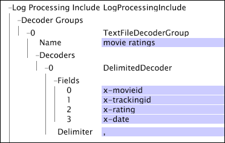

# Grupos de decodificadores de archivos de texto{#text-file-decoder-groups}

{{eol}}

El procesamiento de archivos de registro como fuentes de registro requiere la definición de un decodificador dentro del archivo Incluir conjunto de datos de procesamiento de registros para extraer campos de datos de las entradas de registro.

La definición de grupos de decodificadores de archivos de texto para las fuentes de registro de archivos de registro requiere conocer la estructura y el contenido del archivo de registro, los datos que se extraerán y los campos en los que se almacenan esos datos. En esta sección se proporcionan descripciones básicas de los parámetros que se pueden especificar para los descodificadores, pero la forma en que se utiliza cualquier descodificador depende del archivo de registro que contiene los datos de origen.

Para obtener información sobre los requisitos de formato para las fuentes de registro de archivos de registro, consulte [Archivos de registro](../../../../../home/c-dataset-const-proc/c-log-proc-config-file/c-log-sources.md#concept-3d4fb817c057447d90f166b1183b461e). Para obtener ayuda con la definición de descodificadores de archivos de texto, póngase en contacto con el Adobe.

Un grupo de descodificadores de archivos de texto puede incluir:

* [Decodificadores de expresiones regulares](../../../../../home/c-dataset-const-proc/c-dataset-inc-files/c-types-dataset-inc-files/c-log-proc-dataset-inc-files/c-text-file-dec-groups.md#section-67aca2c1f008404da7f845a64abec97c)
* [Decodificadores delimitados](../../../../../home/c-dataset-const-proc/c-dataset-inc-files/c-types-dataset-inc-files/c-log-proc-dataset-inc-files/c-text-file-dec-groups.md#section-7e0a23decdbc4c75ae750a42446997a6)

## Decodificadores de expresiones regulares {#section-67aca2c1f008404da7f845a64abec97c}

Un decodificador de expresiones regulares identifica patrones de cadena complejos dentro de las entradas de registro en un archivo de registro y extrae estos patrones como campos de datos. Para cada decodificador, el número de campos debe ser igual al número de subpatrones de captura en la expresión regular. La parte de la línea que coincide con el subpatrón de captura nth se asigna al campo nth para esa línea.

**Adición de un decodificador de expresiones regulares a un grupo de decodificadores de archivos de texto**

1. Abra el [!DNL Log Processing Dataset Include] tal como se describe en [Edición de archivos de inclusión de conjuntos de datos existentes](../../../../../home/c-dataset-const-proc/c-dataset-inc-files/c-work-dataset-inc-files/t-edit-ex-dataset-inc-files.md#task-456c04e38ebc425fb35677a6bb6aa077) y agregue un grupo de descodificadores de archivos de texto. Consulte la entrada de tabla [Grupos de decodificadores](../../../../../home/c-dataset-const-proc/c-dataset-inc-files/c-types-dataset-inc-files/c-log-proc-dataset-inc-files/c-log-proc-dataset-inc-files.md#concept-999475a22519432e98844622ca95b6ab).

1. Clic con el botón derecho **[!UICONTROL Decoders]** en el grupo decodificador recién creado, haga clic en **[!UICONTROL Add new]** > **[!UICONTROL Regular Expression]**.

1. Especifique la siguiente información:

   * **Campos:** Lista de los campos del archivo de registro. Si se va a pasar cualquiera de los campos definidos aquí a la fase de transformación de la construcción del conjunto de datos, esos campos deben incluirse en el parámetro Fields de uno de los [!DNL Log Processing Dataset Include] archivos para el conjunto de datos. Los nombres de campo personalizados deben comenzar por &quot;x-&quot;.

   * **Nombre:** Identificador opcional del decodificador.
   * **Expresión regular:** Se utiliza para extraer los campos deseados de cada línea del archivo.

1. Repita los pasos 4 y 5 para cualquier otro descodificador que desee agregar al grupo.
1. Para guardar la variable [!DNL Log Processing Dataset Include] archivo, clic con el botón derecho **[!UICONTROL (modified)]** en la parte superior de la ventana y haga clic en **[!UICONTROL Save]**.

1. Para que los cambios realizados localmente tengan efecto, en la variable [!DNL Profile Manager], haga clic con el botón derecho en la marca de verificación del archivo en la variable [!DNL User] para abrir el Navegador. Haga clic en **[!UICONTROL Save to]** > *&lt;**[!UICONTROL profile name]**>*, donde nombre de perfil es el nombre del perfil del conjunto de datos o el perfil heredado al que pertenece el archivo de inclusión del conjunto de datos.

No guarde el archivo de configuración modificado en ninguno de los perfiles internos proporcionados por Adobe, ya que los cambios se sobrescriben al instalar actualizaciones en estos perfiles.

>[!NOTE]
>
>Un archivo de registro determinado puede tener varios descodificadores de expresión regular. El orden en que se definen los descodificadores es importante: el primer decodificador que coincida con una línea en el archivo de registro es el que se utiliza para descodificar esa línea.

Este ejemplo ilustra el uso de un decodificador de expresiones regulares para extraer campos de datos de un archivo de texto delimitado por tabuladores. Puede obtener el mismo resultado definiendo un decodificador delimitado con un delimitador de tabulación.

Para obtener más información sobre los descodificadores de expresiones regulares, incluida la terminología y la sintaxis, consulte [Expresiones regulares](../../../../../home/c-dataset-const-proc/c-reg-exp.md#concept-070077baa419475094ef0469e92c5b9c).

## Decodificadores delimitados {#section-7e0a23decdbc4c75ae750a42446997a6}

Un decodificador delimitado descodifica un archivo de registro cuyos campos están delimitados por un solo carácter. El número de campos debe corresponder al número de columnas del archivo delimitado; sin embargo, no es necesario nombrar todos los campos. Si un campo se deja en blanco, la columna sigue siendo necesaria en el archivo de registro, pero el decodificador la ignora.

**Adición de un decodificador delimitado a un grupo de decodificadores de archivos de texto**

1. Abra el [!DNL Log Processing Dataset Include] tal como se describe en [Edición de archivos de inclusión de conjuntos de datos existentes](../../../../../home/c-dataset-const-proc/c-dataset-inc-files/c-work-dataset-inc-files/t-edit-ex-dataset-inc-files.md#task-456c04e38ebc425fb35677a6bb6aa077) y agregue un grupo de descodificadores de archivos de texto. Consulte la entrada de tabla [Grupos de decodificadores](../../../../../home/c-dataset-const-proc/c-dataset-inc-files/c-types-dataset-inc-files/c-log-proc-dataset-inc-files/c-log-proc-dataset-inc-files.md#concept-999475a22519432e98844622ca95b6ab).

1. Clic con el botón derecho **[!UICONTROL Decoders]** en el grupo decodificador recién creado, haga clic en **[!UICONTROL Add new]** > **[!UICONTROL Delimited]**.

1. Especifique la siguiente información:

   * **Campos:** Lista de los campos del archivo de registro. Si se va a pasar cualquiera de los campos definidos aquí a la fase de transformación de la construcción del conjunto de datos, esos campos deben incluirse en el parámetro Fields de uno de los [!DNL Log Processing Dataset Include] archivos para el conjunto de datos. Los nombres de campo personalizados deben comenzar por &quot;x-&quot;.

   * **Delimitador:** Carácter que se utiliza para separar campos en el archivo de salida.

1. Repita los pasos 4 y 5 para cualquier otro descodificador que desee agregar al grupo.
1. Para guardar la variable [!DNL Log Processing Dataset Include] archivo, clic con el botón derecho **[!UICONTROL (modified)]** en la parte superior de la ventana y haga clic en **[!UICONTROL Save]**.

1. Para que los cambios realizados localmente tengan efecto, en la variable [!DNL Profile Manager], haga clic con el botón derecho en la marca de verificación del archivo en la variable [!DNL User] y, a continuación, haga clic en **[!UICONTROL Save to]** > *&lt;**[!UICONTROL profile name]**>*, donde nombre de perfil es el nombre del perfil del conjunto de datos o el perfil heredado al que pertenece el archivo de inclusión del conjunto de datos.

>[!NOTE]
>
>No guarde el archivo de configuración modificado en ninguno de los perfiles internos proporcionados por Adobe, ya que los cambios se sobrescriben al instalar actualizaciones en estos perfiles.

Este ejemplo ilustra el uso de un decodificador delimitado para extraer campos de datos de un archivo de texto delimitado por comas que contiene datos sobre películas.

