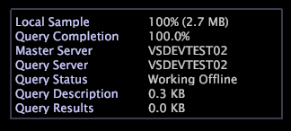

# Leyenda de estado de consulta{#query-status-legend}

La Leyenda de estado de consulta proporciona información detallada sobre las consultas que está realizando.

En la tabla siguiente se enumeran las tareas que se pueden completar con el [!DNL Query Status Legend].

<table id="table_BD9330D4B3014A84B24EF0E71872F627"> 
 <thead> 
  <tr> 
   <th colname="col1" class="entry"> Para realizar esta tarea... </th> 
   <th colname="col2" class="entry"> Instrucciones </th> 
  </tr> 
 </thead>
 <tbody> 
  <tr> 
   <td colname="col1"> 
Para ver la relación entre el tamaño de la muestra local y el tamaño del conjunto de datos general seguido del tamaño en MB de la muestra local 
 </td> 
   <td colname="col2"> 
Vea el campo  Muestra local. 
 </td> 
  </tr> 
  <tr> 
   <td colname="col1"> 
Para ver el porcentaje mínimo completado de todas las consultas actuales 
 </td> 
   <td colname="col2"> 
Consulte el  campo Finalización de consulta. 
 </td> 
  </tr> 
  <tr> 
   <td colname="col1"> 
Identificar el servidor maestro de un cliente en un clúster 
 </td> 
   <td colname="col2"> 
Vea el campo  Servidor maestro. 
 </td> 
  </tr> 
  <tr> 
   <td colname="col1"> 
Para determinar el tamaño de una consulta 
 </td> 
   <td colname="col2"> 
Vea el  campo Resultados de la consulta. Este campo muestra el tamaño de la consulta actual y le proporciona una manera de ver cuánto impacto se produce en el tamaño de la consulta mediante la adición (o eliminación) de una métrica, la selección o cualquier otro cambio en el espacio de trabajo. 
 </td> 
  </tr> 
 </tbody> 
</table>

