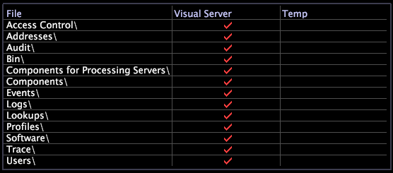

# Administrador de archivos del servidor{#server-files-manager}

El Administrador de archivos de servidor le permite administrar y administrar de forma remota los equipos del servidor de Área de trabajo de datos desde cualquier Área de trabajo de datos autorizada, proporcionando acceso a todos los directorios y archivos del directorio de instalación del producto, incluidos los archivos de configuración y búsqueda.

Puede acceder al mismo [!DNL Server Files Manager] mediante el [!DNL Admin] menú, así como haciendo clic con el botón derecho en el nodo del equipo del servidor Área de trabajo de datos en el [!DNL Servers Manager] y haciendo clic en **[!UICONTROL Server Files]**.

>[!NOTE]
>
>Puede crear nuevos administradores de archivos de servidor que muestren los directorios seleccionados. Consulte [Creación de nuevos administradores](../../../home/c-get-started/c-intf-anlys-ftrs/c-cstm-prof-files-mgrs/c-new-svr-files-mgrs.md#concept-6e8f63273109443699a8f61b1a2ea816)de archivos de servidor.

La columna izquierda de [!DNL Server Files Manager] muestra los nombres de archivos y carpetas. Las marcas de verificación en las columnas central y derecha indican dónde residen estos directorios y archivos en la estructura de archivos.

Si un archivo reside en el directorio de instalación del producto, la columna *nombre* del servidor (por ejemplo, servidor de Área de trabajo de datos) contiene una marca de verificación. Si un archivo reside en el equipo del usuario del Área de trabajo de datos en el directorio *de instalación del Área de trabajo de* datos\Temp, la [!DNL Temp] columna contiene una marca de verificación. El color de las marcas de verificación indica si los archivos que residen en distintas ubicaciones se modificaron al mismo tiempo.

* Una marca de verificación roja en la columna del nombre del servidor indica que la carpeta o el archivo reside en el equipo servidor del Área de trabajo de datos.
* Una marca de verificación roja en la [!DNL Temp] columna indica que la copia local del archivo o la carpeta tiene la misma fecha y hora de modificación que el archivo o la carpeta en el equipo del servidor de Área de trabajo de datos.
* Una marca de verificación en blanco en la [!DNL Temp] columna indica que el archivo o la carpeta del directorio *de instalación de Área de trabajo de* datos\Temp tiene una fecha y hora de modificación distinta a la del archivo o la carpeta del equipo servidor de Área de trabajo de datos.

El siguiente gráfico muestra el gráfico [!DNL Server Files Manager] con marcas de verificación rojas y blancas:

**Para administrar directorios y archivos mediante la función[!DNL Server Files Manager]**

Puede utilizar [!DNL Server Files Manager] para manipular directorios y archivos en un equipo servidor de Área de trabajo de datos.

En la tabla siguiente se enumeran las tareas que se pueden completar mediante el [!DNL Server Files Manager]:

<table id="table_D217AE5A878542EC8B604812A61819C3"> 
 <thead> 
  <tr> 
   <th colname="col1" class="entry"> Para realizar esta tarea... </th> 
   <th colname="col2" class="entry"> Instrucciones </th> 
  </tr> 
 </thead>
 <tbody> 
  <tr> 
   <td colname="col1"> 
Para ver los archivos de cualquier directorio 
 </td> 
   <td colname="col2"> 
Haga clic en el nombre del directorio para ver su contenido. 
 </td> 
  </tr> 
  <tr> 
   <td colname="col1"> 
Ocultar el contenido de un directorio 
 </td> 
   <td colname="col2"> 
Haga clic en el nombre del directorio. 
 </td> 
  </tr> 
  <tr> 
   <td colname="col1"> 
Para ver detalles sobre un directorio 
 </td> 
   <td colname="col2"> 
Haga clic con el botón secundario en la celda situada junto al directorio, en la columna Nombre del servidor o  Plantilla . Verá la siguiente información: 
 
    <ul id="ul_2DA5C8D0E95F4BCC8F7E25D05F00EB02"> 
     <li id="li_3FDECC14D62543B183C3509C338DF432">Ruta. Ruta del directorio. </li> 
     <li id="li_9CF3989FD9E2427995F070E043FAD02C">Dir. Nombre del directorio. </li> 
     <li id="li_68AAA11907404D0BBF407ECD7CA2E467">De. Ubicación del directorio, Remoto o Temp. </li> 
     <li id="li_CB4AEEC89E424868B758465EC0B701B5">Fecha (sólo columna temporal). Fecha de creación o fecha de la última revisión de la copia local. </li> 
    </ul> </td> 
  </tr> 
  <tr> 
   <td colname="col1"> 
Para ver detalles sobre un archivo 
 </td> 
   <td colname="col2"> 
Haga clic con el botón secundario en la marca de verificación situada junto al archivo, en la columna Nombre del servidor o  Plantilla . Verá la siguiente información: 
 
 
     <ul id="ul_C4E6CB86D1774D739B5ECF48AF8DB628"> 
      <li id="li_7A6D39CF8C064FDDAB87F8D4E50FA832">Ruta. Ruta del archivo. </li> 
      <li id="li_9C735B6F0A2541F1992B845359C3685A">Archivo. Nombre del archivo. </li> 
      <li id="li_3EB903E4F4C44A6093732C588F0125EF">De. Ubicación del directorio, Remoto o Temp. </li> 
      <li id="li_C1FED4F98F854D5892DBAD9F9E1D47B8">Fecha. Fecha de la última revisión del archivo. </li> 
      <li id="li_7477C727C62F4406BB2026063E41F2AE">Tamaño. El tamaño del archivo. </li> 
     </ul> 
 </td> 
  </tr> 
  <tr> 
   <td colname="col1"> 
Para descargar un directorio en el equipo local 
 </td> 
   <td colname="col2"> 
Haga clic con el botón secundario en la marca de verificación de la columna del nombre <i>del</i> servidor para este directorio y haga clic en  Convertir directorio en local. Aparece una marca de verificación para el directorio en la  columna Temp . 
 </td> 
  </tr> 
  <tr> 
   <td colname="col1"> 
Para descargar un archivo en el equipo local 
 </td> 
   <td colname="col2"> 
Haga clic con el botón secundario en la marca de verificación de la columna del nombre <i>del</i> servidor para este archivo y haga clic en  Convertir en local. Aparece una marca de verificación para el archivo en la columna  Temperatura . 
 </td> 
  </tr> 
  <tr> 
   <td colname="col1"> 
Para descargar la última parte de un archivo de registro en el equipo local 
 </td> 
   <td colname="col2"> 
Para evitar tener que descargar un archivo de registro completo (especialmente cuando sabe que el mensaje de error está cerca del final del archivo), haga clic con el botón derecho en la marca de verificación de la columna del nombre del servidor del archivo, haga clic en  Colay seleccione el tamaño de la parte que desee descargar. Aparece una marca de verificación para el archivo en la columna  Temperatura . El archivo local contiene sólo la cantidad de datos que especificó, empezando por el final del archivo. 
 </td> 
  </tr> 
  <tr> 
   <td colname="col1"> 
Para abrir un directorio 
 </td> 
   <td colname="col2"> 
Haga clic con el botón derecho en la marca de verificación del directorio en la columna  Temperatura y haga clic en  Abrir &gt;  carpeta. 
 </td> 
  </tr> 
  <tr> 
   <td colname="col1"> 
Para abrir un archivo 
 </td> 
   <td colname="col2"> 
Haga clic con el botón secundario en la marca de verificación del archivo en la columna  Temperatura , haga clic en  Abriry, a continuación, haga clic en  Área de trabajode datos,  en Bloc de notaso  carpeta. 
 </td> 
  </tr> 
  <tr> 
   <td colname="col1"> 
Guardar una copia local de un directorio en el servidor de Área de trabajo de datos 
 </td> 
   <td colname="col2"> 
Haga clic con el botón secundario en la marca de verificación del directorio en la columna  Temp y haga clic en  Guardar directorio en &gt; &lt; <i>nombre de perfil&gt;</i>. 
 </td> 
  </tr> 
  <tr> 
   <td colname="col1"> 
Guardar una copia local de un archivo en el servidor de Área de trabajo de datos 
 </td> 
   <td colname="col2"> 
Haga clic con el botón secundario en la marca de verificación del archivo en la columna  Temperatura y haga clic en  Guardar en &gt; &lt; <i>nombre de perfil&gt;</i>. 
 </td> 
  </tr> 
  <tr> 
   <td colname="col1"> 
Eliminar una copia local de un directorio o archivo 
 </td> 
   <td colname="col2"> 
Haga clic con el botón derecho en la marca de verificación del directorio o archivo de la columna  Temp y haga clic en  Eliminar. 
 </td> 
  </tr> 
  <tr> 
   <td colname="col1"> 
Copiar y pegar un archivo como archivo adjunto de correo electrónico en Microsoft Outlook 
 </td> 
   <td colname="col2"> 
Haga clic con el botón derecho en la marca de verificación del archivo en la columna  Temperatura y haga clic en  Copiar. En el cuerpo del mensaje de correo electrónico, pulse Ctrl+v para adjuntar el archivo. 
 </td> 
  </tr> 
 </tbody> 
</table>

