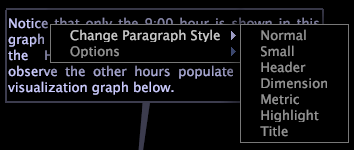

# Anotaciones de texto{#text-annotations}

Las anotaciones de texto son ventanas en las que se puede introducir texto arbitrario para agregar información descriptiva o comentarios a un espacio de trabajo.

Las anotaciones de texto se mueven o manipulan dentro de un espacio de trabajo de la misma manera que otros tipos de visualizaciones. También puede dar formato al aspecto del texto, así como nombrar, editar o guardar cualquier anotación de texto que agregue a un espacio de trabajo. Las anotaciones de texto también se pueden exportar a Microsoft Excel y generar y distribuir por parte de [!DNL Report].

Para obtener más información sobre [!DNL Reports], consulte la Guía *de informes de* Insight.

## Agregar o editar texto {#section-8ecc44e0eeb24c5990050102013c0aed}

* Haga clic dentro del cuerpo del texto para entrar al modo de edición y empezar a escribir.

   >[!NOTE]
   >
   >Las anotaciones de texto admiten funciones de edición básicas, como cortar (Ctrl+x), copiar (Ctrl+c), pegar (Ctrl+v), deshacer (Ctrl+z), rehacer (Ctrl+Mayús+z), seleccionar la sección (hacer clic+arrastrar) y seleccionar todo (Ctrl+a). Consulte [Trabajo con texto en Windows](../../../../home/c-get-started/c-wk-win-wksp/c-work-text-win.md#concept-f1222434bf954767808e94b955945c8d).

## Aplicar formato a párrafos {#section-27744c1589134aa3918aa8787429c0dc}

1. En el cuerpo del texto, haga clic con el botón derecho en el párrafo al que desee dar formato.
1. Haga clic **[!UICONTROL Change Paragraph Style]** > *&lt;**[!UICONTROL text style]**>*.

## Aplicar formato a selecciones {#section-4032ecbcc0064e5c96504c15b6f481bf}

1. Dentro del cuerpo del texto, haga clic y arrastre para seleccionar el texto al que desea dar formato.
1. Haga clic con el botón secundario en la selección y haga clic en **[!UICONTROL Change Selection Style]** > *&lt;**[!UICONTROL text style]**>*.

## Cambiar la configuración de ajuste de palabras {#section-56948687d47349fc8ba21e108fd13cc1}

Esta opción controla si el texto de la anotación se ajusta a las visualizaciones del espacio de trabajo y cómo lo hace.

* Haga clic con el botón secundario en el cuerpo del texto, haga clic en **[!UICONTROL Options]** > **[!UICONTROL Word Wrap]** y, a continuación, haga clic en la opción que desee:

   * **Ninguno:** Esta opción elimina el ajuste de palabras de esta anotación.
   * **Ambos lados:** Esta opción permite que el texto de la anotación se ajuste a ambos lados de las visualizaciones del espacio de trabajo.
   * **Mejor cara:** Esta opción permite que el texto de la anotación se ajuste solo a un lado de las visualizaciones del espacio de trabajo.

## Cambiar la configuración de la columna {#section-5cd3f3d63cf64119a2fcec371e33b734}

Esta opción controla el número de columnas en las que se muestra el texto en la anotación.

* Haga clic con el botón secundario en el cuerpo del texto, haga clic en **[!UICONTROL Options]** > **[!UICONTROL Columns]** y, a continuación, haga clic en la opción que desee:

   * **Automático:** Esta opción selecciona el diseño de columna más adecuado para el ancho y la longitud del texto.
   * **1-4:** Estas opciones permiten mostrar el texto en una, dos, tres o cuatro columnas.

## Exportar a Microsoft Excel {#section-b239057b822348849fd17a83c3a03c22}

Para obtener información sobre la exportación de ventanas, consulte [Exportación de datos](../../../../home/c-get-started/c-wk-win-wksp/c-exp-win-data.md#concept-8df61d64ed434cc5a499023c44197349)de ventana.
