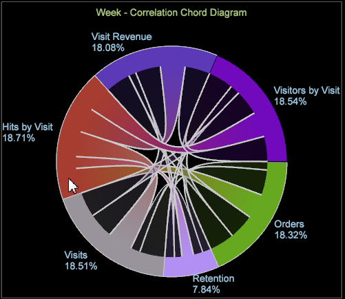

# Visualización de acordes{#chord-visualization}

{{eol}}

La visualización acorde le permite mostrar tanto la proporción como la correlación entre métricas, mostrando correlaciones más grandes como una indicación de una correlación más fuerte.

La visualización del acorde le permite identificar correlaciones entre métricas, lo que le permite añadir y evaluar fácilmente posibles correlaciones. También proporciona otra vista a cualquier elemento creado anteriormente [Matriz de correlación](https://experienceleague.adobe.com/docs/data-workbench/using/client/analysis-visualizations/correlation-analysis/c-correlation-analysis.html). Con la visualización del acorde, no se puede identificar una correlación positiva o negativa entre las métricas (solo que exista una correlación). En algunos casos, la determinación de una relación directa o inversa se puede identificar aplicando métricas de contador.

1. **Abra el **[!UICONTROL Chord]**visualización**.

   En el espacio de trabajo, haga clic con el botón derecho [!DNL Visualization > Predictive Analytics > Chord].

1. **Seleccione un Dimension en el menú**.

   Se abrirá una visualización en blanco que le permitirá seleccionar una dimensión. El nombre de la dimensión aparece en la parte superior de la visualización de acorde en blanco.

   >[!NOTE]
   >
   >Si ya tiene una matriz de correlación abierta en el espacio de trabajo, también puede representarla como una visualización de acorde.

1. **Elegir métricas para correlacionar**.

   Arrastre las métricas desde la **[!UICONTROL Finder]** haciendo clic en **[!UICONTROL Ctrl-Alt]** para arrastrar métricas de la tabla al gráfico. Después de seleccionar dos o más métricas, el gráfico se actualizará automáticamente y empezará a mostrar los datos de correlación. Siga agregando métricas según sea necesario para correlacionar puntos de datos.

   

   La visualización del acorde muestra la proporción del total representado por el área de cada segmento. Siga agregando métricas según sea necesario para identificar e investigar las relaciones significativas.

   

1. **Visualización del acorde**.

   Pase el ratón sobre cada métrica en la visualización para ver las relaciones. En el ejemplo, puede ver una correlación entre Unidades y la mayoría de las demás métricas (excepto para el **Duración de la visita** métrica).

   

   Cuando pasa el ratón por encima del **Duración de la visita** en la visualización del acorde, puede ver que hay muy poca o más correlación débil entre todas las demás métricas.

   

1. **Cambiar configuración.** Haga clic con el botón derecho en la visualización del acorde para abrir un menú para cambiar la dimensión, mostrar las dimensiones como números absolutos o como porcentajes, eliminar la métrica seleccionada o todas las métricas, editar colores y detalles y exportar valores a una matriz de correlación.

   
