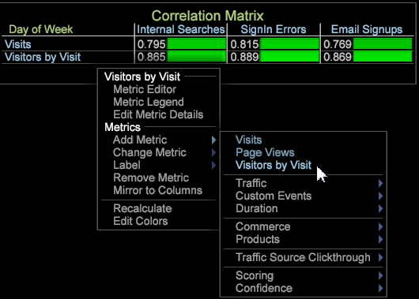
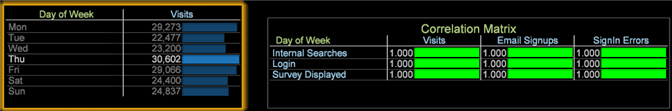

# Matriz de correlación{#correlation-matrix}

Las correlaciones estadísticas miden relaciones significativas para identificar oportunidades a través de la extracción avanzada de datos.

Al utilizar el coeficiente [de correlación](../../../../home/c-get-started/c-analysis-vis/c-correlation-analysis/c-correlation-pearsons.md#concept-5996cb8c89fd4df5b47b7318e7a1d29c)Pearsons, la Matriz de correlación le proporciona información relevante para identificar mejor los próximos pasos en una campaña de marketing, mejorar el diseño del sitio o continuar con el análisis profundo del cliente para dependencias de correlación adicionales.

## Creación de una matriz de correlación {#section-87ed12ccc1af4196a1b6534e621c4cbb}

La matriz de correlación compara las métricas sobre una dimensión contable o no contable. La matriz se puede modificar para resaltar las correlaciones dentro de la visualización mediante la selección de colores o para representarla como mapa de texto, mapa de calor o ambos.

1. Abra una matriz de correlación.

   Haga clic con el botón secundario [!DNL Visualization] > [!DNL Predictive Analytics] > [!DNL Correlation Matrix]. Se abrirá la tabla de dimensiones.

   

   Seleccione una dimensión, como [!DNL Time] > [!DNL Day of the Week] en este menú. La tabla de correlación se abrirá con la dimensión identificada en la esquina de la matriz y su métrica asociada ubicada en la fila y la columna. Para la dimensión Día de la semana, **[!UICONTROL Visits]** es la métrica asociada.

   

   La correlación es 1.000 porque está comparando una métrica con la suya (lo que refleja una correlación perfecta pero no utilizable).

1. Cambie una de las métricas.

   Haga clic con el botón derecho y seleccione **[!UICONTROL Change Metric]** para cambiar una métrica en la fila o columna. Esto configura una correlación entre dos métricas de valor.

   Para este ejemplo, cambie la **[!UICONTROL Visits]** métrica de la columna a **[!UICONTROL Internal Searches]**. Haga clic con el botón derecho y seleccione [!DNL Metric] > [!DNL Custom Events] > [!DNL Custom Event 1-10] > [!DNL Internal Searches].

   

1. Agregue más métricas a la matriz de correlación.

   Haga clic con el botón secundario en una columna o fila de métrica. Por ejemplo, en el menú Métrica, agregue [!DNL Metric] > [!DNL Custom Events] > [!DNL Custom Event 1-10] > [!DNL Sign in Error].

   

   La nueva métrica aparecerá en una columna con un número de correlación. Puede agregar otras métricas, como **[!UICONTROL Email Signups]**, para crear la tabla.

   

   O bien, agregue métricas a las filas para compararlas con las métricas de las columnas.

   

1. (opcional) Para restringir una métrica, agregue un elemento de dimensión.

   Haga clic con el botón derecho en el espacio de trabajo y seleccione **[!UICONTROL Table]**. En la tabla de dimensiones abierta, pulse Ctrl + Alt y arrastre el elemento sobre una métrica en una columna o fila. El elemento aparecerá junto a la métrica entre corchetes.

   Por ejemplo, para la **[!UICONTROL Visits]** métrica, puede restringirla seleccionando la opción **[!UICONTROL Country]** como **[!UICONTROL New Zealand]**.

   

   Observe que cuando selecciona un elemento de dimensión, la correlación cambia en todas las métricas en función del elemento de dimensión seleccionado. Solo la métrica Visita se restringirá para &quot;Nueva Zelanda&quot; una vez que se cierre la ventana de dimensión.

   >[!NOTE]
   >
   >Si se cambia una métrica con una restricción de dimensión (haciendo clic con el botón derecho y seleccionando **[!UICONTROL Change Metric]**), se perderá el elemento de dimensión que restringe la métrica. Tendrá que volver a agregar el elemento de dimensión.

1. Cree un [filtro](../../../../home/c-get-started/c-analysis-vis/c-correlation-analysis/c-correlation-binary-filter.md#concept-24e1daff43c540f69019f236976da31c) binario para restringir aún más la métrica. Haga clic con el botón derecho en la métrica de la tabla y seleccione Filtro binario en el menú.

## Objetivos de análisis y planificación de correlación {#section-cc322da60b7e417ba29e72b0afeb6f79}

Los siguientes son objetivos generales para crear una matriz de correlación.

**Identifique la relación entre dos métricas y una dimensión** específica. En el ejemplo, la matriz se creó en torno a la dimensión principal, Día de la semana, con las métricas Visita, Suscripciones por correo electrónico y Errores de inicio de sesión comparados con los eventos de métricas Búsquedas internas, Inicio de sesión y Estudio mostrado.

**Desarrollar hipótesis para enfocar el análisis**. Después de ejecutar un análisis de correlación, el siguiente paso es buscar las dependencias y la correlación de las métricas. Por ejemplo: comprender que las búsquedas internas tienen un efecto en las suscripciones por correo electrónico proporciona una ruta para predecir esa relación y para modificar las campañas de mercadotecnia o el diseño de navegación del sitio Web.

**Identifique las métricas para incluir algoritmos** de minería de datos más avanzados. En la mayoría de los casos, las métricas clave se identificarán porque se verán afectadas por varias correlaciones. Ahora puede tomar esas métricas clave y aplicarlas a análisis adicionales de minería de datos para obtener una perspectiva más profunda.

## Notas de funciones de la matriz de correlación {#section-ef3626c665ea468a9ecdad624b4132f5}

**Filtrar y seleccionar elementos de dimensión dentro de una tabla compara valores** similares. Por ejemplo, si utiliza la dimensión Día de la semana y luego hace clic en un elemento de esa dimensión principal, como hacer clic en un día específico dentro de la tabla de dimensión Día de la semana, se procesa una coincidencia de uno a uno en el 100 % que no proporciona una correlación utilizable. Dado que la dimensión raíz era Día de la semana, cualquier selección dentro de la tabla de dimensiones Día de la semana modificará la matriz para que sea una correlación uno a uno.

Sin embargo, la correlación 1 a 1 (cuando se realiza una sola selección de todos los elementos) solo se realiza en ese día específico. Si realiza varias selecciones, no necesariamente seguirá siendo una correlación de 1 a 1 y no siempre generará una coincidencia de 100 por ciento, independientemente de seleccionar 1 o más días de la semana.

**Las correlaciones estadísticas no son iguales al Modelo** de datos correlacionados, la referencia histórica de los productos de Adobe Analytics. La correlación estadística en el área de trabajo de datos se basa en el modelo [de correlación](../../../../home/c-get-started/c-analysis-vis/c-correlation-analysis/c-correlation-pearsons.md#concept-5996cb8c89fd4df5b47b7318e7a1d29c)Pearson.

**Mostrar correlación en un diagrama** de puntos. Haga clic con el botón derecho en el título de un diagrama de puntos y elija [!DNL Display Correlation] en el [!DNL Visualization] menú. El valor de correlación se mostrará en la sección superior derecha del diagrama de puntos.

>[!NOTE]
>
>La matriz de diagrama de puntos y perlas mostrará &quot;Error de cálculo&quot; si la aplicación no puede ejecutar el cálculo de correlación de Pearsons. Esto suele deberse a que no hay datos suficientes, lo que puede hacer que la ecuación intente dividirse entre 0.
