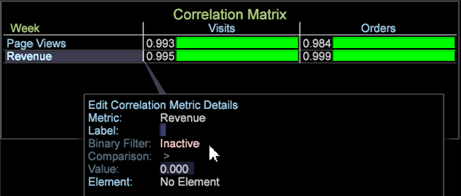

# Filtro binario en la matriz de correlación{#binary-filter-in-the-correlation-matrix}

Un filtro binario en la matriz de correlación permite restringir los valores de una o ambas métricas correlacionadas para enfocar mejor la comparación.

Para definir un filtro binario en una matriz de correlación:

1. En la matriz de correlación, haga clic con el botón derecho en un nombre de métrica.
1. Seleccione **Editar detalles** de métricas.

   

   Se abrirá la **[!UICONTROL Edit Correlation Metric Details]** ventana.

   

1. Configure un filtro binario.

   En primer lugar, haga clic en la **[!UICONTROL Inactive]** configuración. Se alternará para definir el filtro como **[!UICONTROL Active]** y mostrar los campos **Comparación** y **Valor** .

   A continuación, seleccione un **[!UICONTROL Comparison]** operador y defina su configuración **[!UICONTROL Value]** para configurar un filtro para la métrica seleccionada.

>[!IMPORTANT]
>
>El Filtro binario para Área de trabajo de datos 6.2 se ha actualizado con nuevas funciones, lo que requiere que vuelva a crear cualquier matriz de correlación con un filtro binario creado en versiones anteriores.

## Adición de elementos de dimensión {#section-f19f4e0368ca488e92d1e28bcc24417c}

También puede agregar un elemento de dimensión para restringir una métrica. Una métrica solo puede tener un elemento asociado.

Haga clic con el botón derecho en el espacio de trabajo y seleccione **Tabla**. Abra una dimensión con sus elementos y arrástrela a la **[!UICONTROL Element]** configuración de la ventana Editar detalles de métricas de correlación, o bien coloque una métrica en la matriz de correlación.
