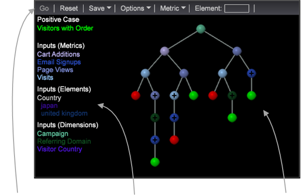

# Generador de árboles de decisión{#decision-tree-builder}

{{eol}}

Los árboles de decisión son una visualización de análisis predictivo que se utiliza para evaluar las características y relaciones del visitante. El Generador de árboles de decisiones genera una visualización de árboles de decisiones en función de un caso positivo especificado y un grupo de entradas.

Un Árbol de decisiones es un clasificador binario con un grupo de reglas (o filtros) que identifica a visitantes que satisfacen reglas específicas en función de un caso positivo. Un árbol de decisiones establece reglas para clasificar a visitantes que satisfacen (o no) este caso positivo. Estas reglas generan un mapa de árboles para proporcionar un nivel de confianza y cumplir estos resultados de caso positivo.

Se crea un árbol de decisión examinando las entradas en cada nivel y eligiendo el que proporciona una ganancia máxima de información en un punto de división especificado. Los puntos de división para cada nivel de variable generan dos conjuntos:

* Valores menores o iguales que el punto de división y
* Valores buenos que el punto de división.

Utilice árboles de decisión para

* Realizar análisis e interpretación significativos en menos tiempo.
* Emplee la generación automatizada de segmentos.
* Haga rápidamente inferencias de un modelo basadas en una gran cantidad de datos.

<table id="table_FCC5D63EF8A843D79B2338BD951025EA"> 
 <tbody> 
  <tr> 
   <td colname="col1"> 
<b>Barra de herramientas y menús</b> 
 
La barra de herramientas incluye botones y comandos de menú para el árbol de decisiones, incluidas funciones para definir el caso positivo y añadir listas de entrada. 
 
Al igual que otras visualizaciones, la variable  Elemento permite arrastrar y soltar Dimension y elementos, aunque también puede arrastrarlos directamente desde el panel Buscadores . 
 
Para obtener más información, consulte <a href="../../../../home/c-get-started/c-analysis-vis/c-decision-trees/c-decision-trees-menu.md#concept-bfc4e80651a243d3966cc770b205606c"> Opciones del árbol de decisiones</a>. 
 </td> 
   <td colname="col2"> 
<b>Lista de entrada</b> 
 
Esta área muestra las entradas en el modelo de árbol. Están codificados por colores para que coincidan con los nodos del área Visualización de árbol . 
 
Hacer clic con el botón derecho en una entrada le permite quitar la entrada del modelo y restablecer. 
 
Si pasa el ratón sobre un nodo de árbol, se mostrarán las condiciones de división a lo largo de la rama a ese nodo y la predicción en ese nodo con su valor de confianza. 
 </td> 
   <td colname="col3"> 
<b>Visualización de árbol</b> 
 
Esta área muestra el modelo de árbol con nodos de hoja codificados por colores según su predicción: verde para una predicción True del Caso Positivo y rojo para una predicción False. 
 
Los nodos divididos están codificados por colores a las entradas que coinciden con su condición de selección. Al pasar el ratón por encima de un nodo, se muestra información sobre la división y se amplía la lista de entradas para mostrar los puntos de división a lo largo de la rama y la distribución del conjunto de formación. 
 
De forma predeterminada, los nodos situados por debajo de un umbral no se muestran. Haga clic en un nodo ampliable (indicado con un símbolo +) para explorar una rama. Haga clic en el nodo raíz para volver a la visualización completa del árbol. 
 </td> 
  </tr> 
 </tbody> 
</table>

<!--  -->
