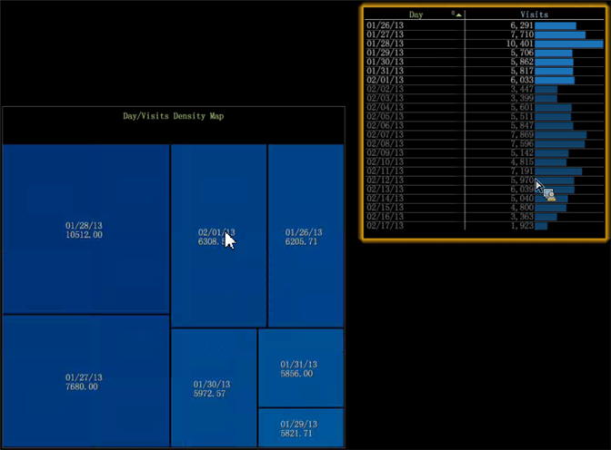

# Mapa de densidad{#density-map}

La visualización del mapa de densidad muestra los elementos como rectángulos sombreados dentro de un mapa cuadrado.

Los tamaños de los rectángulos dependen de los valores de los elementos, donde los valores más grandes se representan mediante rectángulos de área más grande. Similar a un gráfico circular, esta visualización permite ver rápidamente qué elementos constituyen el porcentaje bueno de la dimensión seleccionada.

Para crear un mapa de densidad:

1. Abra un nuevo espacio de trabajo.

   Después de abrir un nuevo espacio de trabajo, es posible que tenga que hacer clic en **Agregar** > **Desbloquear temporalmente**.
1. Haga clic **[!UICONTROL Visualization]** > **[!UICONTROL Density Map]**.

1. Seleccione un **[!UICONTROL Dimension]** en el menú.

   Por ejemplo, seleccione **[!UICONTROL Time]** > **[!UICONTROL Days]**.

   Por el contrario, seleccionar **[!UICONTROL Time]** > **[!UICONTROL Hours]** le daría más elementos con valores más pequeños que se mostrarían como rectángulos más pequeños.

   >[!NOTE]
   >
   >Elija una dimensión con varios elementos según sus necesidades. El límite actual es de 200 de los elementos más grandes para cada dimensión.

1. Para cambiar las vistas de dimensión, abra **[!UICONTROL Visualization]** > **[!UICONTROL Table]** y seleccione entre los elementos de la tabla que desea mostrar en el mapa.

   

   El mapa responderá a las selecciones de la tabla.

1. Al pasar el ratón por encima de los elementos pequeños se mostrarán su nombre y valor en el texto que aparece cerca del cursor del ratón.
1. Enmascara los elementos haciendo clic con el botón derecho y seleccionando **[!UICONTROL Mask]**, luego elija una opción.

   

   Para mostrar todos los nodos enmascarados, seleccione **[!UICONTROL Unhide All]**.

1. Elementos destacados haciendo clic con el botón derecho y seleccionando **[!UICONTROL Spotlight]** y, a continuación, elija una opción. El resaltado permite resaltar y atenuar elementos en un rango.
1. Agregue una leyenda de color al espacio de trabajo. Puede identificar valores en el mapa utilizando la leyenda de color.

   Puede añadir una leyenda de color al espacio de trabajo y los nodos cambiarán de color según la dimensión adicional de datos.
1. Para cambiar la dimensión o métrica, haga clic con el botón derecho en el título del mapa y seleccione en el menú .

   

1. Agregue llamadas haciendo clic con el botón derecho en una celda y seleccionando **[!UICONTROL Add Callout]**. Puede seleccionar de diferentes tipos o visualizaciones en el menú.

   

1. Como en todas las visualizaciones, puede hacer clic con el botón derecho sobre la barra de título para ver los comandos básicos Cerrar, Guardar, Exportar a Microsoft Excel, Ordenar, Copiar, Minimizar y Sin bordes para mostrar una visualización sin borde.

   

1. El mapa de densidad le permite seleccionar y deseleccionar varios elementos similares a otras visualizaciones:

* Haga clic con el botón izquierdo para seleccionar un elemento.
* Ctrl + clic para seleccionar varios elementos.
* Mayús + clic para anular la selección de un elemento.
* Haga clic con el botón derecho en los elementos seleccionados para abrir un menú. A continuación, elija **[!UICONTROL Deselect]** o **[!UICONTROL Deselect All]** para borrar los elementos seleccionados.

## Opciones adicionales {#section-d77defb012424de4a7ced8e5c93115bc}

Haga clic con el botón derecho en el Mapa de densidad para abrir un menú con estas opciones:

<table id="table_3ADA85031C834792BFD041E186962A41"> 
 <thead> 
  <tr> 
   <th colname="col1" class="entry"> Opción </th> 
   <th colname="col2" class="entry"> Descripción </th> 
  </tr>
 </thead>
 <tbody> 
  <tr> 
   <td colname="col1"> Agregue Llamada </td> 
   <td colname="col2">Agregue un texto o gráfico como una llamada en la visualización para identificar o describir aún más un elemento. 
También puede seleccionar una Leyenda de métrica, una Tabla, un Gráfico de líneas o un Diagrama de puntos en blanco en función del elemento seleccionado en el Mapa de densidad. A continuación, puede agregar métricas y dimensiones a estas visualizaciones en blanco según sea necesario. 
 </td> 
  </tr> 
  <tr> 
   <td colname="col1"> Máscara </td> 
   <td colname="col2">Las opciones de enmascaramiento permiten ocultar elementos seleccionados. Haga clic con el botón derecho para mostrar las opciones de Máscara. 
 Ocultar este elemento: elija esta opción para enmascarar un solo elemento que haya seleccionado. 
 
 Ocultar seleccionado: elija esta opción para enmascarar varios elementos que haya seleccionado. 
 
 Mostrar superior: elija esta opción para mostrar solo los primeros 100, 50, 25 o 10 elementos principales según los valores del mapa de densidad. 
 
 Mostrar abajo: elija esta opción para mostrar solo los 100, 50, 25 o 10 elementos superiores inferiores según los valores del mapa de densidad. 
 </td> 
  </tr> 
  <tr> 
   <td colname="col1"> Elementos destacados </td> 
   <td colname="col2"> El resaltado permite resaltar y atenuar elementos en un rango. Haga clic con el botón derecho para abrir un menú de opciones. 
 Mostrar superior: elija esta opción para resaltar solo los primeros 100, 50, 25 o 10 elementos principales según los valores del mapa de densidad. 
 
 Mostrar abajo: elija esta opción para resaltar solo los 100, 50, 25 o 10 elementos superiores inferiores basados en los valores del mapa de densidad. 
 </td> 
  </tr> 
  <tr> 
   <td colname="col1"> 
Anular selección 
 
Anular todas las selecciones 
 </td> 
   <td colname="col2"> 
 Seleccione estos comandos para anular la selección del elemento actual, si está seleccionado, o anule la selección de todos los elementos seleccionados. 
 </td> 
  </tr> 
 </tbody> 
</table>
