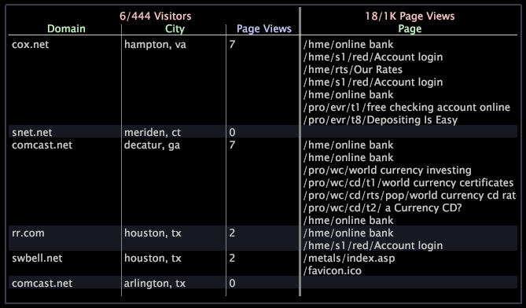
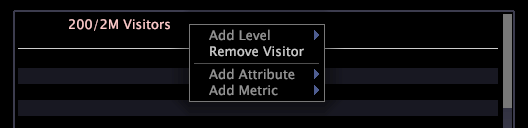

# Detail table{#detail-table}

Las tablas de detalles permiten ver información adicional sobre un subconjunto de datos, que se define mediante las selecciones que se realizan en otras visualizaciones.

La información adicional que se muestra es una muestra de todos los datos disponibles.

En la tabla siguiente se describen los elementos de una tabla de detalles.

<table id="table_C88C7F7F5AEA4820B908923E45CC0A62"> 
 <thead> 
  <tr> 
   <th colname="col1" class="entry"> Elemento </th> 
   <th colname="col02" class="entry"> Color </th> 
   <th colname="col2" class="entry"> Descripción </th> 
  </tr> 
 </thead>
 <tbody> 
  <tr> 
   <td colname="col1"> 
Nivel 
 </td> 
   <td colname="col02"> 
Rosa 
 </td> 
   <td colname="col2"> 
Cualquier dimensión contable para la cual desee ver información detallada de atributos y métricas. El nivel va precedido del número de elementos mostrados del número de elementos disponibles, por ejemplo, 6/444 indica que se están mostrando 6 elementos de un posible 444. En el ejemplo anterior, el nivel Visitantes indica que todos los detalles proporcionados se basan en el visitante. El nivel Vistas de página indica que todos los detalles proporcionados se basan en la vista de página. Ver varios niveles al mismo tiempo resulta útil cuando desea analizar datos que tienen diferentes elementos principales contables. 
 </td> 
  </tr> 
  <tr> 
   <td colname="col1"> 
Atributo 
 </td> 
   <td colname="col02"> 
Verde 
 </td> 
   <td colname="col2"> 
Cualquier dimensión que sea de uno a muchos o de uno a uno con el nivel, como Ciudad a visitantes. Cada fila muestra el elemento relacionado con cada elemento del nivel seleccionado. En el ejemplo anterior, los atributos Dominio y Ciudad enumeran el dominio y la ciudad de cada uno de los visitantes de muestra. 
 </td> 
  </tr> 
  <tr> 
   <td colname="col1"> 
Métrica 
 </td> 
   <td colname="col02"> 
Azul 
 </td> 
   <td colname="col2"> 
Detalles de la métrica sobre el nivel seleccionado. En el ejemplo anterior, con el nivel establecido en Visitantes, la métrica Vistas de página muestra el número de vistas de página para un visitante individual, mientras que el nivel Vistas de página proporciona los detalles sobre cada una de esas vistas de página. 
 </td> 
  </tr> 
 </tbody> 
</table>

Supongamos que está trabajando con datos de sitios web y desea averiguar qué páginas visitan los visitantes en determinadas ciudades y dominios concretos durante un intervalo de tiempo determinado.

En primer lugar, debe crear una visualización que muestre el intervalo de tiempo en el que le interese y, a continuación, debe seleccionar ese intervalo de tiempo. Ahora puede agregar una tabla de detalles para ver los detalles deseados para un número de visitantes de muestra en el conjunto de datos.

Para ver los detalles descritos anteriormente, debe completar los siguientes pasos:

1. Haga clic con el botón derecho en la tabla de detalles y haga clic en **[!UICONTROL Add Level]** > **[!UICONTROL Visitor]**.
1. Haga clic con el botón derecho en la tabla de detalles y haga clic en **[!UICONTROL Add Level]** > **[!UICONTROL Page View]**.
1. Haga clic con el botón secundario en el encabezado del **[!UICONTROL Visitors]** nivel y haga clic en **[!UICONTROL Add Attribute]** > **[!UICONTROL Geography]** > **[!UICONTROL Domain]**.
1. Haga clic con el botón derecho en el encabezado de nivel Visitantes y haga clic en **[!UICONTROL Add Attribute]** > **[!UICONTROL Geography]** > **[!UICONTROL City]**.
1. Haga clic con el botón derecho en el encabezado de nivel Visitantes y haga clic en **[!UICONTROL Add Metric]** > **[!UICONTROL Page Views]**.
1. Haga clic con el botón derecho en el encabezado de nivel Vistas de página y haga clic en **[!UICONTROL Add Attribute]** > **[!UICONTROL Page]** > **[!UICONTROL Page]**.

El siguiente espacio de trabajo de muestra muestra los detalles relacionados de una muestra aleatoria de seis visitantes del sitio durante el período de tiempo especificado.

## Agregar un nivel {#section-f948d3361fd84906ac4d9ebce520bfd0}

* Haga clic con el botón derecho en la tabla de detalles y haga clic en **[!UICONTROL Add Level]** > *&lt;**[!UICONTROL dimension name]**>*.

## Eliminar un nivel {#section-a8c820e0b656451e98e5ea75373edefc}

* Haga clic con el botón secundario en el encabezado de nivel existente y haga clic en **[!UICONTROL Remove Level]** > *&lt;**[!UICONTROL dimension name]**>*.

## Add attributes and metrics {#section-cdda2df3c9a448d5b9770686c8b8efb3}

* Haga clic con el botón secundario en un encabezado de atributo o métrica y haga clic en **[!UICONTROL Add Attribute]** > *&lt;**[!UICONTROL attribute name]**>* o **[!UICONTROL Add Metric]** > *&lt;**[!UICONTROL metric name]**>*.

## Eliminar atributos y métricas {#section-4002ac957a2846678f9940270987d651}

* Haga clic con el botón secundario en la columna que desee eliminar y haga clic en **[!UICONTROL Remove Attribute]** > *&lt;**[!UICONTROL attribute name]**>* o **[!UICONTROL Remove Metric]** > *&lt;**[!UICONTROL metric name]**>*.

## Exportar a Microsoft Excel {#section-a9eaba63c88a4598836a34669ba8cac1}

Para obtener información sobre la exportación de ventanas, consulte [Exportación de datos](../../../home/c-get-started/c-wk-win-wksp/c-exp-win-data.md#concept-8df61d64ed434cc5a499023c44197349)de ventana.
