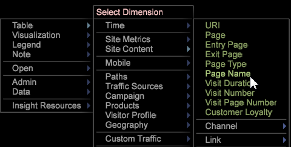

# Creación de un canal{#building-a-funnel}

{{eol}}

Siga estos pasos para crear una nueva visualización de canal

<!--  -->

1. En un espacio de trabajo nuevo, abra una tabla de dimensiones.

   

   Por ejemplo, haga clic con el botón derecho en el espacio de trabajo y seleccione **[!UICONTROL Table > Site Content > Page Name]**

1. Abra una visualización de canal.

   Por ejemplo, haga clic con el botón derecho en el espacio de trabajo y seleccione **[!UICONTROL Visualization > Funnel]**.

   

1. Para añadir una dimensión, seleccione el elemento y arrástrelo mientras mantiene presionada la tecla **[!UICONTROL `<Ctrl>`]** + **[!UICONTROL `<Alt>`]**.

1. Arrastre el elemento hasta su posición sobre la zona de destino. **[!UICONTROL Drag Dimension Element Here]**.

   

1. Añada dimensiones adicionales.

   Puede añadir hasta un total de ocho pasos al canal.
1. Libere la selección de tabla que ha realizado para ver el canal en función de una audiencia total.

   Las visualizaciones de canal siguen el patrón de todas las demás visualizaciones, lo que permite que el elemento seleccionado controle el segmento de datos que está visualizando.
1. Modifique la dimensión del clip de canal, la dimensión de nivel y la métrica.

   Haga clic con el botón derecho en el título para ajustar estas opciones en función de las métricas y dimensiones definidas en su perfil personalizado.

   

Desde el canal, puede identificar las visitas en el orden previsto y las tasas y el porcentaje de clientes que convierten las ventas y siguen las campañas o rutas de contenido. Para obtener más información, puede abrir un [Navegador de rutas](../../../../home/c-get-started/c-analysis-vis/c-funnel-visualization/c-path-browser-funnel.md#concept-b0cedf7a28ae422696ded1258c9a4119) para ver una lista detallada de las páginas tomadas antes de llegar a la página seleccionada y las rutas que se siguen después de que se fueron.

Consulte [Funciones de canal](../../../../home/c-get-started/c-analysis-vis/c-funnel-visualization/c-funnel-visualization-features.md#concept-e65c81fe17794acd8d00d796b1780dc3).
