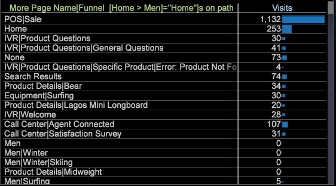

# Adición de un explorador de rutas{#adding-a-path-browser}

Desde la visualización Canal, puede abrir un navegador de rutas para identificar visitas en el orden previsto de visitantes adicionales y visitas en el orden previsto de visitantes.

<!--  -->

Puede identificar dónde &quot;visitas en el orden previsto&quot; de los visitantes (que salieron de la ruta) o dónde los visitantes se &quot;desplazan&quot; (que siguieron la ruta). Puede abrir varios exploradores de rutas desde la misma visualización de canal seleccionando flechas de visitas en el orden previsto o pulsando conos.

1. Abra el Explorador de rutas para el visitante de visitas en el orden previsto, los visitantes que abandonaron el sitio durante un paso específico. Haga clic con el botón derecho en la flecha de visitas en el orden previsto y seleccione la opción Agregar explorador de rutas.

   

   Desde el Explorador de rutas, puede ver dónde fueron los visitantes antes de visitar un elemento seleccionado en el Canal (a la izquierda) y dónde navegaron después de salir de la página (a la derecha).

   

   En la visualización del navegador de rutas, el ancho de las líneas que entran y salen de la dimensión seleccionada identifica el volumen de tráfico. Por ejemplo: antes de visitar la página de hombres, algunos visitantes ingresaron a través de otras rutas, pero la mayoría ingresó a través de la página principal. Cuando se marchó, la mayoría fue a la página Hombres Surfing.

1. Abra el Explorador de rutas para los visitantes de visitas en el orden previsto. Haga clic con el botón secundario en el cono del canal para identificar la ruta de los visitantes que pasaron al canal o se trasladaron al paso siguiente.
1. Haga clic en el botón **Más** en la parte inferior de la visualización del navegador de rutas para abrir una tabla con todas las visitas enumeradas en una vista de tabla de las visitas anteriores y actuales.

   

