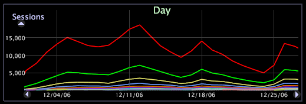

# Cambiar una serie{#change-a-series}

Los elementos dentro de una dimensión se pueden codificar con colores como una serie dentro de un gráfico de líneas para que cada elemento se pueda rastrear más fácilmente en otras visualizaciones del espacio de trabajo.

La función de serie solo se aplica a los gráficos cuando el gráfico de líneas se muestra como líneas, no como barras.

Cuando una serie está activa, los datos de los diferentes elementos de la dimensión se muestran en colores alternativos. Resulta útil agregar una tabla al espacio de trabajo que muestre la misma dimensión para proporcionar una leyenda de serie para la dimensión seleccionada. Consulte [Uso de leyendas](../../../../home/c-get-started/c-analysis-vis/c-tables/c-srs-leg.md#concept-c48042a705524bc4b63cd6f24874cc12)de serie.

**Para habilitar una serie**

* Haga clic con el botón derecho en un elemento o en la etiqueta de la dimensión y haga clic en **[!UICONTROL Change Series]** > *&lt;**[!UICONTROL dimension name]**>*.

**Para deshabilitar una serie**

* Haga clic con el botón derecho en un elemento o en la etiqueta de la dimensión y haga clic en **[!UICONTROL Change Series]** > **[!UICONTROL None]**.

