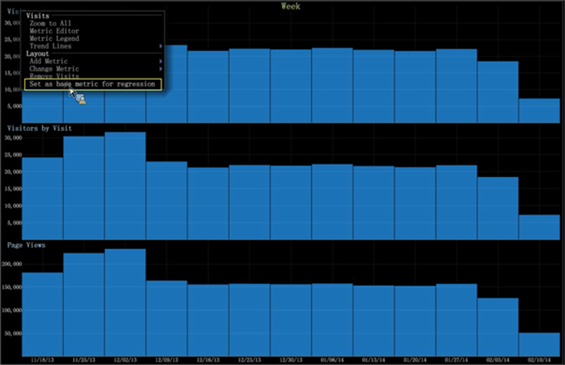

# Regression Analysis Graph{#regression-analysis-graph}

El gráfico de barras en el área de trabajo de datos ahora incluye una comparación de regresión para varias métricas en varios gráficos.

[Los gráficos](https://docs.adobe.com/content/help/en/data-workbench/using/client/analysis-visualizations/graphs/c-graphs.html) de barras del área de trabajo de datos permiten retroceder las métricas de un gráfico a las métricas de otro gráfico. Si tiene varios gráficos, puede comparar una métrica (como variable independiente) con un gráfico que evalúe otras métricas (como variables dependientes). Esto le permite determinar la fuerza de la relación entre una variable dependiente (la métrica establecida primero) y una serie de otras métricas cambiantes (regresiones con la métrica dependiente establecida).

El análisis de regresión en una visualización de gráfico permite a los analistas realizar escenarios de &quot;y si&quot;. Por ejemplo: si las visitas aumentan a este nivel, ¿qué impacto tendrá este aumento en los ingresos?

**Configuración del análisis de regresión**

1. Seleccione el gráfico como métrica dependiente para una comparación de regresión.

   Haga clic con el botón derecho en el gráfico y seleccione **Establecer como métrica base para la regresión**.

   

1. Configure otros gráficos de métricas como variables independientes.

   Haga clic con el botón derecho en la métrica y seleccione **[!UICONTROL Regress with `<base metric name>`]** para otras métricas.

   

1. Vea la regresión haciendo clic con el botón derecho en el gráfico para mover la barra hacia arriba y hacia abajo.

   Si hace clic con el botón secundario en el gráfico para un valor específico, podrá ver las tasas de regresión para cada métrica en función de los valores hacia arriba o hacia abajo.

   

   Por ejemplo: si mis vistas de página disminuyen a 86.041, las demás métricas tendrán estos valores: Visitas a 12.183 y Visitantes por Visita a 12.028.

   

   Si los valores de Visitantes por Visitas aumentan a 26.141, las demás métricas serán Visitas a 26.560 y Vistas de página a 189.091.

