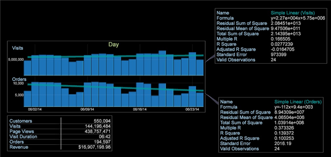

# Líneas de tendencia{#trend-lines}

Las líneas de tendencias permiten superponer gráficos para comparar e interpretar datos.

Al igual que la visualización de diagrama de [puntos](https://docs.adobe.com/content/help/en/data-workbench/using/client/analysis-visualizations/c-scat-plots.html) , ahora puede establecer líneas de tendencia en una visualización de gráfico para mostrar la tasa de cambio en función de líneas lineales, exponenciales, de potencia o polinomiales. La función Línea de tendencias permite superponer líneas de tendencia en un gráfico, generalmente en una dimensión de tiempo.

Por ejemplo: en esta comparación de gráficos, podemos ver que las visitas están aumentando, pero los pedidos están disminuyendo.

Para agregar una línea de tendencias

1. Abra un gráfico y haga clic con el botón secundario en el nombre de la métrica en la esquina superior izquierda.
1. Haga clic **[!UICONTROL Trend Lines]** y seleccione una de las opciones.

   

   Puede seleccionar la línea de tendencia para que aparezca sobre el gráfico como Lineal **** simple, **Exponencial**, **Potencia** o **Polinómica**. El polinomio creará una línea de tendencia de regresión polinómica. Lineal simple creará una línea de tendencia como la tasa de cambio a lo largo de la línea de regresión. Exponential calcula una línea de tendencia como y = b*exp( a*x ) y Power como y = b*x`a`.

   La tendencia se calculará y procesará en el gráfico, y se abrirá una llamada que mostrará información detallada de la ecuación de tendencia.

   

