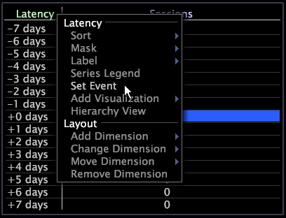

# Tablas de latencia{#latency-tables}

Las visualizaciones de tabla de latencia son tablas que incluyen una dimensión de latencia, que es un tipo de dimensión derivada que mide el tiempo que ha transcurrido desde que se produjo un evento en particular.

Para definir el evento, realice selecciones en una o varias visualizaciones y defina dichas selecciones como el evento mediante la opción de menú contextual Establecer evento. Las tablas de latencia son especialmente útiles para rastrear la actividad relacionada con una campaña o con un pedido de cliente en particular en el que está buscando una correlación horaria.

En [!DNL Site], las tablas de latencia proporcionan información sobre las sesiones del visitante que se produjeron siete días antes o después del evento, pero puede configurar tablas de latencia para proporcionar información sobre diferentes dimensiones horarias y contables. Consulte [Configuración de tablas](../../../home/c-get-started/c-intf-anlys-ftrs/c-config-ltcy-tbls/c-config-ltcy-tbls.md#concept-7175c3defec64556994f0dfcccb7d15c)de latencia.

Los elementos de la dimensión principal, como una sesión, que forman parte del evento específico seleccionado, tienen una latencia de cero. Todos los demás elementos son latencias asignadas que reflejan la distancia (en la dimensión temporal adecuada) del evento.

El siguiente ejemplo ilustra cómo puede utilizar la tabla de latencia.

**Identifique los eventos de valor en relación con una campaña**

Supongamos que desea rastrear la actividad de los clientes durante los siete días anteriores y posteriores a la respuesta a una campaña publicitaria en particular. Para ver la latencia de una campaña publicitaria en particular, debe establecer la campaña de interés como el evento de la tabla de latencia.

La latencia en el espacio de trabajo siguiente se basa en la selección de Campaña 11566 (las sesiones en respuesta a esta campaña).

Una latencia de &quot;+0 días&quot; identifica las sesiones en respuesta a la Campaña 11566, así como todas las demás sesiones para los mismos clientes que se produjeron el mismo día.

Una latencia de &quot;-2 días&quot; identifica las sesiones de los mismos clientes que se produjeron dos días antes de que los clientes respondieran a la campaña.

Una latencia de &quot;+7 días&quot; identifica las sesiones de los mismos clientes que se produjeron siete días después de responder a la campaña.

Además de los procedimientos enumerados en las secciones siguientes, puede realizar todas las mismas tareas que puede realizar en una tabla, como ordenar elementos, enmascarar elementos, agregar una leyenda de serie, exportar datos, etc. For more information, see [Tables](../../../home/c-get-started/c-analysis-vis/c-tables/c-tables.md#concept-c632cb8ad9724f90ac5c294d52ae667f).

## Crear una tabla de latencia {#section-31a03031d9854ef7acc2462d4f37678d}

Para crear una tabla de latencia, debe empezar por realizar una selección y, a continuación, establecer esa selección como el evento para el que desea rastrear la latencia.

1. Haga clic con el botón derecho en un espacio de trabajo y abra las visualizaciones que desee, que deben basarse en la dimensión contable utilizada para configurar la tabla de latencia.

   Por ejemplo, en [!DNL Site] las visualizaciones debe estar basada en sesiones.

1. Abra una tabla de latencia en blanco.
1. Realice una selección en el espacio de trabajo.
1. Haga clic con el botón derecho en la tabla de latencia y haga clic en **[!UICONTROL Set Event]**.

>[!NOTE]
>
>Los eventos que seleccione no se conservan a menos que guarde las selecciones como una dimensión de latencia. Para obtener más información, consulte [Reutilización de una dimensión](../../../home/c-get-started/c-analysis-vis/c-lat-tbls.md#section-29c6483bf9ba476fb1c24ad1df253f46)de latencia.

## Reutilización de una tabla de latencia {#section-05f741169d204213b6537dce553e4f73}

Si desea volver a usar la misma tabla de latencia, puede guardar la tabla de latencia localmente o si tiene los permisos adecuados, puede guardarla en el servidor para que todos los usuarios de un perfil en particular puedan acceder a ella.

**Guardar la tabla de latencia para utilizarla en otros espacios de trabajo**

1. Haga clic con el botón derecho en el borde superior de la visualización y haga clic en **[!UICONTROL Save]**. Aparecerá la [!DNL Save] ventana. La ubicación de almacenamiento predeterminada es la carpeta User\*profile name*\Work.
1. En el [!DNL File name] campo, escriba un nombre descriptivo para la visualización y haga clic en **[!UICONTROL Save]**.

**Para recuperar la tabla de latencia guardada**

1. Haga clic con el botón derecho en el espacio de trabajo y haga clic en **[!UICONTROL Open]** > **[!UICONTROL File]**. Aparecerá la [!DNL Open Visualization] ventana.
1. Vaya a la tabla de latencia que guardó.
1. Seleccione el archivo de visualización de la tabla de latencia ( [!DNL *.vw]) y haga clic en **[!UICONTROL Open]**.

## Reutilización de una dimensión de latencia {#section-29c6483bf9ba476fb1c24ad1df253f46}

Si desea volver a utilizar la misma dimensión de latencia, puede guardar la dimensión de latencia localmente o si tiene los permisos adecuados, puede guardarla en el servidor para que todos los usuarios de un perfil concreto tengan acceso a ella.

Todas las dimensiones de latencia que cree se guardarán en el directorio Dimensiones del perfil y estarán disponibles en la lista [!DNL Change Dimension] desplegable del área de trabajo de datos.

**Guardar la dimensión de latencia para utilizarla en otros espacios de trabajo**

1. Haga clic con el botón secundario en la etiqueta de la [!DNL Latency] columna o en uno de sus elementos y haga clic en **[!UICONTROL Save Dimension]**. Aparecerá la [!DNL Save Dimension As] ventana.
1. Seleccione o cree el subdirectorio adecuado en el directorio Dimensiones.
1. En el [!DNL File name] campo, escriba un nombre descriptivo para la dimensión (por ejemplo, [!DNL Latency for Campaign 11565.dim]) y haga clic en **[!UICONTROL Save]**.

**Para recuperar la dimensión de latencia guardada**

1. Haga clic con el botón derecho en el espacio de trabajo y haga clic en **[!UICONTROL Open]** > **[!UICONTROL File]**. Aparecerá la [!DNL Open Visualization] ventana.
1. Vaya a la visualización de latencia guardada en la carpeta User\*profile name*\Dimensions.
1. Seleccione el archivo de dimensión de latencia ( [!DNL *.dim]) y haga clic en **[!UICONTROL Open]**.

## Exportar a Microsoft Excel {#section-3dffa5c3aab14cdaa40c78b81b08fe53}

Para obtener información sobre la exportación de ventanas, consulte [Exportación de datos](../../../home/c-get-started/c-wk-win-wksp/c-exp-win-data.md#concept-8df61d64ed434cc5a499023c44197349)de ventana.

## Exportar a un archivo TSV {#section-fd921f351c994ed0a94f63d3bd5b5a87}

Para obtener información sobre la exportación de ventanas, consulte [Exportación de datos](../../../home/c-get-started/c-wk-win-wksp/c-exp-win-data.md#concept-8df61d64ed434cc5a499023c44197349)de ventana.
