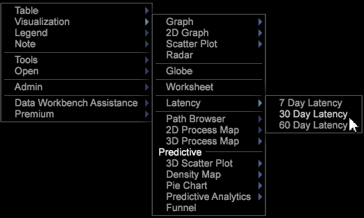

# Análisis de latencia{#latency-analysis}

{{eol}}

La visualización de latencia permite analizar el comportamiento latente del cliente en un número determinado de días antes o después de que se produzca un evento después de una campaña u otro tipo de evento o período de tiempo.

La variable **[!UICONTROL Latency]** la visualización le permite establecer una métrica para identificar el comportamiento antes, durante o después de que se produzca un evento para determinar su efecto en el comportamiento del cliente. Por ejemplo, puede identificar la eficacia de una campaña de marketing consultando los ingresos una semana después de que se produzca un evento. O puede mostrar el comportamiento del cliente una semana antes del evento como punto de referencia para ver el efecto de un evento en el comportamiento.

Con la visualización de latencia, puede cambiar la dimensión Tiempo de día, hora, semana u otro período de tiempo, para visitar, hacer clic, visitar u otra dimensión contable.

**Configuración del análisis de latencia**

1. Abra un espacio de trabajo y haga clic con el botón derecho [!DNL Visualization] > [!DNL Latency].

1. En el menú, seleccione el número de días para analizar los eventos de latencia. 

1. Haga clic con el botón derecho en el **[!UICONTROL Latency]** etiqueta para abrir el menú.

   * Al usar la variable **[!UICONTROL Set Countable]** , establezca una dimensión contable como visita, pulsación, visita y otros.
   * Al usar la variable **[!UICONTROL Set Countable (Time)]** , establezca una dimensión de tiempo como día, hora, semana, día de la semana y hora del día.

   

1. Modifique la visualización Latencia .

   Haga clic con el botón derecho en el **[!UICONTROL Latency]** para seleccionar opciones de menú para cambiar recuentos, dimensiones, volver a etiquetar o seleccionar o cambiar otras configuraciones.
