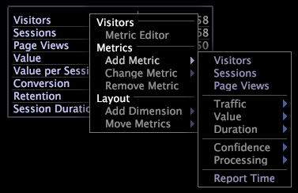

# Leyendas de métricas{#metric-legends}

{{eol}}

Las leyendas de métricas le permiten ver métricas de línea de base relacionadas con su perfil y estadísticas relacionadas con el conjunto de datos (o con la selección actual, si se ha realizado una).

Las leyendas de métricas en la aplicación de Adobe muestran las métricas relevantes para el conjunto de datos, como en el siguiente [!DNL Site] leyenda de métrica.

Las leyendas de métricas son en realidad un caso especial de visualización de tabla. De este modo, las mismas funciones disponibles para las tablas están disponibles para las leyendas de las métricas. Consulte [Tablas](../../../../home/c-get-started/c-analysis-vis/c-tables/c-tables.md#concept-c632cb8ad9724f90ac5c294d52ae667f).

## Agregar una métrica {#section-6655470bf06c4d2b82f7a01784552d1e}

* En el pie de ilustración de la métrica, haga clic con el botón derecho en el nombre de una métrica y haga clic en **[!UICONTROL Add Metric]** > *&lt;**[!UICONTROL metric name]**>*.

## Eliminar una métrica {#section-c0da3396b2d44b9b899b7a0e7d747d94}

* En la leyenda de la métrica, haga clic con el botón derecho en el nombre de la métrica que desee eliminar y haga clic en **[!UICONTROL Remove]**.

## Exportación a Microsoft Excel {#section-03b07062fb43422c902ff65cb66bbd27}

Para obtener información sobre la exportación de ventanas, consulte [Exportación de datos de ventana](../../../../home/c-get-started/c-wk-win-wksp/c-exp-win-data.md#concept-8df61d64ed434cc5a499023c44197349).

## Exportación a un archivo TSV {#section-51a0a6f9cd05448caf149ddc927aa665}

Para obtener información sobre la exportación de ventanas, consulte [Exportación de datos de ventana](../../../../home/c-get-started/c-wk-win-wksp/c-exp-win-data.md#concept-8df61d64ed434cc5a499023c44197349).
