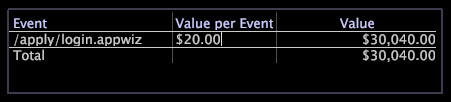

# Leyendas de valores{#value-legends}

Una leyenda de valor muestra eventos de valor definidos.

La leyenda del valor solo está configurada en las aplicaciones HBX y [!DNL Site] , pero se puede configurar para otras aplicaciones. Para obtener más información, póngase en contacto con los servicios de consultoría de Adobe.

En HBX y [!DNL Site], un evento de valor se define como una sesión que generó valor comercial. Por ejemplo, los registros de datos de evento asociados con vistas de página específicas (por ejemplo, una página de agradecimiento por pedidos o una página de finalización de aplicaciones) pueden representar eventos de valor para una organización empresarial.

Con los eventos de valor, puede medir y rastrear la cantidad de valor generado por el sitio web. Puede evaluar el valor empresarial en dólares para cada evento y responder preguntas como:

* ¿Cuál es la ruta más rentable a través del sitio web?
* ¿Qué referente o campaña ha generado el mayor valor?

Para cada evento, la leyenda muestra el valor de unidad del evento (valor por evento) y el valor total generado por el evento. La leyenda se utiliza para definir y cambiar eventos de valor y para asignarles valores de unidad.

En la tabla siguiente se enumeran las métricas relacionadas con los eventos de valor.

| Métrica | Descripción |
|---|---|
| Conversión | El porcentaje de sesiones que generaron valor empresarial |
| Valor | El valor comercial total generado, en dólares |
| Promedio de Valor | El valor empresarial promedio generado, en dólares, por sesión |

Puede definir fácilmente cualquier cosa que los visitantes hagan en el sitio web como un evento de valor: publicar una solicitud de servicio al cliente, completar una aplicación, ver un fragmento de contenido o completar una compra. Cada evento de valor corresponde a un usuario que accede a una página o conjunto de páginas en particular del sitio web y está asociado con un valor comercial en dólares. Por ejemplo, puede suponer que cada usuario que llega a la página &quot;Gracias por comprar&quot; genera un margen de contribución de 20 dólares en promedio. Definiría un evento de valor para esa página que tenga un valor de 20 $.

## Definir nuevos eventos de valor {#section-2ea4d168336e4d2e98b22b636ed43853}

**Para definir un nuevo evento de valor en HBX o[!DNL Site]**

Cuando se crea un evento de valor, se arrastran las páginas del sitio web que representan el valor desde una visualización a una leyenda de valor.

1. Abra una leyenda de valores.

   

1. Agregue eventos de valor a la leyenda desde mapas de procesos, tablas de páginas de URI o vistas de jerarquía de páginas:

   * Desde un mapa de procesos, arrastre los nodos desde el mapa de procesos hasta la leyenda.
   * Desde una tabla de página URI, pulse Ctrl+Alt y arrastre una página desde la tabla hasta el pie de ilustración.
   * En una vista de jerarquía de páginas, haga clic en a la izquierda de un nodo (carpeta, página o grupo) y arrástrelo al pie de ilustración.

   

   El puntero del ratón muestra la palabra &quot;No&quot; hasta que el ratón llegue a la leyenda.

1. En la leyenda del valor, asigne un valor comercial a cada sesión para la que se produzca el evento:

   1. En la columna [!DNL Value per Event] , haga clic en la celda que corresponda a la página añadida como evento de valor.
   1. Escriba la cantidad en dólares que desea asignar para el valor de ese evento y pulse Intro.

   

   De forma predeterminada, la dirección URL de la página que definió como un evento de valor aparece en la leyenda de valores. Si lo desea, puede hacer doble clic en esta dirección URL de la leyenda para entrar al modo de edición y cambiar el nombre del evento. También puede editar el valor de un evento en particular en cualquier momento. El servidor de Data Workbench vuelve a calcular automáticamente las métricas basadas en eventos de valor, como el valor promedio y la conversión.

Una vez definido al menos un evento de valor, la dimensión Segmento de valor queda disponible para su uso. Esta dimensión representa el valor total que un visitante ha generado en todas las sesiones.

## Eliminar eventos de valor {#section-25cd90a859384ca183c0fc0998f888cf}

* Haga clic con el botón derecho en el evento deseado y haga clic en **[!UICONTROL Delete Event]**.

   

>[!NOTE]
>
>El servidor de Data Workbench calcula las métricas de todo el conjunto de datos al que puede acceder el perfil que está utilizando. De forma predeterminada, [!DNL Data Workbench Server] calcula métricas como Valor, Eventos de valor, Valor promedio y Conversión en todos los datos del conjunto de datos de análisis, incluso si los datos no proceden de la misma fuente lógica.

## Exportación a Microsoft Excel {#section-feaa7a8eb8124fafbc74169bebaed6d8}

Para obtener información sobre la exportación de ventanas, consulte [Exportación de datos de ventana](../../../../home/c-get-started/c-wk-win-wksp/c-exp-win-data.md#concept-8df61d64ed434cc5a499023c44197349).
