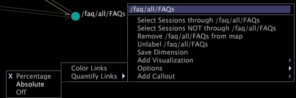

# Mostrar una cantidad de métrica{#display-a-metric-quantity}

{{eol}}

Un mapa de procesos 2D puede mostrar las cantidades de métricas que representan la cantidad de actividad desde o hacia un nodo del mapa.

La secuencia real de actividad puede haber incluido nodos que no se agregaron a este mapa. Esta cantidad se expresa como un porcentaje, un valor absoluto o ningún valor.

>[!NOTE]
>
>Puede mostrar cantidades de métricas solo para mapas de procesos 2D.

**Para mostrar cantidades de métricas en un mapa de proceso 2D**

* Haga clic en el nodo deseado. Todos los demás nodos del mapa de proceso se atenúan para que pueda ver con mayor facilidad las flechas hacia y desde el nodo resaltado y las cantidades de métricas asociadas.

**Para elegir cómo se muestra la cantidad**

1. Haga clic con el botón derecho en un nodo y haga clic en **[!UICONTROL Options]** > **[!UICONTROL Quantify Links]**.
1. Haga clic en **[!UICONTROL Percentage]**, **[!UICONTROL Absolute Value]** o **[!UICONTROL Off]**.

   

Los siguientes ejemplos muestran cantidades de métricas para dos mapas de procesos 2D.

