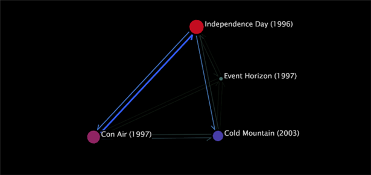

# Tipos de mapas de procesos{#types-of-process-maps}

{{eol}}

Información sobre los diferentes tipos de mapas de procesos.

## Mapas de procesos 2D {#section-ea7fbdb80b1b44aebcd9e4090b6540bf}

Los mapas de proceso bidimensionales proporcionan una vista bidimensional de la actividad entre elementos de dimensión. El tamaño de un nodo en un mapa de proceso 2D es proporcional al valor de la métrica asociada a ese nodo. Además, el grosor y la intensidad de una flecha entre dos nodos son proporcionales a la media de los valores de la métrica para esos nodos.

Dentro de un mapa de proceso 2D, puede realizar cualquiera de las siguientes tareas:

* Seleccionar, mover, quitar y etiquetar nodos
* Realización de selecciones
* Guardar dimensiones
* Crear otras visualizaciones
* Activar vínculos de color
* Mostrar las cantidades de métricas
* Añadir llamadas

El mapa de proceso 2D del siguiente ejemplo muestra los nodos correspondientes a los nombres de las películas. Cada nombre de película es un elemento de la dimensión Película , que se define en un conjunto de datos formado por datos de película. La dimensión Película es la dimensión base para este mapa de proceso.

En el ejemplo, el tamaño de cada nodo y el grosor y la intensidad de cada flecha son proporcionales a la métrica Clasificaciones, que es un recuento de las clasificaciones que recibió una película. Por lo tanto, una película con un nodo grande, como *Día de la Independencia*, tiene más clasificaciones que una película con un nodo pequeño, como *Horizonte de eventos*. También puede ver que más espectadores de películas han clasificado *Día de la Independencia* before *Montaña fría* que clasificó las mismas películas en el orden contrario. Tenga en cuenta que las flechas no indican que los espectadores tengan una clasificación *Día de la Independencia* y luego *Montaña fría* inmediatamente después, o viceversa. Es posible que los espectadores hayan clasificado otras películas en el medio, pero estas películas no se muestran en este mapa.

## Mapas de métricas 2D {#section-a9b846fc71224058918fbc378315effe}

Los mapas de métricas bidimensionales son un tipo de mapa de proceso 2D que posiciona los nodos en función del valor de una métrica en particular. En muchos casos, la métrica utilizada con el mapa de métricas 2D es Conversión o Retención. Los mapas de conversión y retención ayudan a comprender qué pasos de los procesos de los canales orientados al cliente influyen en la conversión y retención de los clientes.

>[!NOTE]
>
>La métrica que utilice con un mapa de métricas 2D debe expresarse como porcentaje.

En un mapa de métricas de conversión, los nodos con una conversión del 0 por ciento se trazan a la izquierda del gráfico y las páginas con una conversión del 100 por ciento se trazan a la derecha. Se muestra la actividad entre nodos, lo que facilita ver qué pasos de un proceso conducen a una conversión mayor o menor y qué pasos conducen al abandono. Un análisis de conversión de procesos es una manera eficaz de comparar procesos o distintas implementaciones del mismo proceso.

De manera similar, los mapas de retención muestran elementos con una retención del 0% a la izquierda del gráfico y elementos con una retención del 100% a la derecha. Puede ver la tasa de retención de cada nodo en el mapa, lo que le ayuda a determinar qué elementos influyen en el retorno de los clientes.

>[!NOTE]
>
>No se pueden mover nodos en mapas de métricas 2D horizontalmente. Los mapas de métricas están diseñados para colocar los nodos de izquierda a derecha en función de sus valores de métrica.

## Mapas de procesos 3D {#section-80acb63ea0994af1af7faef3c6264e51}

Los mapas de procesos tridimensionales proporcionan una vista tridimensional de la actividad entre elementos de dimensión. La altura de una barra en un mapa de proceso 3D es proporcional al valor de la métrica asociada a ese nodo. Al igual que con los mapas de proceso 2D, el grosor y la intensidad de los conectores entre dos nodos son proporcionales a la media de los valores de la métrica para esos nodos. Dentro de un mapa de proceso 3D, puede realizar cualquiera de las siguientes tareas:

* Seleccionar, mover, quitar y etiquetar nodos
* Realización de selecciones
* Guardar dimensiones
* Crear otras visualizaciones
* Activar vínculos de color

El mapa de proceso 3D del siguiente ejemplo muestra los nodos correspondientes a las páginas de un sitio web. Cada página es un elemento de la dimensión Página , que se define en un conjunto de datos que consta de datos de tráfico web. La dimensión Página es la dimensión base para este mapa de proceso.

En el ejemplo, la altura de cada barra y el grosor y la intensidad de cada conector son proporcionales a la métrica Sesiones, un recuento de sesiones en las que se vieron las páginas. Por lo tanto, una página con barra alta, como /faq/all/FAQs, se vio durante más sesiones que una página con una barra corta, como /vs/demo. Tenga en cuenta que las conexiones entre dos páginas no indican que se haya visto una página inmediatamente antes o después de otra durante una sesión determinada. Es posible que se hayan visto otras páginas durante la misma sesión, pero estas páginas no se muestran en este mapa.
