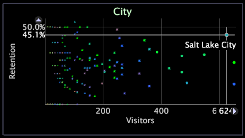

# Diagrama de puntos 2D{#d-scatter-plots}

Diagrama de puntos representa los elementos de una dimensión de datos (como Página o Ciudad) en una cuadrícula en la que los ejes x e y representan métricas diferentes.

Los gráficos de puntos pueden resultar útiles al intentar comprender la relación entre grandes cantidades de elementos dispares, mediante dos métricas diferentes. En el siguiente ejemplo, el diagrama de puntos muestra cada ciudad según el número de visitantes y la tasa de retención respectiva.

El diagrama de puntos permite ver rápidamente los periféricos. Salt Lake City, por ejemplo, tiene una tasa de retención por visitante superior a la media.

Los gráficos de puntos también se pueden utilizar para mostrar la coherencia de los datos. En el siguiente ejemplo, el diagrama de puntos muestra el número de visitantes con sesiones de una duración determinada.

El tamaño de cada punto del diagrama de puntos se determina mediante la métrica de radio. La métrica de radio predeterminada difiere para cada aplicación de Adobe. Por ejemplo, en [!DNL Site], la métrica de radio se basa en Sesiones de forma predeterminada. Puede cambiar la métrica de radio para que los puntos de los gráficos de puntos representen cualquier métrica disponible. Para ver los pasos necesarios para ello, consulte [Cambio de las métricas de radio](../../../home/c-get-started/c-analysis-vis/c-scat-plots.md#section-fd80576d583c430cb469daf12e39aa2a) El color de los puntos se basa en la leyenda de color que está abierta en el espacio de trabajo. Para obtener más información sobre las leyendas de color, consulte [Leyendas de color](../../../home/c-get-started/c-analysis-vis/c-legends/c-color-leg.md#concept-f84d51dc0d6547f981d0642fc2d01358).

## Seleccionar puntos {#section-4b4d45f39b884d54bb7407b3b2f4ea50}

**Seleccionar un solo punto**

* Haga clic en el punto .

**Para añadir otro punto o grupo de puntos a la selección**

* Ctrl + clic en un punto o Ctrl + arrastrar en varios puntos.

**Eliminación de un punto o grupo de puntos de la selección**

* Mayús + clic en un punto o Mayús + arrastrar por varios puntos.

## Cambio de dimensiones {#section-796cd962ef3f476caa89d99083782ed1}

* Haga clic con el botón derecho en la etiqueta de la dimensión en la parte superior del gráfico y haga clic en **[!UICONTROL Change Dimension]** > *&lt;**[!UICONTROL dimension name]**>*.

## Cambio de métricas {#section-44b8be9215cd4039b1eeb98ae1b31445}

**Cambiar la métrica mostrada en el eje x o y de un diagrama de puntos**

* Haga clic con el botón derecho en la etiqueta de la métrica que desea cambiar y haga clic en **[!UICONTROL Change Metric]** > *&lt;**[!UICONTROL metric name]**>*.

## Cambio de las métricas de radio {#section-fd80576d583c430cb469daf12e39aa2a}

**Cambiar la métrica de radio de un diagrama de puntos**

Haga clic con el botón derecho en la etiqueta de la dimensión en la parte superior del gráfico y haga clic en **[!UICONTROL Change Radius Metric]** > *&lt;**[!UICONTROL metric name]**>*.

