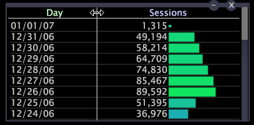

# Ajuste de datos a una ventana{#fit-data-to-a-window}

La opción Ajustar a ventana permite que las columnas de datos de una tabla se expandan o reduzcan automáticamente para ajustarse a la ventana cada vez que cambie su tamaño.

Cuando [!DNL Fit to Window] está desactivado, las columnas de datos deben cambiar de tamaño manualmente.

**Para activar o desactivar la opción Ajustar a ventana**

* Haga clic con el botón derecho en el borde superior de la visualización y haga clic en **[!UICONTROL Fit to Window]**.

   

Cuando está habilitada, aparece una X a la izquierda de [!DNL Fit to Window].

**Para cambiar el tamaño de las columnas de datos manualmente**

* Haga clic en la línea que divide dos columnas de datos cualesquiera (en la región del eje superior) y arrastre hasta el ancho deseado.

   
