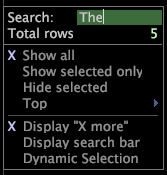

# Enmascarar datos{#mask-data}

Enmascaramiento hace referencia a la selección de un subconjunto de los datos o un subconjunto de los elementos de una dimensión.

Los elementos que no desea incluir en el análisis se enmascaran u ocultan.

La Data Workbench proporciona dos métodos para enmascarar elementos de dimensión. El primer método emplea las opciones disponibles en el menú [!DNL Mask]. Con las opciones del menú [!DNL Mask], puede utilizar el ratón para seleccionar los elementos que desea mostrar o enmascarar, o bien puede mostrar los elementos de mayor clasificación cuando ordene los datos por métrica. El segundo método para enmascarar elementos de dimensión emplea una búsqueda.

**Para enmascarar datos**

1. Haga clic con el botón derecho en un elemento o en la etiqueta de la dimensión deseada y haga clic en **[!UICONTROL Mask]**.

   

1. Haga clic en una de las opciones siguientes:

   * **[!UICONTROL Show all]**
   * **[!UICONTROL Show selected only]**
   * **[!UICONTROL Hide selected]**
   * **[!UICONTROL Show top > 5, 10, 25, 50, 100]** o  **[!UICONTROL 500]** de los elementos mostrados ordenados por métrica
   * **[!UICONTROL Show top > All Positive]** para mostrar solo los valores buenos que no sean cero (0)
   * **[!UICONTROL Display “X more”]** para mostrar el número de elementos enmascarados actualmente
   * **[!UICONTROL At least one >]***&lt;>>*(solo disponible cuando se trabaja con una dimensión denormalizada)**[!UICONTROL countable dimension name]**

      Al trabajar con una dimensión denormalizada, esta opción permite enmascarar una dimensión por una dimensión contable. Cuando se selecciona, la tabla muestra solo los elementos que tienen al menos un elemento de la dimensión contable seleccionada. La tabla muestra hasta 1023 elementos.

>[!NOTE]
>
>Dado que el Adobe [!DNL Platform] procesa los datos en orden aleatorio, cuando al menos una máscara resulta en más de 1023 elementos, los elementos más comunes y grandes tienen buenas posibilidades de ser incluidos en la tabla.

Cuando se enmascara por Mostrar arriba o por lo menos uno, de forma predeterminada el orden de la tabla corresponde a los valores afectados por la selección en ese momento. Si posteriormente cambia la selección, el orden no cambia con respecto al orden original a menos que se recurra a la tabla o se habilite la selección dinámica. Al hacer clic en **[!UICONTROL Mask]** > **[!UICONTROL Dynamic Selection]**, la tabla se reinicia cada vez que cambia la selección.

**Enmascarar datos mediante una búsqueda**

* Puede enmascarar los datos mediante cualquiera de las siguientes opciones de búsqueda:

   * Haga clic con el botón derecho en un elemento o en la etiqueta de la dimensión deseada, haga clic en **[!UICONTROL Mask]** y, a continuación, en el cuadro [!DNL Search] escriba la frase para la que desea buscar.

      

   * Haga clic con el botón derecho en un elemento o en la etiqueta de la dimensión deseada, haga clic en **[!UICONTROL Mask]** > **[!UICONTROL Display search bar]** y, a continuación, en el cuadro de búsqueda que aparece en la celda de la etiqueta de dimensión, escriba la frase en la que desea buscar.

      

      A medida que escribe una frase de búsqueda, la Data Workbench actualiza la dimensión para reflejar coincidencias.

Para restringir aún más la máscara durante una búsqueda, puede utilizar cualquiera de los siguientes métodos:

* Puede escribir &quot;re:&quot; en el cuadro [!DNL search] o en la barra para que la frase de búsqueda se interprete como una expresión regular. Puede utilizar cualquiera de las sintaxis asociadas con expresiones regulares en la frase de búsqueda. Para obtener más información sobre las expresiones regulares, consulte el apéndice Expresión regular en la *Guía de configuración de conjunto de datos*.
* Puede escribir el símbolo $ como el primer carácter de la cadena de búsqueda para encontrar frases que comiencen con la cadena introducida, o como el último carácter para encontrar frases que terminen con la cadena introducida.
* Puede escribir un espacio como el primer carácter de la cadena de búsqueda para encontrar cualquier palabra dentro de una frase que comience con la cadena introducida, o como el último carácter para encontrar cualquier palabra dentro de una frase que termine con la cadena introducida.

A continuación se muestran ejemplos de diferentes formas de enmascarar una tabla utilizando la cadena &quot;on&quot; en una búsqueda:

* Al escribir &quot;on&quot; se muestran todas las frases que contienen la cadena &quot;on&quot; en cualquier parte de la frase: &quot;**en la banca de línea**&quot;, &quot;c **en** compradores de tacto&quot;, &quot;bulli **en las monedas**&quot;, &quot;bank **on** line&quot;, &quot;gold opti **on** s&quot; y &quot;silver bulli **on&quot; a11/>.&quot;**
* Al escribir &quot;$on&quot; se muestran todas las frases que comienzan por la cadena &quot;on&quot;:

   &quot;**en** banca en línea&quot; y &quot;**en** pago en línea.&quot;

* Al escribir &quot;on$&quot; se muestran todas las frases que terminan con la cadena &quot;on&quot;:

   &quot;bulli de plata **on**&quot; y &quot;gold opti **on**.&quot;

* Al escribir &quot;on&quot; se muestran todas las frases que contienen una palabra que comienza con la cadena &quot;on&quot;:

   &quot;**en** línea de banca&quot; y &quot;banco **en** línea&quot;.&quot;

* Al escribir &quot;on&quot; se muestran todas las frases que contienen una palabra que termina con la cadena &quot;on&quot;:

   &quot;las monedas bulli **on**&quot; y &quot;silver bulli **on**.&quot;

* El uso de &quot;on&quot; muestra todas las frases que contienen la cadena &quot;on&quot; como una palabra:

   &quot;**en** línea de banca&quot; y &quot;banco **en** línea&quot;.
