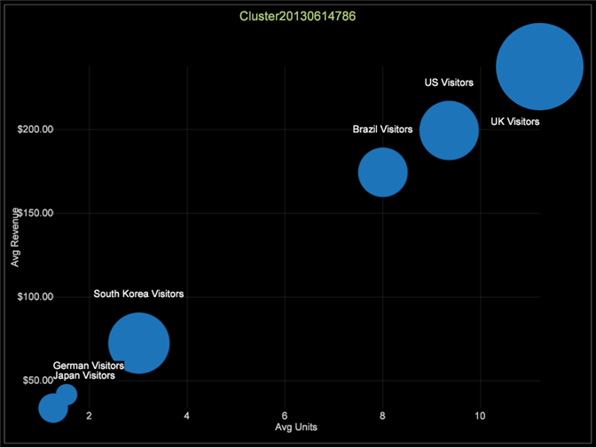

# Exploración de clústeres{#exploring-clusters}

Una vez creado un Dimension de clúster, puede guardarlo y examinarlo mediante el Explorador de clústeres.

1. Seleccione Visualización > Análisis predictivos > Clúster > Explorador de clústeres > Clústeres. Elija la dimensión de clúster guardada que desee explorar.

   

1. Haga clic con el botón derecho en el título de la visualización y haga clic en Alternar etiquetas para activarlas. Puede utilizar este menú para cambiar la dimensión de clúster que está explorando, cambiar la métrica de radio, añadir líneas de tendencia y mostrar la correlación.

   

1. Para modificar el Dimension de clúster que está explorando, cambie la métrica de radio, agregue líneas de tendencia y muestre la correlación con este menú.

   

   El Explorador de clústeres muestra los centros de los clústeres a lo largo de dos ejes de entrada a la vez. Esto permite examinar su separación en un espacio multidimensional.

1. Haga clic con el botón derecho en el clúster para mostrar el menú y elija entre los tipos de llamada: Anotación de imagen o texto, leyenda de métrica, tabla, gráfico de líneas o diagrama de puntos.

   
