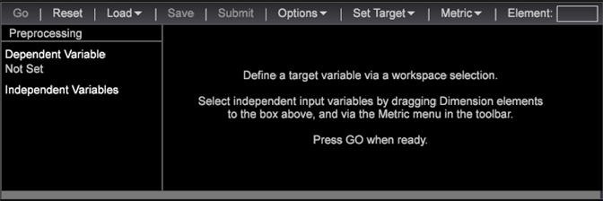
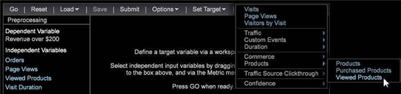
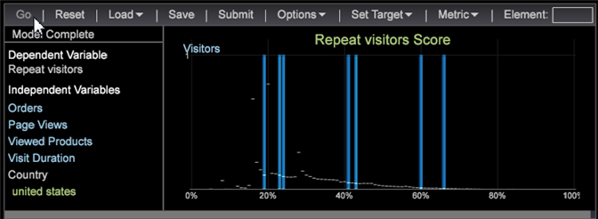

# Configuración de la puntuación de tendencia{#setting-up-propensity-scoring}

Siga estos pasos para utilizar la visualización Puntuación de tendencia.

1. Abra un nuevo espacio de trabajo y haga clic en **[!UICONTROL Add]** > **[!UICONTROL Visualization]** > **[!UICONTROL Predictive Analytics]** > **[!UICONTROL Scoring]** > **[!UICONTROL Propensity Score]**.

   

1. Establezca la variable **[!UICONTROL Target]** (la variable dependiente).

   Configure la variable dependiente seleccionando:

* **Elementos** de dimensión: Haga clic con el botón derecho en el espacio de trabajo y seleccione **[!UICONTROL Table]**. A continuación, seleccione un elemento de dimensión como la variable dependiente.

   OR

* **[!UICONTROL Filter Editor]**. Haga clic en **[!UICONTROL Add]** > **[!UICONTROL Visualization]** > **[!UICONTROL Filter Editor]** para abrir la visualización Editor de filtros.

   

   Después de seleccionar un elemento de dimensión o Filtro como la variable dependiente, haga clic en **[!UICONTROL Set Target]**, escriba un nombre para describir la variable dependiente. A continuación, haga clic en **[!UICONTROL OK]** (y asegúrese de que el cuadro de filtro está resaltado) para establecer el objetivo.

   

   El nombre que se le asigna al objetivo es la variable dependiente que aparecerá en el panel izquierdo.
1. Agregue variables independientes.

   Agregue las variables independientes mediante Métricas o Elementos de dimensión.

   

* **Métricas**. En la barra de herramientas Puntuación de tendencia, seleccione una métrica en el **[!UICONTROL Metrics]** menú.

* **Elementos** de dimensión: Haga clic con el botón derecho en el espacio de trabajo y seleccione **[!UICONTROL Table]**. Seleccione uno o varios elementos de dimensión y arrástrelos a la columna izquierda debajo **[!UICONTROL Independent Variables]** o al **[!UICONTROL Element]** cuadro utilizando las teclas `<Ctrl>` + `<Alt>` .

1. Establezca **[!UICONTROL Training Filter]**. Para definir el conjunto de visitantes que desea puntuar, haga clic en **[!UICONTROL Options]** > **[!UICONTROL Set Training Filter]** en la barra de herramientas Puntuación de tendencia. Esto proporcionará un subconjunto de datos generados utilizando solo los visitantes que desee puntuar. Por ejemplo: quién visitó el último mes, los visitantes que residen en Australia o los visitantes que vieron productos específicos.

   El filtro predeterminado es **[!UICONTROL Train on Everyone]**, pero puede cambiarlo activándolo **[!UICONTROL Dimension Elements]** en una tabla o generando un filtro con el **[!UICONTROL Filter Editor]**.

   Después de seleccionar un elemento Dimensión o crear un filtro y, mientras está activado, haga clic en **Opciones** > **Definir filtro** de formación, escriba un nombre para describir el filtro y, a continuación, haga clic en **[!UICONTROL OK]**.
1. Una vez que haya identificado todas las entradas, presione **[!UICONTROL Go]**.

   

   El proceso de puntuación comenzará pasando los datos varias veces. A continuación, se mostrarán los resultados como gráficos de barras sobre una línea de porcentaje.
1. Guardar puntuación de tendencia.

   A partir de la versión 6.1, ahora tiene una opción al usar la opción Guardar puntuación de tendencia:

* Dimensión
* Dimensión y métrica

   Puede terminar con dos archivos guardados, una dimensión y una métrica definida.

   >[!NOTE]
   >
   >Si envía la Puntuación de tendencia para su procesamiento, solo obtendrá una dimensión.

   La métrica derivada es la métrica de puntuación media asociada.
1. Compruebe la precisión.

   El sistema mostrará **[!UICONTROL Model Complete]** y generará un modelo de puntuación cuando se complete el proceso.

   Al hacer clic con el botón derecho **[!UICONTROL Model Complete]** se identificará la precisión del modelo de puntuación definido por el sistema. Los valores que oscilan entre 0 y 100 por ciento identificarán la probabilidad de que los visitantes coincidan con la **[!UICONTROL Target]** variable.

   La matriz de confusión ofrece cuatro recuentos por la combinación de Real Positive (AP), Real Negative (AN), Predicted Positive (PP) y Predicted Negative (PN). Estos números se obtienen aplicando el modelo de puntuación resultante a los datos de prueba retenidos del 20 % de los cuales conocemos la verdadera respuesta. Si la puntuación es buena al 50 %, se predice como un caso positivo (que coincide con el evento definido).

   

<table id="table_154BDD6D294C4ED1B8C15EC33B74B199"> 
 <tbody> 
  <tr> 
   <td colname="col1"><b> Precisión</b> </td> 
   <td colname="col2"> Indica la precisión del modelo identificando las predicciones correctas sobre todas las predicciones. 
(TP + TN)/(TP + FP + TN + FN) 
 </td> 
  </tr> 
  <tr> 
   <td colname="col1"><b> Recordar</b> </td> 
   <td colname="col2"> Identifica la capacidad para volver a identificar el modelo de puntuación. 
<b>TP / (TP + FN)</b> 
 </td> 
  </tr> 
  <tr> 
   <td colname="col1"><b> Precisión</b> </td> 
   <td colname="col2">Identifica el nivel de discrepancia. 
TP / (TP + FP) 
 </td> 
  </tr> 
 </tbody> 
</table>

1. Abra un [gráfico](../../../../home/c-get-started/c-analysis-vis/c-visitor-propensity/c-propensity-gain-lift-chart.md#concept-0d049f6baf534f7fb97f271843ba6c4a)de alza o ganancia o el visor [del](../../../../home/c-get-started/c-analysis-vis/c-visitor-propensity/c-propensity-model-viewer.md#concept-9f2593a8218140b7bd132a4c74e159f9)modelo.

   Haga clic con el botón derecho en la visualización **Modelo completado** y seleccione **[!UICONTROL Lift Chart]**, **[!UICONTROL Gain Chart]** o **[!UICONTROL Model Viewer.]**
