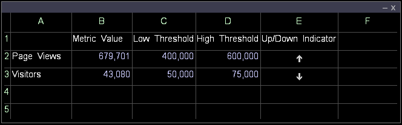

# Creación de un indicador de métrica{#create-a-metric-indicator}

Puede utilizar hojas de cálculo para indicar que una métrica ha alcanzado un umbral definido.

Además, puede utilizar [!DNL Report] para generar y distribuir automáticamente un informe cuando una métrica alcance un umbral definido dentro de un lapso de tiempo especificado.

Para obtener más información sobre [!DNL Report], consulte la *Guía del informe de Data Workbench*.

* [Indicador arriba o abajo](../../../../home/c-get-started/c-analysis-vis/c-wksts/c-metric-ind.md#section-40d7a2c3df0d40d4a7bb1a7e856abcba)
* [Indicador de comprobación](../../../../home/c-get-started/c-analysis-vis/c-wksts/c-metric-ind.md#section-98c5298a74f34dcbaaf151549fcc7090)

**Creación de un indicador de métrica mediante una hoja de cálculo**

1. Defina el contenido de las celdas de la hoja de cálculo.

   1. En la columna A, introduzca el nombre de la métrica deseada (por ejemplo, [!DNL Visitors]).
   1. En la columna B, introduzca el valor de la métrica deseada (por ejemplo, [!DNL =Visitors]).
   1. En la columna C, introduzca el umbral bajo de la métrica.
   1. En la columna D, introduzca el umbral alto de la métrica.
   1. En la columna E, introduzca una fórmula adecuada. Para ver ejemplos, consulte [Indicador arriba o abajo](../../../../home/c-get-started/c-analysis-vis/c-wksts/c-metric-ind.md#section-40d7a2c3df0d40d4a7bb1a7e856abcba) o [Indicador de comprobación](../../../../home/c-get-started/c-analysis-vis/c-wksts/c-metric-ind.md#section-98c5298a74f34dcbaaf151549fcc7090).
   1. En la celda de la fórmula (Columna E), haga clic con el botón derecho, haga clic en **[!UICONTROL Format]** > **[!UICONTROL Indicator]** y, a continuación, haga clic en una de las siguientes opciones:

      * **[!UICONTROL None]**: Enumera el cálculo exacto en lugar de un indicador.
      * **[!UICONTROL Check]**: Utiliza una marca de verificación o una X para indicar que el valor está por encima o por debajo del umbral establecido, según la fórmula. Consulte [Indicador de comprobación](../../../../home/c-get-started/c-analysis-vis/c-wksts/c-metric-ind.md#section-98c5298a74f34dcbaaf151549fcc7090).
      * **[!UICONTROL Up or Down]**: Utiliza una flecha hacia arriba o hacia abajo para indicar si el valor está por debajo del umbral bajo (flecha hacia abajo), por encima del umbral alto (flecha hacia arriba) o entre los umbrales bajo y alto (en blanco). Consulte [Indicador arriba o abajo](../../../../home/c-get-started/c-analysis-vis/c-wksts/c-metric-ind.md#section-40d7a2c3df0d40d4a7bb1a7e856abcba).

1. Repita el paso 1 para otras métricas para las que desee crear indicadores.

La hoja de cálculo resultante tendría un aspecto similar al siguiente ejemplo:

## Indicador arriba o abajo {#section-40d7a2c3df0d40d4a7bb1a7e856abcba}

Para [!DNL Up] o [!DNL Down indicator], utilice la fórmula siguiente:

[!DNL (metric value - low threshold)/(high threshold - low threshold)*2 - 1]

Por ejemplo: [!DNL =(b2-c2)/(d2-c2)*2-1]

Se pueden obtener tres resultados para cada métrica al utilizar esta fórmula con [!DNL Up] o [!DNL Down indicator]:

* Si el valor de la métrica está entre los umbrales bajo y alto, la fórmula evalúa un número entre -1 y 1 (exclusivamente). La flecha hacia arriba o hacia abajo no se muestra en la hoja de cálculo.
* Si el valor de la métrica es menor o igual que el umbral bajo, la fórmula evalúa un valor menor o igual que -1. El indicador de métrica cambia a una flecha hacia abajo.
* Si el valor de la métrica es bueno o igual al umbral alto, la fórmula se evalúa como un número bueno o igual a 1. El indicador de métrica cambia a una flecha hacia arriba.

La siguiente hoja de cálculo ilustra lo que mostraría la fórmula de ejemplo [!DNL =(b2-c2)/(d2-c2)*2-1]:

## Compruebe el indicador {#section-98c5298a74f34dcbaaf151549fcc7090}

Para [!DNL Check indicator], se utiliza una fórmula que indica si desea que se le notifique cuando el valor de la métrica sea superior o inferior al umbral especificado. Por ejemplo:

* Si desea que se le notifique cuando el valor esté por debajo del umbral establecido, puede utilizar el siguiente formato:

   * [!DNL threshold - metric]

      Por ejemplo: [!DNL =(c2-b2)]

* Si desea que se le notifique cuando el valor esté por encima del umbral establecido, puede utilizar la fórmula siguiente:

   * [!DNL metric - threshold]

      Por ejemplo: [!DNL =(b3-c3)]

Cuando se muestra una marca de verificación, la fórmula evaluada como un número positivo. Cuando se muestra una X, la fórmula se evalúa como un número negativo.

Hay dos posibles resultados para cada métrica al utilizar el [!DNL Check indicator]:

* Si la fórmula indica que es deseable mantener el valor de la métrica por encima del umbral, se mostrará una marca de verificación cuando el valor de la métrica sea bueno o igual al umbral y una X cuando el valor sea menor que el umbral.
* Si la fórmula indica que es deseable mantener el valor de la métrica por debajo del umbral, se muestra una marca de verificación cuando el valor de la métrica es menor o igual que el umbral y una X cuando el valor es bueno que el umbral.

La siguiente hoja de cálculo ilustra qué mostrarían las fórmulas de ejemplo [!DNL =(c2-b2)] y [!DNL =(b3-c3)]:

