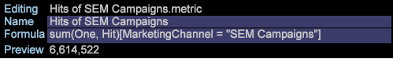

# Atribución de mejor ajuste{#best-fit-attribution}

La atribución de mejor ajuste es un método de aprendizaje automático para asignar valores de atribución en los distintos canales de un evento de conversión exitoso. Área de trabajo de datos evalúa automáticamente las contribuciones al éxito en una ventana de tiempo por canal y, a continuación, crea un modelo de atribución basado en los patrones de interacción reales de los clientes.

**[!UICONTROL Best Fit Attribution]** le permite comparar las interacciones, o los toques, que han contribuido a una venta exitosa, registro por correo electrónico u otros indicadores de rendimiento. El análisis de atribución asigna peso automáticamente a los toques más importantes y proporciona un modelo de atribución por canal basado en los datos y en la respuesta a su mercado y a sus protocolos internos.

Por ejemplo: si un cliente visita su sitio a través de una búsqueda orgánica, luego participa en una campaña y luego se registra para recibir un correo electrónico, la atribución [basada en](/help/home/c-get-started/c-attribution-profiles/c-rules-attrib/c-rules-attrib.md) reglas identificará el primer toque o último toque, o distribuirá uniformemente la atribución de éxito en todos los puntos de contacto mediante modelos de atribución preestablecidos. Cuando el usuario define la atribución basada en reglas, los atributos de mejor ajuste definen los valores mediante un algoritmo calculando la probabilidad de una conversión como función de los puntos de contacto observados.

>[!NOTE]
>
>Para ejecutar la atribución **de** mejor ajuste en el área de trabajo de datos, debe actualizar el certificado del servidor ( [!DNL .pem file]) para que sea compatible con Adobe Analytics Premium. También debe agregar **Premium** a la personalización [!DNL Profile.cfg] para el cliente y recibir nuevos certificados de Adobe ClientCare para el servidor y el servidor de informes.

## Configuración básica {#section-db597eaee462412ea7280d1426366c61}

Consulte [Generar una atribución](../../../../home/c-get-started/c-attribution-profiles/c-attrib-algorithmic/c-attrib-building.md#concept-fede6fc4f592475fa8b351b1765a522d) de mejor ajuste para obtener instrucciones paso a paso.

**Establezca la métrica** de éxito Defina una métrica que represente un evento de éxito.

La métrica de éxito suele ser *Pedidos*, aunque puede aprovechar el área de trabajo de datos para definir una métrica de éxito muy compleja junto con la ventana de éxito.

**Establecer la métrica** Táctil (opcional)

Identifique las interacciones para rastrear que llevaron a una conversión exitosa y luego establezca la métrica de toque sobre la cual se calculará la atribución.

>[!NOTE]
>
>La configuración de una métrica táctil solo es necesaria si se utiliza para derivar métricas de canal a partir de elementos de dimensión de arrastrar y soltar en lugar de utilizar métricas de canal existentes.

Si no tiene una métrica definida para campañas o canales, pero tiene dimensiones que representan canales, la Atribución de mejor ajuste puede generarlas automáticamente según la métrica Táctil.

Por ejemplo, con la métrica de toque configurada como *visitas* y una dimensión denominada Tipo *de* medio con elementos que incluyen *correo electrónico*, *Comunicado* de prensa, Publicidad *de***[!DNL Hits where Media Type = Email] impresión y Medios sociales, la visualización generará métricas de canal del formulario cuando arrastre y suelte los elementos en la visualización.

A continuación, la métrica Táctil determina la asignación de las puntuaciones de atribución para identificar las interacciones de marketing que se consideran influyentes para el éxito, lo que permite calificar los toques de marketing para la población identificada en la ventana Éxito. Puede establecer métricas como Vistas *de* página o *Visitas* individuales, o bien utilizar métricas táctiles personalizadas específicas de sus necesidades.

En muchos casos, la ventana Táctil debe incluir la ventana Éxito para evaluar un largo tiempo de espera en el ciclo de ventas.

**Establezca la métrica Ingresos.**

Puede optar por identificar los ingresos entre puntos de contacto estableciendo una métrica de ingresos adecuada. Si se especifica, el modelo mostrará la distribución de ingresos a través de los canales de entrada. 

Puede establecer una métrica de ingresos con tipos de datos de moneda para asignar el éxito a todos los puntos de contacto principales definidos y analizados. Esta métrica desglosa los ingresos de ventas finales y asigna en función de la ponderación asignada por el algoritmo.

**Configure las ventanas de éxito y toque.**

La ventana Éxito define la población que se va a examinar y el período de los eventos exitosos, lo que permite indicar las ventanas de tiempo y la amplitud de la población que se deben tener en cuenta para el análisis mediante una selección de espacio de trabajo. La ventana **Éxito** define el período y la población que se deben examinar para los eventos de éxito. La ventana **táctil** especifica el período de tiempo histórico que se debe examinar para las interacciones de canal que conducen a los eventos de éxito.

>[!NOTE]
>
>La configuración de una métrica táctil solo es necesaria si intenta crear métricas de éxito automáticamente arrastrando elementos de dimensión a la visualización.

Puede establecer un día, mes, año o cualquier intervalo de tiempo disponible para restringir la evaluación de eventos de éxito y de contacto a lo largo del ciclo de ventas o para audiencias específicas que ingresan al sitio. La creación de ventanas para limitar la atribución le permite enfocar el análisis en los períodos de tiempo relevantes para sus necesidades específicas.

En muchos casos, deseará que la ventana Táctil incluya la ventana Éxito para que pueda ampliar el análisis a lo largo de un largo plazo en función de su ventana de ventas. O bien, puede rastrear y analizar los toques por separado del evento de éxito.

**Seleccione los canales.**

Al introducir canales, tiene dos opciones.

**Agregar la métrica táctil y agregar elementos de dimensión a los canales**

En muchos casos, deseará desglosar los puntos de contacto principales por elementos de dimensión para definir canales específicos. En función de los valores del elemento, la atribución de mejor ajuste seleccionará automáticamente a los de mayor rendimiento y los clasificará según el porcentaje y los mostrará en una visualización de gráfico.

Un modelo de atribución se generará dibujando a los visitantes que interactuaron durante la ventana de éxito y examinando el canal Toca durante la ventana Tocar que produjo o no un evento exitoso.

## Desglose por canales {#section-a30592b84bc84f57bd2b988824e852d4}

Al introducir canales, tiene dos opciones:

* Agregue una métrica **** táctil y, a continuación, agregue elementos **** de dimensión para los canales.

   **O bien**

* Cree métricas que filtren para los elementos de canal que desee evaluar.

**Opción 1: Agregue una métrica táctil y elementos de dimensión para los canales**.

Este es el enfoque más fácil. Atribución de mejor ajuste crea las métricas automáticamente para evaluar la atribución. En el ejemplo siguiente, la métrica táctil es ***Visitas*** y los canales son: ***Mostrar campañas***, campañas ***de*** correo electrónico y campañas ****** SEM.

Con este método, la atribución de mejor ajuste crea una métrica en segundo plano para evaluar la atribución en los canales (pero nunca se ve la métrica generada automáticamente y no se guarda). En el ejemplo siguiente, se crean tres métricas en las que las visitas se filtran para cada uno de los tres canales (por ejemplo, *Campañas* de visualización, Campañas *de* correo electrónico y Campañas ** SEM). Esto es lo más sencillo porque permite que la Atribución de mejor ajuste cree las métricas por usted.

**Opción 2: Crear una métrica**.

En la segunda opción, puede crear y guardar las métricas de los canales que desea evaluar filtrando un canal específico. A continuación se muestra un ejemplo de una métrica de este tipo.

A continuación, en lugar de introducir una métrica táctil y elementos de dimensión para los canales, puede hacer clic en la barra de menús de la visualización y seleccionar **Entradas** > **Agregar canal** y, a continuación, seleccionar las métricas que ha creado.

Consulte el ejemplo del segundo método a continuación. Puede ver que los resultados de ambas opciones son idénticos.
