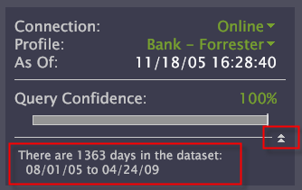

# Configuración de la barra lateral{#configure-the-sidebar}

La barra lateral proporciona acceso a las funciones que se utilizan con regularidad y conserva las visualizaciones a medida que se desplaza entre espacios de trabajo.

Los administradores pueden personalizar una barra lateral para que sea adecuada para diferentes grupos de usuarios y luego implementar la barra lateral con un perfil.

La barra lateral es ideal para ayudarle a realizar un seguimiento de los filtros y las anulaciones locales. Si prefiere no usar la barra lateral, puede ocultarla.

## Añadir visualizaciones a la barra lateral {#section-666f70a405db4f8d8eaffa567ffcac06}

1. Iniciar Data Workbench.
1. En la barra lateral, haga clic en **[!UICONTROL Add]** > *&lt;**[!UICONTROL item]***. Por ejemplo, [!DNL Selections Panel], [!DNL Filters Panel]o [!DNL Table].

   Los siguientes paneles de la barra lateral están disponibles en la instalación estándar de la Data Workbench. Puede que haya más elementos disponibles en su perfil específico:

   * **Panel de selecciones:** permite comprender qué selecciones están activas en el espacio de trabajo actual. El [!DNL Selections Panel] se actualiza cada vez que realiza una selección nueva. Para borrar las selecciones, haga clic en **[!UICONTROL x]**. Consulte [Realización de selecciones en visualizaciones](../../home/c-get-started/c-vis/c-sel-vis/c-sel-vis.md#concept-012870ec22c7476e9afbf3b8b2515746) para obtener información sobre cómo seleccionar datos.
   * **Panel de filtros:** facilita la carga y la aplicación de filtros guardados. Puede cargar varios filtros y habilitar o deshabilitar cada uno de ellos de forma independiente haciendo clic en la casilla de verificación situada junto a ellos. Consulte [Editores de filtro](../../home/c-get-started/c-analysis-vis/c-filter-editors/c-filter-editors.md#concept-2f343ecbed8240f18b0c1f1eccef11e3).
   * **Panel de anulación local:** este panel muestra qué métricas, dimensiones y filtros están presentes en el perfil se han modificado en su copia personal del perfil. Esto le ayuda a alertar sobre posibles diferencias entre la forma en que aparecen los datos en su cliente y la de otros usuarios. Cuando se guardan los cambios en una métrica, dimensión o filtro en el servidor, la anulación se elimina de [!DNL Local Overrides panel]. Si hace clic en una anulación y luego en **[!UICONTROL Revert to Server]**, la anulación local se elimina y el elemento vuelve a la versión compartida.
   * **Leyenda de métrica:** añade una leyenda de métrica. [!DNL Metric legends] permite ver las métricas de línea de base relacionadas con su perfil y las estadísticas relacionadas con el conjunto de datos (o con la selección actual, si se ha realizado una). Consulte [Leyendas de métricas](../../home/c-get-started/c-analysis-vis/c-legends/c-metric-leg.md#concept-e7195bc8f7844ae295bda3a88b028d5b).
   * **Leyenda de color:** añade una leyenda de color. Puede aplicar colores a las visualizaciones de código por métricas, como Conversión y Retención, y utilizarlas en casi todas las [!DNL Workspace]. Vincular métricas comerciales al color facilita la detección de anomalías, excepciones y tendencias. Consulte [Leyendas de color](../../home/c-get-started/c-analysis-vis/c-legends/c-color-leg.md#concept-f84d51dc0d6547f981d0642fc2d01358).
   * **Anotación de texto:** añade un panel de notas. [!DNL Text annotations] son ventanas en las que puede introducir texto arbitrario para añadir información descriptiva o comentarios a un  [!DNL Workspace]. Consulte [Uso de anotaciones de texto](../../home/c-get-started/c-analysis-vis/c-annots/c-text-annots.md#concept-55b4aa3e0c58470b8e3c9d452e12a777).
   * **Tabla:** añade una tabla. Una tabla puede mostrar una o más métricas en una o más dimensiones de datos. Consulte [Tablas](../../home/c-get-started/c-analysis-vis/c-tables/c-tables.md#concept-c632cb8ad9724f90ac5c294d52ae667f).
   * **Abrir:** abre un archivo guardado.

## Abrir un panel lateral {#section-cbc8e57491854274a577d47a48c306b8}

Puede abrir un archivo de visualización de barra lateral desde una ubicación guardada o desde el portapapeles.

1. En la barra lateral, haga clic en **[!UICONTROL Add]** > **[!UICONTROL Open]**.
1. Haga clic en **[!UICONTROL File]** para localizar el archivo [!DNL .vw] del panel que desea agregar o haga clic en **[!UICONTROL Last Closed Window]**, que extrae la visualización del portapapeles.

   Además, puede hacer clic en **[!UICONTROL From Clipboard]** para pegar una visualización que se ha copiado en el portapapeles. Consulte [Copia de un panel lateral](../../home/c-get-started/c-config-sidebar.md#section-720ae057632a4b8dbb94412e06a370b1).

## Copia de un panel lateral {#section-720ae057632a4b8dbb94412e06a370b1}

1. Haga clic con el botón derecho en el borde superior del panel y, a continuación, haga clic en **[!UICONTROL Copy]** > **[!UICONTROL Window]**.
1. Para pegar el panel, haga clic en **[!UICONTROL Add]** > **[!UICONTROL Open]** > **[!UICONTROL From Clipboard]**.

## Guardar un panel lateral {#section-fb19936b12704fb0a4c592abb579db1d}

En un panel lateral, haga clic con el botón derecho en la barra de título y haga clic en **[!UICONTROL Save]**.

Del mismo modo, puede abrir una visualización de barra lateral guardada. Data Workbench guarda la visualización como un archivo [!DNL .vw] en la ubicación especificada.

## Revertir a la barra lateral predeterminada {#section-4d14b8771ad747bba799876267f24831}

En la barra lateral, haga clic en **[!UICONTROL Options]** > **[!UICONTROL Revert]**.

Cuando cierra la Data Workbench, el sistema guarda la configuración actual de la barra lateral en el archivo [!DNL sidebar.vw] del perfil de usuario. Cuando se abre la Data Workbench, el sistema carga el archivo [!DNL sidebar.vw] desde el perfil del usuario, en lugar de un perfil principal.

Puede volver a una barra lateral predeterminada o guardada anteriormente, que elimina la barra lateral del perfil del usuario y vuelve a cargar la barra lateral del perfil principal. Los administradores pueden reemplazar la barra lateral predeterminada (principal) con una barra lateral local cargándola desde [!DNL Profile Manager].

## Personalizar el archivo del panel Más estado {#section-8d502f3b59cc4331966edec05e896ce1}

Los administradores del sistema pueden crear fórmulas en [!DNL More Status Panel.vw]. Esto coloca palabras contextuales alrededor de los valores de métricas y dimensiones, y muestra los resultados en [!DNL More Status panel] en la barra lateral.

Para mostrar [!DNL More Status panel] en la barra lateral, haga clic en las flechas que se muestran en el siguiente ejemplo.

El siguiente procedimiento muestra un ejemplo sencillo de cómo crear un estado personalizado que le indica cuántos días hay en un conjunto de datos:

1. En [!DNL Profile Manager], haga clic en **[!UICONTROL Sidebar\]**.

1. En la columna [!DNL Base_5_3*], haga una copia local del archivo [!DNL More Status Panel.vw].

   Para ello, haga clic con el botón derecho en la marca de verificación del archivo y haga clic en **[!UICONTROL Make Local]**.

1. Abra el archivo [!DNL More Status Panel.vw] en [!DNL .vw] [!DNL Editor] o en el Bloc de notas.

   

1. Complete los campos [!DNL Context] y [!DNL Items] en [!DNL Editor]. Consulte [Sintaxis del idioma de consulta](../../home/c-get-started/c-qry-lang-syntx/c-qry-lang-syntx.md#concept-15d1d3f5164a47d49468c5acb7299d9f) para obtener instrucciones sobre la sintaxis.

1. Guarde el archivo.

   Los valores del ejemplo anterior dan como resultado una fórmula de estado que se muestra de la siguiente manera:

   
