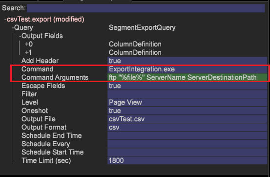

# Exportación de segmentos mediante envío S/FTP{#export-a-segment-using-s-ftp-delivery}

Ahora puede utilizar CSV, TSV, Exportación de segmentos y Exportación de segmentos con Encabezado mediante protocolos FTP y SFTP para exportar archivos de segmentos desde el cliente (estación de trabajo) al servidor.

**Configuración de archivos de configuración de exportación S/FTP**

Para establecer la configuración de exportación, se agregaron dos nuevos archivos de configuración de exportación para configurar una conexión FTP o SFTP, lo que permite que los detalles del servidor se seleccionen del archivo *FTPServerInfo.cfg* y que las credenciales se seleccionen de la carpeta *FTPUserCredentials* (correspondiente al nombre del servidor indicado en los argumentos de comando).

* Establezca el **archivo FTPServerInfo.cfg** .

   Introduzca la información del servidor FTP y establezca los reintentos de conexión permitidos desde la estación de trabajo. Edite desde la estación de trabajo o desde el servidor en el archivo [!DNL Server\Addresses\Export\] **[!DNL FTPServerInfo.cfg]** .

   ```
   FTP Servers = vector: 1 items 
     0 = ftpServerInfo:  
       Address = string:  
       Name = string:  
       Port = int: 21 
   Connect Retries = vector: 1 items 
     0 = connectServerRetries:  
       Retries = int: 0 
       Server Name = string:
   ```

* Establezca el **archivo FTPUserCredentials.cfg** .

   Introduzca las credenciales de usuario para conectarse a los servidores mediante el archivo [!DNL Server\Admin\Export\] **[!DNL FTPUserCredentials.cfg]** . Este archivo contiene las credenciales de usuario necesarias para conectarse a los servidores y solo se puede editar desde el servidor y no desde la estación de trabajo (cliente).

   ```
   FTP User Credentials = vector: 1 items 
     0 = ftpUserCredInfo: 
       User Name = string:  
       User Password = EncryptedString:  
       Server Name = string:  
       Public Key Path = string:  
       Private Key Path = string:  
       Passphrase = EncryptedString:
   ```

   >[!NOTE]
   >
   >Asegúrese de que las claves SSH que genere para la autenticación tengan el mismo formato que las generadas cuando utilice el comando SSH Keygen.
   >
   >Ejemplo para generar claves SSH mediante keygen:
   >
   >```
   >ssh-keygen -t rsa -b 4096 -C "<label>"
   >```

   Hay seis parámetros en el archivo **FTPUserCredentials.cfg** que se requieren para varias transferencias FTP o SFTP.

   1. *Nombre de usuario*
   1. *Contraseña de usuario*
   1. *Nombre del servidor*
   1. *Ruta de clave pública*
   1. *Ruta de clave privada*
   1. *Frase de contraseña*
   <table id="table_4EB416DC770D4D1AA4FAD9676C0D680C"> 
    <thead> 
      <tr> 
      <th colname="col1" class="entry"> Protocolo </th> 
      <th colname="col2" class="entry"> Parámetros </th> 
      </tr> 
    </thead>
    <tbody> 
      <tr> 
      <td colname="col1"> <p>FTP </p> </td> 
      <td colname="col2"> <p>Defina los parámetros 1, 2, 3. </p> </td> 
      </tr> 
      <tr> 
      <td colname="col1"> <p>SFTP mediante autenticación de contraseña </p> </td> 
      <td colname="col2"> <p>Establezca los parámetros 1, 2, 3 cuando la transferencia utilice autenticación por contraseña (-p en los argumentos de comando). </p> </td> 
      </tr> 
      <tr> 
      <td colname="col1"> <p>SFTP mediante autenticación de clave </p> </td> 
      <td colname="col2"> <p>Defina los parámetros 1, 2, 3, 4, 5, 6 cuando la transferencia utilice la autenticación de claves (-k en los argumentos de comando). </p> </td> 
      </tr> 
    </tbody> 
    </table>

**Configuración de los comandos de exportación de FTP y SFTP**

1. Abra una tabla de exportación.

   En la estación de trabajo, haga clic con el botón derecho en una tabla *de* detalles y elija uno de los tipos de exportación: CSV, TSV, Exportación de segmentos o Exportación de segmentos con encabezado. O bien abra el [!DNL .export] archivo desde un símbolo del sistema y edítelo (consulte [Configuración de segmentos para exportación](../../../home/c-get-started/c-exp-data-seg-exp/t-config-sgts-expt.md#task-8857f221fa66463990ec9b60db6db372)).

1. En el campo *Comando* , configúrelo para que señale al ejecutable de exportación:

   ```
   ExportIntegration.exe
   ```

1. Defina los campos Argumentos *de* comando como se muestra a continuación para el protocolo y la autenticación necesarios:

   **FTP**

   ```
   <Command Arguments> set to  
   <ftp "%file%" ServerName ServerDestinationPath>
   ```

   

   **SFTP** (si se utiliza una contraseña para la autenticación)

   ```
   <Command Arguments> set to  
   <sftp "%file%" ServerName ServerDestinationPath -p>
   ```

   **SFTP** (si se utilizan claves para la autenticación)

   ```
   <Command Arguments> set to  
   <sftp "%file%" ServerName ServerDestinationPath -k>
   ```

   

Todos los argumentos de comando son obligatorios y deben introducirse como se muestra.

## Exportación mediante S/FTP con claves privadas/públicas {#section-0534424d79a54a47b82594cfa7b3c17f}

Para implementar la exportación mediante FTP y SFTP mediante claves privadas y públicas, coloque los archivos de configuración en estas carpetas:

* Coloque **FTPServerInfo.cfg** en la [!DNL Server/Addresses/Export/] carpeta.
* Coloque **FTPUserCredentials.cfg** en la [!DNL Server/Admin/Export/] carpeta.

El archivo **FTPServerInfo.cfg** incluye seis parámetros:

1. *Nombre de usuario*
1. *Contraseña de usuario*
1. *Nombre del servidor*
1. *Ruta de clave pública*
1. *Ruta de acceso de clave privada:* coloque la ruta de acceso de clave privada en el archivo de configuración sin la extensión, por ejemplo:

[!DNL Private Key Path = string: E:\\Server\\campaign\\campaignprivatekey]

1. *Frase de contraseña*

FTP utiliza los parámetros 1, 2 y 3.

SFTP utiliza los parámetros 1, 2 y 3 cuando la transferencia utiliza autenticación por contraseña.

SFTP utiliza los seis parámetros cuando la transferencia se realiza mediante autenticación de claves. Por ejemplo, si utiliza claves para la autenticación:

[!DNL 'Command Arguments' = sftp "%file%" ServerName ServerDestinationPath -k]

Los archivos de configuración deben estar en la ubicación correcta.

>[!NOTE]
>
>Las claves públicas deben apuntar a un archivo **.pem** y no a una ubicación de carpeta. Puede crear claves utilizando una función de generación de claves SSH de aplicaciones como Cygwin. (La aplicación genera claves en un formato .ppk que no se admite).
