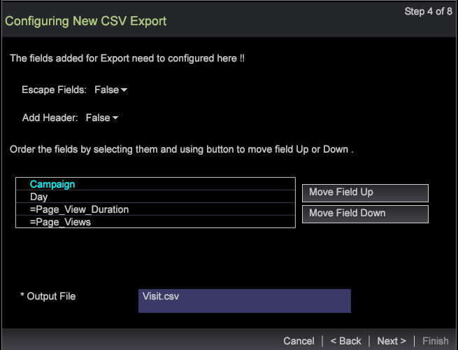
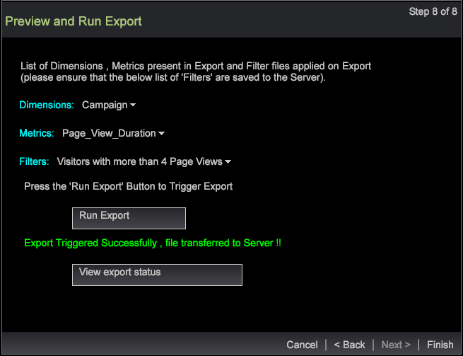

# Asistente para la exportación de segmentos{#segment-export-wizard}

{{eol}}

Exportación de segmentos mediante el asistente de exportación de segmentos

El asistente de exportación de segmentos proporciona un proceso paso a paso para configurar y exportar segmentos en lugar de [exportación de segmentos desde una tabla de detalles](https://experienceleague.adobe.com/docs/data-workbench/using/client/export-data/c-sgmt-expt.html).

## Exportación de segmentos mediante el asistente {#section-b30f2699dbc7490bad18512b91cb0cb3}

Para abrir el asistente, haga clic con el botón derecho en un espacio de trabajo y seleccione **Administrador** > **Asistentes** > **Asistente para la exportación de segmentos**.

>[!NOTE]
>
>Solo se capturarán los segmentos aplicados antes de abrir el asistente. Además, las exportaciones de segmentos creadas a partir del asistente no pueden generar comandos externos.

1. Seleccione los distintos niveles principales de las dimensiones y métricas que desea añadir a la exportación.

   Los niveles mostrados dependen del perfil seleccionado. Puede seleccionar varios niveles de dimensión según el perfil.

   

1. Haga clic en **Siguiente**.
1. Seleccione el Dimension y las métricas de los niveles seleccionados.

   Por ejemplo, después de seleccionar Vista de página como nivel principal, puede seleccionar las dimensiones y métricas secundarias disponibles para exportar.

1. Haga clic en **Siguiente**.

   

   

1. Seleccione el formato de exportación e introduzca un nombre para el archivo de exportación.

   

   Los tipos CSV, TSV, Exportación de segmentos y Exportación de segmentos con encabezado no necesitan ninguna configuración adicional. Sin embargo, la exportación de perfiles y audiencias, el servicio de registro personalizado y la exportación de Adobe Target deben configurarse en el paso 3. Por ejemplo, consulte los campos de configuración de Profiles and Audience Export. Configure estos tipos de exportación y haga clic en **Siguiente**.

   

   

   

1. Configure el tipo de exportación seleccionado.

   Encabezado: si Encabezado es Verdadero, asigne un nombre a la variable **Archivo de salida** campo .

   Campo de escape: establezca como **True** o **False**.

   Orden de los campos (Order of Fields): permite seleccionar un campo y moverlo hacia arriba o hacia abajo para definir el orden en el archivo de exportación.

   

   Haga clic en **Siguiente**.

1. Ver el nivel y los filtros aplicados en este cuadro de diálogo. Haga clic en **Siguiente**. 

1. If **CSV**, **TSV**, **Exportación de segmentos** o **Exportación de segmentos con encabezado** está seleccionada y hay tres opciones:

   Exportación genérica : el servidor generará el archivo de salida en la carpeta Servidor/Exportar .

   

   Exportación de FTP : el archivo de salida se transferirá al servidor seleccionado. (La lista del servidor se seleccionará del archivo FTPServerInfo.cfg ).

   

   Exportación SFTP : el archivo de salida se transferirá de forma segura al servidor seleccionado.

1. Haga clic en **Siguiente**

   **Nota:** Si el tipo de exportación seleccionado es **Perfiles y exportación de audiencias**, **Servicio de registro personalizado** y **Exportación de Adobe Target**, el texto será estático en función de la exportación seleccionada.

1. Configure los parámetros de programación.

   **Una toma** se puede establecer en True o False.

   **Programación avanzada** se puede activar o desactivar haciendo clic en el botón Configuración de programación avanzada .

   

   Al igual que la exportación desde la tabla de detalles, una toma desaparecerá si la configuración avanzada está activada. Haga clic en **Siguiente**.

1. Obtenga una vista previa del archivo de exportación y, a continuación, haga clic en **Ejecutar exportación**.

   

   

Los siguientes tipos de exportación están disponibles mediante el asistente:

**Tipos de exportación de segmentos**

* Genéricas
* FTP
* SFTP

**Exportación de segmentos con encabezado**

* Genéricas
* FTP
* SFTP

**Exportación de CSV**

* Genéricas
* FTP
* SFTP

**Exportación de TSV**

* Genéricas
* FTP
* SFTP
