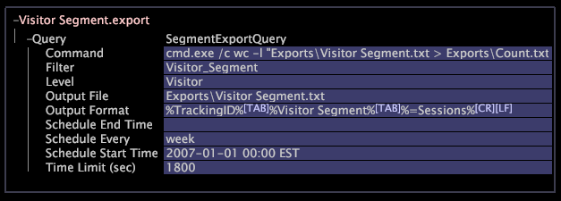

# Configurar segmentos para exportar{#configure-segments-for-export}

Puede crear un segmento de los elementos de cualquier dimensión contable y, a continuación, generar los datos de ese segmento por lotes o en tiempo real en un archivo delimitado por tabuladores.

Cada vez que se exporta un segmento, se generan datos de métricas o dimensiones para todos los elementos de dimensión incluidos en ese segmento. Puede controlar el formato de los datos generados para que otros sistemas puedan cargarlos fácilmente.

>[!NOTE]
>
>No se pueden exportar dimensiones de informes porque utilizan un [!DNL report time.metric] archivo como referencia. Como solución alternativa, si coloca un código [!DNL report time.metric] en el perfil, la exportación de segmentos puede utilizarlo como punto de referencia para las dimensiones de informes. Sin embargo, [!DNL report time.metric] no se actualiza automáticamente en función del valor Con el tiempo del perfil, por lo que cuando se desea cambiar la referencia de dimensión de informes, se debe cambiar el [!DNL report time.metric] archivo codificado.

Para configurar un segmento para la exportación, debe abrir y editar un [!DNL .export] archivo.

1. En la [!DNL Profile Manager], haga clic en el **[!UICONTROL Export]** directorio de la [!DNL File] columna para mostrar su contenido.

       Si el directorio Export no existe, créelo de la siguiente manera:
   
   1. Vaya al directorio de instalación de Área de trabajo de datos.
   1. Abra el directorio del perfil con el que está trabajando.
   1. En el directorio Profile, cree un nuevo directorio llamado &quot;Export&quot;.

1. En la [!DNL Profile Manager], haga clic con el botón secundario en la celda vacía de la [!DNL User] columna del directorio de exportación y, a continuación, haga clic en **[!UICONTROL Create]** > **[!UICONTROL New Segment Export]**.

   En la columna para Exportar aparece un archivo con el nombre [!DNL New Segment Export.export] . [!DNL File] Se muestra un archivo para Exportar.

1. Para cambiar el nombre del nuevo archivo, haga clic con el botón secundario en la columna del archivo y escriba el nuevo nombre en el parámetro File. [!DNL User]
1. Para abrir el nuevo archivo, haga clic con el botón derecho en la columna del [!DNL User] archivo y haga clic en **[!UICONTROL Open]** > **[!UICONTROL from the workbench]**.

   Aparece la ventana de configuración del [!DNL .export] archivo.

1. Haga clic en **[!UICONTROL Query]** y, a continuación, modifique los campos del [!DNL .export] archivo como se describe en la tabla siguiente:

<table id="table_C2EC8FCD3FA04DE78D2CADFA3F7FD8E3"> 
 <thead> 
  <tr> 
   <th colname="col1" class="entry"> Para este parámetro... </th> 
   <th colname="col2" class="entry"> Proporcione esta información... </th> 
  </tr> 
 </thead>
 <tbody> 
  <tr> 
   <td colname="col1"> Comando </td> 
   <td colname="col2"> 
Opcional. Programa que se ejecutará después de crear el archivo de salida. Este campo debe hacer referencia a un archivo ejecutable (un archivo  .exe  ), no a un comando shell. 
 
Nota:  La exportación de segmentos fallará si hay un espacio en el parámetro de comando. 
 </td> 
  </tr> 
  <tr> 
   <td colname="col1"> Filtro </td> 
   <td colname="col2"> 
Opcional. Un filtro con nombre o una expresión de filtro. Puede crear un filtro con nombre mediante un editor de filtros y, a continuación, escribir el nombre de ese filtro aquí, o bien escribir una expresión de filtro en sí misma. 
 
Para obtener más información sobre los editores de filtros, consulte <a href="../../../home/c-get-started/c-analysis-vis/c-filter-editors/c-filter-editors.md#concept-2f343ecbed8240f18b0c1f1eccef11e3"> Editores de filtros </a>. Para obtener más información sobre la sintaxis de expresión de filtro, consulte <a href="../../../home/c-get-started/c-qry-lang-syntx/c-syntx-fltr-exp.md#concept-72f2563f809747a2a3cff7ec72462a15"> Sintaxis para expresiones de filtro </a>. 
 
Los elementos de Nivel que coinciden con el filtro se exportan, mientras que el resto de elementos no. 
 </td> 
  </tr> 
  <tr> 
   <td colname="col1"> Nivel </td> 
   <td colname="col2"> 
Dimensión contable cuyos elementos se van a exportar. 
 
Ejemplo: Un nivel de visitante exporta una fila de datos para cada visitante. 
 </td> 
  </tr> 
  <tr> 
   <td colname="col1"> Archivo de salida </td> 
   <td colname="col2"> 
Ruta y nombre de archivo de los datos exportados. Si el perfil se está ejecutando en un clúster de servidores de Área de trabajo de datos, cada servidor de Área de trabajo de datos escribe un archivo de salida que contiene una parte de los datos. 
 
El directorio de instalación del servidor de Área de trabajo de datos contiene un directorio de exportación en el que puede guardar el archivo de salida. Por ejemplo, puede introducir  Exportar\Visitor Segment.txt , donde  Visitor Segment.txt  es el nombre del archivo que contiene los datos exportados. 
 </td> 
  </tr> 
  <tr> 
   <td colname="col1"> Formato de salida </td> 
   <td colname="col2"> La métrica o los datos de dimensión que se exportarán para cada elemento de nivel. Si el resultado es un archivo delimitado por tabuladores, los campos deben separarse con caracteres de tabulación y el formato debe terminar con los caracteres de nueva línea correspondientes. Para obtener más información, consulte <a href="../../../home/c-get-started/c-exp-data-seg-exp/c-abt-otpt-frmt.md#concept-ac7e24d1374a4b418365db7cc98c361e"> Acerca del formato de salida </a>. </td> 
  </tr> 
  <tr> 
   <td colname="col1"> Hora de finalización del programa </td> 
   <td colname="col2"> 
Opcional. La fecha y hora de finalización de la programación, incluida la zona horaria. 
 
Formato: AAAA-MM-DD hh:mm huso horario 
 
Ejemplo: 2013-08-01 12:01 EDT 
 
Las exportaciones programadas se detienen en este momento; sin embargo, el archivo de salida se vuelve a generar cada vez que se cambia su definición. Este campo no tiene sentido sin definir Programar cada. Para obtener más información sobre la configuración de huso horario, consulte la Guía <i>de configuración de</i>conjuntos de datos. 
 </td> 
  </tr> 
  <tr> 
   <td colname="col1"> Programar cada </td> 
   <td colname="col2"> Opcional. Frecuencia con la que se regenera el archivo de salida. Los valores admitidos son hora, día, semana y mes. El archivo de salida se vuelve a generar cada vez que se cambia su definición. </td> 
  </tr> 
  <tr> 
   <td colname="col1"> Hora de inicio del programa </td> 
   <td colname="col2"> 
Opcional. La fecha y hora de inicio de la programación, incluida la zona horaria. 
 
Formato: AAAA-MM-DD hh:mm huso horario 
 
Ejemplo: 2013-08-01 12:01 EDT 
 
Las exportaciones programadas empiezan en este momento y el calendario es relativo a este tiempo. Este campo no tiene sentido sin definir  Programar cada . Para obtener más información sobre la configuración de huso horario, consulte la Guía <i>de configuración de</i>conjuntos de datos. 
 </td> 
  </tr> 
  <tr> 
   <td colname="col1"> Límite de tiempo (s) </td> 
   <td colname="col2"> Opcional. Tiempo máximo permitido para transcurrir mientras se genera una exportación de segmentos. Si se supera el intervalo especificado, la exportación se inicia de nuevo. Al establecer este valor en 0 (cero), se elimina el límite. El valor predeterminado es 600 segundos. </td> 
  </tr> 
 </tbody> 
</table>

1. Haga clic con el botón secundario **[!UICONTROL (New)]** en la parte superior de la ventana y, a continuación, haga clic en **[!UICONTROL Save]**.
1. Para que este archivo esté disponible para todos los usuarios del perfil de trabajo, haga clic con el botón secundario en la marca de verificación del archivo creado en la [!DNL .export] columna [!DNL User] y, a continuación, haga clic en **[!UICONTROL Save to]** > *&lt;**[!UICONTROL working profile name]**>*.

   >[!NOTE]
   >
   >Al guardar el [!DNL .export] archivo en el servidor de Área de trabajo de datos, la exportación se ejecuta una vez inmediatamente, incluso si la hora de inicio de programación se establece en una fecha y hora futuras.

   The following is a sample [!DNL .export] file.

   

   >[!NOTE]
   >
   >El [!DNL Visitor Segment.export] archivo que se muestra en el ejemplo hace referencia al filtro Segmento del visitante. Al modificar la definición de este filtro, se cambia la definición de la exportación.

