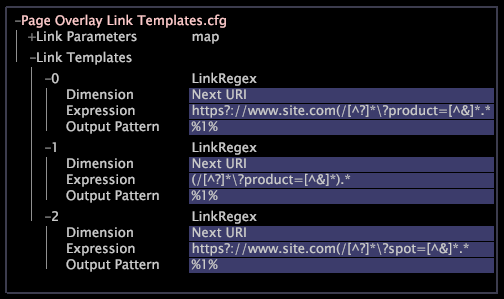

# Configurar una superposición de página{#configure-a-page-overlay}

Las superposiciones de página solo se configuran en la aplicación Sitio, pero se pueden configurar para otras aplicaciones.

Para obtener información sobre la configuración de la superposición de página para otra aplicación, póngase en contacto con los servicios de consultoría de Adobe.

La visualización de superposición de página es una herramienta para el análisis de vínculos HTML. Cuando se solicita una superposición para una página en particular, el Área de trabajo de datos toma una instantánea de la página real tal como aparecería en un navegador web y analiza el código HTML que representa los vínculos según una lista de expresiones regulares que se defina. Para cada vínculo de la página seleccionada, el software intenta encontrar una coincidencia de patrón de expresión regular trabajando en la lista hasta que se encuentre la primera coincidencia. Si hay una coincidencia, el vínculo aparece resaltado en la superposición de página.

La superposición de página muestra los datos únicamente cuando se agrega una leyenda de color al espacio de trabajo que contiene la superposición de página.

>[!NOTE]
>
>La configuración de la superposición de página requiere un trabajo de configuración cuidadoso y es posible crear resultados confusos si los vínculos se asignan de manera inadecuada a los datos. El trabajo que implica configurar la superposición de página para un sitio específico depende de cómo se presenten los vínculos dentro del código HTML en las páginas del sitio.

La superposición de página, por su naturaleza, sugiere al usuario el modelo mental de que muestra &quot;donde la gente hace clic&quot;. Si los datos que respaldan la visualización no coinciden con este modelo, el riesgo de confusión es alto.

En [!DNL Site], un vínculo suele representar un elemento de la dimensión Siguiente URI o Siguiente vínculo, pero puede asignar un vínculo a cualquier dimensión que tenga sentido para el análisis. Para obtener información sobre la configuración de la superposición de página para otras dimensiones, póngase en contacto con los servicios de consultoría de Adobe.

>[!NOTE]
>
>No se recomienda utilizar la dimensión Página para la superposición de página. Los usuarios pueden cambiar el nombre de los elementos de las dimensiones Página, alterando así la sintaxis del vínculo en el que se basa la funcionalidad de superposición de página.

Para configurar la superposición de página para [!DNL Site], debe editar dos archivos:

* **[!DNL Page Overlay.vw]::**Este archivo es un archivo de plantilla para crear visualizaciones de superposición de página. Debe haber al menos un archivo de plantilla en el perfil para el que está configurando la superposición de página.
* **[!DNL Page Overlay Link Templates.cfg]::**Cuando la visualización de superposición de página carga una página, identifica automáticamente los vínculos de la página y sus destinos. Para relacionar estos vínculos con elementos de los datos, debe definir un conjunto de expresiones regulares en este archivo.

   Puede definir varias expresiones regulares para que coincidan con los elementos de la dimensión. El orden en que se definen las expresiones es importante. Cuando se solicita una superposición para una página en particular, el Área de trabajo de datos toma una instantánea de la página real tal como aparecería en un navegador web y analiza el código HTML que representa los vínculos según una lista de expresiones regulares que se defina. Para cada vínculo de la página seleccionada, el software intenta encontrar una coincidencia de patrón de expresión regular trabajando en la lista hasta que se encuentre la primera coincidencia. La primera expresión que coincide con un elemento de dimensión es la que se utiliza. Por lo tanto, es mejor enumerar primero la expresión regular con el patrón de coincidencia más específico, seguido de expresiones menos específicas. Si hay una coincidencia, el vínculo aparece resaltado en la visualización de superposición de página.

**Para configurar la superposición de página para el sitio**

1. I

   En el [!DNL Profile Manager], vaya a **[!UICONTROL Context]** > **[!UICONTROL Dimension Element]** > **[!UICONTROL URI]**.

   >[!NOTE]
   >
   >El directorio Elemento de dimensión contiene los elementos de menú contextual que aparecen al hacer clic con el botón derecho en un elemento de dimensión. Por ejemplo, abra una tabla URI y seleccione un elemento URI. Se abre la superposición de página y el URI con el botón derecho.

1. En la carpeta URI, haga clic con el botón derecho en la marca de verificación situada junto al [!DNL Page Overlay.vw] archivo y haga clic en **[!UICONTROL Make Local]**. En la [!DNL User] columna aparece una marca de verificación para este archivo.
1. Haga clic con el botón secundario en la marca de verificación recién creada y haga clic en **[!UICONTROL Open]** > **[!UICONTROL in Notepad]**.
1. Especifique el dominio (y la altura del explorador, si es necesario).

   ```
   window = simpleBorderWindow: 
     client = scrollWindow: 
       client = PageOverlay: 
         URI Template = string: http://%Domain%%Element%
         URI Parameters = map: 
           Domain = string: domain name
           Element = ref: Element/Name
         Dim = ref: wdata/model/dim/URI
         Dim Element = ref: Element/Name
         Level = ref: wdata/model/dim/Page View
         Group = ref: wdata/model/dim/Session
         Browser Height = int: browser height
     pos = v3d: (518, 202, 0)
     size = v3d: (810, 610, 0)
     titleBar = editor: 
       size = v3d: (61, 19, 0)
       text = string: 
   ```

1. Guarde el archivo.
1. Para que este cambio esté disponible para todos los usuarios del perfil de trabajo, en la [!DNL Profile Manager], haga clic con el botón secundario en la marca de verificación del [!DNL .vw] archivo en la [!DNL User] columna y haga clic en **[!UICONTROL Save to]** > *&lt;**[!UICONTROL working profile name]**>*.

   >[!NOTE]
   >
   >Puede crear archivos de plantilla adicionales para otros sitios o subdominios. Cada plantilla que cree aparecerá en el [!DNL Page Overlay menu].

1. En la carpeta Contexto del [!DNL Profile Manager], haga clic con el botón derecho en la marca de verificación situada junto al [!DNL Page Overlay Link Templates.cfg] archivo y haga clic en **[!UICONTROL Make Local]**.

   En la [!DNL User] columna aparece una marca de verificación para este archivo.

1. Haga clic con el botón secundario en la marca de verificación recién creada y haga clic en **[!UICONTROL Open]** > **[!UICONTROL from the workbench]**.
1. Haga clic con el botón derecho **[!UICONTROL Link Templates]** y haga clic en **[!UICONTROL Add new]** > **[!UICONTROL Regular Expression]**.
1. Edite los parámetros del vector LinkRegex según sea necesario:

<table id="table_24DD4BB5009542F7BB1DA3318E2E6E2B"> 
 <thead> 
  <tr> 
   <th colname="col1" class="entry"> Para este parámetro... </th> 
   <th colname="col2" class="entry"> Proporcione esta información... </th> 
  </tr>
 </thead>
 <tbody> 
  <tr> 
   <td colname="col1"> <p>Dimensión </p> </td> 
   <td colname="col2"> <p>Dimensión (generalmente la dimensión de URI Siguiente) representada por el vínculo. </p> </td> 
  </tr> 
  <tr> 
   <td colname="col1"> <p>Expresión </p> </td> 
   <td colname="col2"> <p>Expresión regular utilizada para seleccionar la parte relevante del vínculo HTML para encontrar el siguiente elemento de la dimensión. La expresión regular debe ser una coincidencia exacta y el patrón de salida deseado se agrupa entre paréntesis. Para obtener más información sobre las expresiones regulares, consulte la Guía <i>de configuración de</i>Dataset. </p> </td> 
  </tr> 
  <tr> 
   <td colname="col1"> <p>Patrón de salida </p> </td> 
   <td colname="col2"> <p>Patrón de salida de la expresión regular utilizada para extraer el elemento resultante del parámetro Dimension. </p> </td> 
  </tr> 
 </tbody> 
</table>

El siguiente archivo de ejemplo muestra tres expresiones regulares:



1. Para guardar el archivo, haga clic con el botón derecho del ratón **[!UICONTROL (modified)]** en la parte superior de la ventana y haga clic en **[!UICONTROL Save]**.
1. Para que este cambio esté disponible para todos los usuarios del perfil de trabajo, haga clic con el botón secundario en la marca de verificación de [!DNL Page Overlay Link Templates.cfg] la [!DNL User] columna y haga clic en **[!UICONTROL Save to]** > *&lt;**[!UICONTROL working profile name]**>*.

