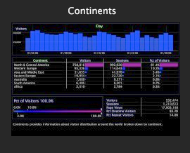

# Versiones de archivos{#file-versioning}

La superficie de trabajo facilita la determinación de dónde se almacena cada espacio de trabajo concreto, ya sea en el servidor de Data Workbench, en el equipo local o en ambos.

## Identificación de versiones de archivo {#section-d555c96b016344f19b356c12213dd2a9}

**Servidor**

Un espacio de trabajo del servidor se almacena en el servidor de Datas Workbench conectado y está disponible para todos los usuarios que tengan acceso a este perfil y esta pestaña. Un espacio de trabajo del servidor se muestra como una sola miniatura.

Los espacios de trabajo del servidor se almacenan de forma predeterminada en la subcarpeta correspondiente dentro de la carpeta Workspaces del servidor de Data Workbench conectado.

**Local**

Un espacio de trabajo local es la versión local de un espacio de trabajo del servidor. Un espacio de trabajo local se muestra como dos miniaturas superpuestas. La miniatura de la parte superior está rodeada inicialmente por un resplandor, que indica que los cambios recientes se realizaron localmente en el espacio de trabajo del servidor. Este resplandor se disipa con el tiempo.

Los espacios de trabajo locales se almacenan de forma predeterminada en la carpeta de nombres [!DNL User\working profile name\Workspaces\tab] dentro del directorio de instalación de la Data Workbench (o Insight).

>[!NOTE]
>
>Cuando tiene una versión local de un espacio de trabajo del servidor, debe volver a la versión del servidor para poder descargar una versión actualizada del espacio de trabajo del servidor. Para volver a la versión del servidor sin cambios locales, haga clic con el botón derecho en la miniatura del espacio de trabajo local y haga clic en **[!UICONTROL Revert to server version]**.

**Usuario**

Un espacio de trabajo de usuario es un espacio de trabajo creado en y que existe solo en el equipo local. Un espacio de trabajo de usuario se muestra como una sola miniatura con una descripción de puntos de un espacio de trabajo en blanco detrás de él, lo que indica que no hay espacio de trabajo de origen en el servidor de Datas Workbench conectado.

Los espacios de trabajo del usuario se almacenan de forma predeterminada en la carpeta User\*working profile name*\Workspaces\*tab name* dentro del directorio de instalación de Insight .
