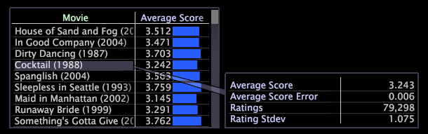

# Añadir llamadas a un espacio de trabajo{#adding-callouts-to-a-workspace}

Las llamadas son ventanas que se agregan a un espacio de trabajo para llamar la atención sobre un elemento de dimensión en particular mediante la creación de una nueva visualización con una selección virtual de ese elemento.

La Data Workbench se ofrece con un conjunto estándar de tipos de llamadas. Debido a que la implementación se puede personalizar completamente, los tipos de llamadas disponibles que aparecen en la implementación pueden diferir de lo que se documenta en esta guía.

De forma predeterminada, la Data Workbench proporciona las siguientes llamadas:

* [Anotación](../../../home/c-get-started/c-vis/c-call-wkspc.md#section-7b6742160b3f4aed872a09c8c023f90d)
* [Gráfico de líneas en blanco](../../../home/c-get-started/c-vis/c-call-wkspc.md#section-5dcc0504bdb64ed4976f880e2f7b277f)
* [Diagrama de puntos en blanco](../../../home/c-get-started/c-vis/c-call-wkspc.md#section-5dcc0504bdb64ed4976f880e2f7b277f)
* [Tabla en blanco](../../../home/c-get-started/c-vis/c-call-wkspc.md#section-5dcc0504bdb64ed4976f880e2f7b277f)
* [Leyenda de confianza](../../../home/c-get-started/c-vis/c-call-wkspc.md#section-386d1293ddc24a0c9cccb332e20db791)
* [Leyenda de métrica](../../../home/c-get-started/c-vis/c-call-wkspc.md#section-daa6d372c22246d9827880a9d6e804d8)

>[!NOTE]
>
>Las llamadas no funcionan como selecciones (es decir, no afectan a otras visualizaciones dentro del espacio de trabajo) a menos que realice una selección dentro de la llamada.

Puede añadir o editar las definiciones de llamada configurando los archivos de llamada almacenados en la carpeta de instalación *nombre de perfil*\Context\Callout folder of the [!DNL Server]. Consulte [Configuración de llamadas](../../../home/c-get-started/c-intf-anlys-ftrs/c-config-callouts.md#concept-f6e91e172f5e4c009245c9c549beb76a).

## Para agregar una llamada de anotación a una visualización {#section-7b6742160b3f4aed872a09c8c023f90d}

1. Haga clic con el botón derecho en el elemento para el que desea crear una llamada de y, a continuación, haga clic en **[!UICONTROL Add Callout]** > **[!UICONTROL Annotation]** > **[!UICONTROL Image]** o **[!UICONTROL Add Callout]** > **[!UICONTROL Annotation]** > **[!UICONTROL Text]**. Aparece una ventana en blanco con una conexión visible a ese elemento.

   

   Para agregar llamadas a visualizaciones de gráficos, debe hacer clic con el botón derecho en la parte inferior de la visualización (el eje base) para abrir un menú.

   

1. En función de su selección, complete el paso correspondiente:

   * Para una anotación de texto, escriba o pegue el texto deseado en la llamada y, a continuación, dé formato al texto según corresponda. Consulte [Uso de anotaciones de texto](../../../home/c-get-started/c-analysis-vis/c-annots/c-text-annots.md#concept-55b4aa3e0c58470b8e3c9d452e12a777).
   * Para una anotación de imagen, pegue la imagen deseada en la llamada copiando la imagen y haciendo clic con el botón derecho en la llamada. Haga clic en **[!UICONTROL Paste image]**. Consulte [Uso de anotaciones de imagen](../../../home/c-get-started/c-analysis-vis/c-annots/c-image-annots.md#concept-02081ed7d91c4fdcb8fc863f2a51c962).

## Agregar una tabla, un gráfico de líneas o una llamada de diagrama de puntos en blanco a una visualización {#section-5dcc0504bdb64ed4976f880e2f7b277f}

1. Haga clic con el botón derecho en el elemento para el que desea crear una llamada de y haga clic en **[!UICONTROL Add Callout]** > *&lt;**[!UICONTROL callout type]**>*.

   En el siguiente ejemplo se muestra una llamada Tabla en blanco .

   

1. Para seleccionar una dimensión, haga clic con el botón derecho en **[!UICONTROL None]** y haga clic en **[!UICONTROL Change Dimension]** > *&lt;**[!UICONTROL dimension name]**>*.

   >[!NOTE]
   >
   >Si cambia la dimensión dentro de una visualización que tiene una llamada de , la llamada cambia de estar conectada al elemento de la dimensión original a estar conectada a toda la visualización.

## Para agregar una llamada de leyenda de confianza a una visualización {#section-386d1293ddc24a0c9cccb332e20db791}

1. Haga clic con el botón derecho en el elemento para el cual desee crear la llamada y haga clic en **[!UICONTROL Add Callout]** > **[!UICONTROL Confidence Legend]**.

   

1. Si lo desea, cambie el campo [!DNL Metric or Formula].

Para ver las reglas de sintaxis de expresión, consulte [Sintaxis del idioma de consulta](../../../home/c-get-started/c-qry-lang-syntx/c-qry-lang-syntx.md#concept-15d1d3f5164a47d49468c5acb7299d9f). Consulte [Leyendas de confianza](../../../home/c-get-started/c-analysis-vis/c-legends/c-conf-leg.md#concept-73db81c2c218427786c04068aa778efd).

## Para agregar una llamada de leyenda de métrica a una visualización {#section-daa6d372c22246d9827880a9d6e804d8}

1. Haga clic con el botón derecho en el elemento para el cual desee crear la llamada y haga clic en **[!UICONTROL Add Callout]** > **[!UICONTROL Metric Legend]**.

   

1. Si lo desea, agregue o elimine métricas de la leyenda de la métrica.

Consulte [Leyendas de métricas](../../../home/c-get-started/c-analysis-vis/c-legends/c-metric-leg.md#concept-e7195bc8f7844ae295bda3a88b028d5b).
