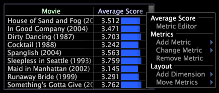

# Menús de métricas y dimensiones{#metric-and-dimension-menus}

{{eol}}

Los menús a los que se accede haciendo clic con el botón derecho en la métrica o el área de dimensión de una visualización proporcionan acceso a las acciones relacionadas con la métrica o la dimensión en esa visualización.

Para obtener más información sobre el uso de estas opciones de menú con un tipo de visualización particular, consulte la sección de visualización adecuada dentro de [Visualizaciones de análisis](../../../home/c-get-started/c-analysis-vis/c-analysis-vis.md).

## Menú Métrica {#section-115db63a26f04b57ac954a69972c6291}

Para acceder al menú de métricas, haga clic con el botón derecho en cualquier área relacionada con métricas dentro de una visualización.

Este menú le ofrece diferentes opciones en función del tipo de visualización en el que esté trabajando. En el siguiente ejemplo se muestran algunas de las opciones de menú disponibles, mientras que en la tabla siguiente se enumeran todas las opciones de menú disponibles.

<table id="table_81EFAC2D754843DD98C2DDF81A35A2B4"> 
 <thead> 
  <tr> 
   <th colname="col1" class="entry"> Opción del menú </th> 
   <th colname="col2" class="entry"> Descripción </th> 
  </tr> 
 </thead>
 <tbody> 
  <tr> 
   <td colname="col1"> <i>nombre de métrica</i> </td> 
   <td colname="col2"> 
Encabezamiento de las siguientes opciones de menú relacionadas con métricas. 
 </td> 
  </tr> 
  <tr> 
   <td colname="col1"> 
Ampliar a todo 
 </td> 
   <td colname="col2"> 
Devuelve a una visualización de todos los datos dentro del gráfico. Consulte <a href="../../../home/c-get-started/c-vis/c-zoom-vis.md#concept-7e33670bb5344f78a316f1a84cc20530"> Ampliación de las visualizaciones</a>. 
 </td> 
  </tr> 
  <tr> 
   <td colname="col1"> 
Ampliar a selección 
 </td> 
   <td colname="col2"> 
Amplía un subconjunto seleccionado de datos en un gráfico de líneas. Consulte <a href="../../../home/c-get-started/c-vis/c-zoom-vis.md#concept-7e33670bb5344f78a316f1a84cc20530"> Ampliación de las visualizaciones</a>. Para obtener más información sobre las selecciones, consulte <a href="../../../home/c-get-started/c-vis/c-sel-vis/c-sel-vis.md#concept-012870ec22c7476e9afbf3b8b2515746"> Realización de selecciones en visualizaciones</a>. 
 </td> 
  </tr> 
  <tr> 
   <td colname="col1"> 
Editor de métricas 
 </td> 
   <td colname="col2"> 
Permite editar la definición de la métrica identificada por el campo del nombre de la métrica. Consulte <a href="../../../home/c-get-started/c-admin-intrf/c-prof-mgr/c-drvd-mtrcs.md#section-db6d924cf4e14bcc8d57cfe1059fc797"> Edición de métricas derivadas existentes</a>. 
 </td> 
  </tr> 
  <tr> 
   <td colname="col1"> 
Métricas 
 </td> 
   <td colname="col2"> 
Encabezamiento de las siguientes opciones de menú relacionadas con métricas. 
 </td> 
  </tr> 
  <tr> 
   <td colname="col1"> 
Agregar métrica 
 </td> 
   <td colname="col2"> 
Agrega una nueva métrica a la visualización a la izquierda de la métrica seleccionada. 
 </td> 
  </tr> 
  <tr> 
   <td colname="col1"> 
Cambiar métrica 
 </td> 
   <td colname="col2"> 
Cambia la métrica seleccionada en la visualización. 
 </td> 
  </tr> 
  <tr> 
   <td colname="col1"> 
Eliminar métrica 
 </td> 
   <td colname="col2"> 
Quita la métrica seleccionada de la visualización. 
 </td> 
  </tr> 
  <tr> 
   <td colname="col1"> 
Diseño 
 </td> 
   <td colname="col2"> 
Encabezado de las siguientes opciones de menú relacionadas con el diseño. 
 </td> 
  </tr> 
  <tr> 
   <td colname="col1"> 
Agregar Dimension 
 </td> 
   <td colname="col2"> 
Agrega otra dimensión a la visualización. 
 </td> 
  </tr> 
  <tr> 
   <td colname="col1"> 
Mover métricas 
 </td> 
   <td colname="col2"> 
Mueve la métrica seleccionada a otro eje de la visualización. 
 </td> 
  </tr> 
 </tbody> 
</table>

## Uso del menú de dimensión {#section-e09de0aa6b74459a957b627ff7d07979}

Para acceder al menú de dimensión, haga clic con el botón derecho en cualquier área relacionada con dimensiones dentro de una visualización.

Este menú le ofrece diferentes opciones en función del tipo de visualización en el que esté trabajando. En el siguiente ejemplo se muestran algunas de las opciones de menú disponibles, mientras que en la tabla siguiente se enumeran todas las opciones de menú disponibles.

<table id="table_D8BB675B710B48A783B1C9EB206033E9"> 
 <thead> 
  <tr> 
   <th colname="col1" class="entry"> Opción del menú </th> 
   <th colname="col2" class="entry"> Descripción </th> 
  </tr> 
 </thead>
 <tbody> 
  <tr> 
   <td colname="col1"> 
Agregar Llamada 
 </td> 
   <td colname="col2"> 
Agrega una llamada para el elemento seleccionado, lo que llama la atención sobre ese elemento. Consulte <a href="../../../home/c-get-started/c-vis/c-call-wkspc.md#concept-212b09e763044d938987b4a9c658adc0"> Adición de llamadas a un espacio de trabajo</a>. 
 </td> 
  </tr> 
  <tr> 
   <td colname="col1"> 
Cambiar nombre de elemento 
 </td> 
   <td colname="col2"> 
Cambia el nombre del elemento. Haga clic en  Revertir para volver al nombre original. 
 </td> 
  </tr> 
  <tr> 
   <td colname="col1"> 
<i>nombre de dimensión</i> 
 </td> 
   <td colname="col2"> 
Encabezado de las siguientes opciones de menú relacionadas con dimensiones. 
 </td> 
  </tr> 
  <tr> 
   <td colname="col1"> 
Ordenar 
 </td> 
   <td colname="col2"> 
Ordena los elementos de la dimensión seleccionada como desee. 
 </td> 
  </tr> 
  <tr> 
   <td colname="col1"> 
Máscara 
 </td> 
   <td colname="col2"> 
Selecciona un subconjunto de los elementos de la dimensión seleccionada. 
 </td> 
  </tr> 
  <tr> 
   <td colname="col1"> 
Etiqueta 
 </td> 
   <td colname="col2"> 
Permite editar la etiqueta para la dimensión seleccionada. 
 </td> 
  </tr> 
  <tr> 
   <td colname="col1"> 
Resaltar selección 
 </td> 
   <td colname="col2"> 
Resalta el elemento seleccionado de la dimensión. 
 </td> 
  </tr> 
  <tr> 
   <td colname="col1"> 
Borrar resaltado 
 </td> 
   <td colname="col2"> 
Borra el resaltado de cualquier elemento de la visualización. 
 </td> 
  </tr> 
  <tr> 
   <td colname="col1"> 
Leyenda de serie 
 </td> 
   <td colname="col2"> 
Codifica con colores los elementos dentro de la dimensión seleccionada como una serie. Consulte <a href="../../../home/c-get-started/c-analysis-vis/c-tables/c-srs-leg.md#concept-c48042a705524bc4b63cd6f24874cc12"> Uso de leyendas de series</a>. 
 </td> 
  </tr> 
  <tr> 
   <td colname="col1"> 
Añadir visualización 
 </td> 
   <td colname="col2"> 
Añade una visualización que utiliza la dimensión seleccionada. 
 </td> 
  </tr> 
  <tr> 
   <td colname="col1"> 
Guardar Dimension 
 </td> 
   <td colname="col2"> 
Guarda la dimensión seleccionada de la visualización. 
 </td> 
  </tr> 
  <tr> 
   <td colname="col1"> 
Vista Jerarquía 
 </td> 
   <td colname="col2"> 
Cambia la visualización de la página actual a una visualización de jerarquía de páginas, que muestra las páginas de un sitio organizadas jerárquicamente por nombre de archivo y ordenadas alfabéticamente. Consulte <a href="../../../home/c-get-started/c-analysis-vis/c-tables/c-hier-vews.md#concept-b461183424a841eb94f8143a0eaf9bff"> Aplicación de vistas de jerarquía</a>. 
 </td> 
  </tr> 
  <tr> 
   <td colname="col1"> 
Diseño 
 </td> 
   <td colname="col2"> 
Encabezado de las siguientes opciones de menú relacionadas con el diseño. 
 </td> 
  </tr> 
  <tr> 
   <td colname="col1"> 
Agregar Dimension 
 </td> 
   <td colname="col2"> 
Agrega otra dimensión a la visualización. 
 </td> 
  </tr> 
  <tr> 
   <td colname="col1"> 
Cambiar dimensión 
 </td> 
   <td colname="col2"> 
Cambia la dimensión en la visualización. 
 </td> 
  </tr> 
  <tr> 
   <td colname="col1"> 
Mover Dimension 
 </td> 
   <td colname="col2"> 
Mueve la dimensión seleccionada a otro eje de la visualización. 
 </td> 
  </tr> 
  <tr> 
   <td colname="col1"> 
Quitar Dimension 
 </td> 
   <td colname="col2"> 
Quita la dimensión seleccionada de la visualización. 
 </td> 
  </tr> 
 </tbody> 
</table>
