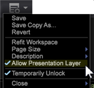
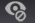

# Anotación de visualizaciones{#annotating-visualizations}

{{eol}}

La capa de presentación permite marcar y anotar las visualizaciones del espacio de trabajo y, a continuación, publicarlas con las llamadas y comentarios. Agregue descripciones de texto, objetos gráficos, flechas de llamada, codificación de color, imágenes y otras funciones en una superposición para agregar anotaciones y aclarar puntos de datos importantes y, a continuación, compártalas con los interesados.

**Agregue anotaciones a las visualizaciones:**

1. Abra un espacio de trabajo.
1. Vaya a **Archivo** > **Capa de presentación**.
1. Haga clic en **Permitir capa de presentación**.

   Cambie el comando de este menú para permitir o no permitir la generación de una capa de presentación. Aparecerá una marca de verificación cuando se permita la capa de presentación.

   

   Cuando permita la capa de presentación, aparecerá un icono en el lado derecho de la barra de herramientas.

    Este icono en el que se puede hacer clic muestra que se encuentra en la variable **Ocultar capa de presentación** pero no puede ver anotaciones.

1. Haga clic en el icono para alternar con **Mostrar capa de presentación**.

   Ver anotaciones en la capa de presentación.

    Este icono en el que se puede hacer clic muestra que se encuentra en la variable **Mostrar capa de presentación** pero no se puede editar.

   >[!NOTE]
   >
   >También puede hacer clic con el botón derecho en el espacio de trabajo para cambiar de modo mediante comandos de menú.

   

1. **Edite y añada funciones de llamada .**

   Vuelva a hacer clic en el icono para capturar una representación estática de la visualización del espacio de trabajo y abrir una superposición para añadir o editar anotaciones.

    Este icono en el que se puede hacer clic muestra que se encuentra en la variable **Editar capa de presentación** para añadir y editar anotaciones.

   Aparece una superposición gris en el modo de edición.

1. **Añadir características de llamada**.

   Haga clic con el botón derecho en la visualización para agregar un nuevo cuadro de texto. flechas y otras funciones de llamada para resaltar y anotar para la presentación.

   

1. **Establecer características gráficas**.

   Seleccione un objeto gráfico y haga clic con el botón derecho para definir las opciones. Puede definir colores para un cuadro u otro objeto gráfico, ajustar la configuración del texto en un cuadro de texto y agregar flechas o establecer capas para líneas.

   

1. **Añadir imágenes al espacio de trabajo**.

   Haga clic con el botón derecho del ratón para añadir las imágenes .jpg y .png a la superposición y cambiar su tamaño.

1. **Asignación de colores a objetos gráficos**.

   Puede seleccionar objetos en la capa de presentación y asignar colores mediante el selector de color. 

1. **Exportar y compartir capa de presentación**.

   Después de anotar las visualizaciones de su espacio de trabajo, puede exportar la capa de presentación con visualizaciones y compartirla como un archivo gráfico .png .

   Haga clic en **Exportar** > **Exportar PNG**.
